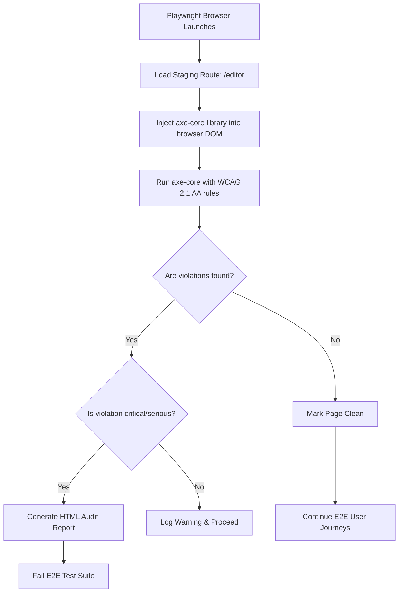

# Accessibility Scanning and Compliance Specifications

## Purpose
This document establishes the accessibility (a11y) verification framework, keyboard interaction rules, and automated screen reader auditing procedures for the NewsOps Cloud digital publishing system. It defines how WCAG 2.1 Level AA criteria are enforced programmatically using axe-core, ensuring that public news feeds, individual articles, and operational CMS interfaces remain completely inclusive and compliant with international standards.

## Executive Summary
For modern digital media publishing, accessibility is both an ethical imperative and a legal requirement (under mandates such as Section 508 and the European Accessibility Act). NewsOps Cloud integrates automated accessibility scans into its testing pipeline. Every frontend user interface compile must pass axe-core test gates. This document covers rules, testing scripts, focus management patterns, database audit tables, and monitoring metrics required to maintain a barrier-free experience.

## Vision
Our vision is to provide an equivalent digital experience for all users—regardless of physical, sensory, cognitive, or motor capability—by validating that every page template achieves a 100/100 accessibility score and complies fully with WCAG 2.1 Level AA rules.

## Scope
The scope of accessibility verification covers:
1. **Public Reading Interfaces**: Landing pages, category indexes, article detail views, search overlays, and newsletter signup widgets.
2. **Collaborative WYSIWYG Editor**: Text formatting inputs, document navigation sidebars, and media embed interfaces.
3. **Tenant Admin Portal**: Core dashboards, subscription managers, analytics screens, and configuration panels.

## Goals
- **Zero WCAG 2.1 AA Violations**: Maintain a clean, warning-free state on all reader-facing routes.
- **Ensure Full Keyboard Control**: Enable complete interface navigation without the use of a mouse.
- **Enforce Alt Text Rules**: Programmatically block publishing tasks if visual content lacks appropriate text descriptions.

## Functional Requirements
1. **axe-core Test Execution**: The frontend testing harness must evaluate rendered DOM trees using `axe-playwright` during E2E runs.
2. **Focus Indicators**: All focusable elements must display a high-contrast focus ring when navigated to via keyboard controls.
3. **Semantic Markup Validation**: Verify correct usage of HTML5 landmarks (`<header>`, `<nav>`, `<main>`, `<article>`, `<aside>`, `<footer>`) to allow screen readers to jump between blocks easily.
4. **Dynamic Live Announcements**: Notify screen reader software of dynamic content changes (e.g. real-time editor co-author indicators) using ARIA live regions (`aria-live="polite"`).

## Non-Functional Requirements
1. **Axe Scan Speed**: The local axe audit execution must complete in less than `3 seconds` per page layout in the E2E pipeline.
2. **Contrast Thresholds**: Verify color contrast ratios: at least `4.5:1` for regular text and `3:1` for large text elements (above 18pt or bold 14pt).
3. **Tab Index Ordering**: Enforce structured, linear keyboard tab-index flows, completely avoiding arbitrary `tabindex` values greater than `0`.

## Business Rules
1. **Mandatory Alt Text**: An article cannot progress to the "Published" state unless all uploaded inline images contain a validated `alt` description (minimum 5 characters) or are tagged as decorative (`alt=""`).
2. **CI Block on Critical Violations**: The CI build must fail if axe-core scans discover any "critical" or "serious" accessibility violations on main layouts.
3. **Contrast Enforcement**: Design system CSS classes must be audited; modifying tailwind base configurations to use colors with insufficient contrast is forbidden.

## Actors
- **Screen Reader User**: A reader navigating the news site utilizing software like JAWS, NVDA, or VoiceOver.
- **Keyboard-only Editor**: A newsroom editor writing and editing articles without mouse controls.
- **Frontend Engineer**: Builds UI components using semantic markup, correct ARIA attributes, and accessible design states.
- **QA Accessibility Auditor**: Performs manual screen reader testing and adjusts automated axe configurations.

## User Stories
1. **Screen Reader Article Consumption**: As a visually impaired Site Reader, I want to hear article headings structure sequentially (H1 followed by H2s, then H3s) so that I can easily scan the story outline using my screen reader.
2. **Keyboard CMS Management**: As an editor with motor restrictions, I want to use keyboard shortcuts to trigger the "Publish" modal, shift focus directly to the modal options, and confirm publication with the `Enter` key without losing focus focus-position.
3. **Storybook Contrast Warning**: As a Frontend Engineer, I want automated accessibility linting inside my component workbench (Storybook) so that I am notified of poor color choices before checking in my component.

## Acceptance Criteria
1. **axe-playwright Quality Gate**: Public article page templates must have `0` violations for WCAG 2.1 AA rules when tested using `axe-playwright`.
2. **Keyboard Focus Trap**: Inside the "Add Media Link" modal, focus must be trapped so that clicking `Tab` at the last input circles back to the first close icon, and pressing `Esc` closes the window and returns focus to the initial target button.
3. **Skip Navigation Links**: Each page layout must include a hidden `#skip-link` element at the top of the body that becomes visible on focus and shifts focus directly to the `<main>` element, bypassing header navigation links.

## Workflows

### 1. Automated a11y Gatekeeper Workflow
```
Developer Proposes PR -> Build Triggered
                             |
                             v
                  Run Playwright E2E Tests
                             |
                  Load Target Web Page
                             |
                  Execute axe-playwright Auditor
                             |
              Did Axe find Critical/Serious issues?
                           /         \
                        Yes           No
                         /             \
                        v               v
            Block PR & Export Report   Accept Build Integration
```

### 2. Focus Trap Loop Lifecycle Workflow
1. The user activates a sidebar dialog panel using the `Enter` key.
2. The browser shifts focus immediately to the title or first field of the sidebar: `document.getElementById('sidebar-title').focus()`.
3. An event listener intercepts keydown events inside the sidebar.
4. **Keydown Tab Event**:
   - If focus is on the last focusable element in the sidebar, pressing `Tab` redirects focus to the first focusable element.
   - If focus is on the first focusable element, pressing `Shift + Tab` redirects focus to the last element.
5. **Keydown Escape Event**: Closes the sidebar dialog, removes elements from viewport accessibility tree, and focuses the button that opened it.

## API Design

### 1. Accessibility Snippet Validator
- **Method**: `POST`
- **Path**: `/api/v1/audit/accessibility/validate`
- **Headers**:
  - `Content-Type`: `application/json`
  - `Authorization`: `Bearer JWT_TOKEN`
- **Request Payload**:
```json
{
  "page_path": "/articles/world-cup-updates",
  "html_content": "<div class='card'><span style='color: #eee; background: #fff;'>Low Contrast</span></div>"
}
```
- **Response (200 OK)**:
```json
{
  "valid": false,
  "violations_count": 2,
  "violations": [
    {
      "id": "image-alt",
      "severity": "critical",
      "target": "img",
      "message": "Images must have alternate text."
    },
    {
      "id": "color-contrast",
      "severity": "serious",
      "target": "span",
      "message": "Element has insufficient color contrast of 1.2:1 (expected minimum 4.5:1)."
    }
  ]
}
```

### 2. Log External Auditing Exception
- **Method**: `POST`
- **Path**: `/api/v1/audit/accessibility/exception`
- **Headers**:
  - `Authorization`: `Bearer JWT_TOKEN`
- **Request Payload**:
```json
{
  "page_url": "https://newsops.cloud/legacy/editor",
  "violation_code": "nested-interactive",
  "reason": "Legacy template requires double-interactive grids; mitigation is manual keyboard trap.",
  "expiry_date": "2026-12-31"
}
```
- **Response (200 OK)**:
```json
{
  "exception_id": "a11y_ex_10091",
  "status": "approved",
  "authorized_by": "sec_audit_lead"
}
```

## Database Design

### Accessibility Violations Tracking Database Schema
```sql
-- Historical logging of accessibility failures found during builds
CREATE TABLE accessibility_audit_runs (
    id UUID PRIMARY KEY DEFAULT gen_random_uuid(),
    commit_sha VARCHAR(40) NOT NULL,
    environment VARCHAR(50) NOT NULL, -- 'ci', 'staging', 'production'
    scanned_pages_count INT NOT NULL,
    total_violations INT NOT NULL,
    critical_violations INT NOT NULL,
    status VARCHAR(30) NOT NULL, -- 'clean', 'warnings', 'blocked'
    created_at TIMESTAMP WITH TIME ZONE DEFAULT CURRENT_TIMESTAMP
);

CREATE TABLE accessibility_violations_log (
    id UUID PRIMARY KEY DEFAULT gen_random_uuid(),
    run_id UUID REFERENCES accessibility_audit_runs(id) ON DELETE CASCADE,
    page_url VARCHAR(255) NOT NULL,
    rule_id VARCHAR(100) NOT NULL, -- e.g. 'color-contrast'
    severity VARCHAR(20) NOT NULL, -- 'critical', 'serious', 'moderate', 'minor'
    target_selector TEXT NOT NULL, -- CSS selector target
    help_message TEXT NOT NULL,
    resolved VARCHAR(20) DEFAULT 'open', -- 'open', 'resolved', 'exempted'
    resolved_at TIMESTAMP WITH TIME ZONE
);

CREATE INDEX idx_a11y_runs ON accessibility_audit_runs(created_at DESC);
CREATE INDEX idx_a11y_violations_rule ON accessibility_violations_log(rule_id);
```

## UI Design
The frontend uses accessible design templates containing layout components:
1. **Skip Navigation Button**: An invisible link that becomes styled and focusable on the very first `Tab` hit:
   ```css
   .skip-link {
     position: absolute;
     top: -100px;
     left: 0;
     background: #000;
     color: #fff;
     padding: 8px;
     z-index: 100;
   }
   .skip-link:focus {
     top: 0;
   }
   ```
2. **Accessible Form Elements**: Text inputs must have explicit, visible `<label>` nodes linked to inputs via matching `for` and `id` values.
3. **Contrast Switcher**: A utility dropdown in the header allowing users to select dark mode, light mode, or a high-contrast mode with a `contrast-ratio` of `7:1`.

## Permissions
- `Compliance Auditor`:
  - `accessibility:audits:read`
  - `accessibility:exceptions:write`
- `Frontend Engineer`:
  - `accessibility:audits:read`
- `Tenant Editor`:
  - `accessibility:metadata:write` (Allows adding image descriptions)

## Security
1. **Safe Snippet Parsing**: The HTML validator sanitizes input values using a secure parser before running axe checks to prevent DOM-based XSS exploits in testing tools.
2. **Log Anonymization**: Error paths and query snippets logged from accessibility failures do not store cookies or custom authorization headers.

## Performance
- **Selective Auditing**: Run axe checks on representative layouts (e.g. 1 article view, 1 dashboard page) rather than every single dynamic article route to minimize E2E suite execution latency.
- **Server-Side Render Pre-scan**: Run node-based static markup scans before executing client side browser animations to catch basic structure violations immediately.

## Monitoring
We monitor accessibility metrics using these Prometheus metrics:
- `newsops_accessibility_violations_total`: Gauge monitoring the counts of open accessibility defects by page types and severity.
- `newsops_accessibility_score`: Gauge representing Lighthouse CI accessibility score averages.

### Alert Triggers
- **Accessibility Regressions**: Alert triggers if `newsops_accessibility_violations_total{severity="critical"}` is greater than `0` in a pipeline deploy check.

## Logging
Accessibility violation records are outputted in JSON format:
```json
{
  "timestamp": "2026-06-27T17:48:00.320Z",
  "level": "WARN",
  "context": "a11y-audit-engine",
  "page_url": "/articles/breaking-news",
  "violation": {
    "rule_id": "label",
    "severity": "critical",
    "html_element": "<input type='text' id='email-input'>",
    "help": "Form elements must have labels"
  },
  "message": "Accessibility violation detected in client interface. Resolve before release."
}
```

## Error Handling
| Error Code | Source Component | HTTP Status | Customer-Facing Message |
| :--- | :--- | :--- | :--- |
| `ERR_A11Y_CRITICAL_VIOLATION` | axe-core runner | 422 Unprocessable | The interface violated accessibility WCAG 2.1 criteria. Code compilation rejected. |
| `ERR_MISSING_ALT_TEXT` | Editorial Ingest | 400 Bad Request | Image upload requires a descriptive alternative text profile. |
| `ERR_FOCUS_TRAP_FAILURE` | Modal Controller | 500 Internal Error | Focus loop initialization failed. Interactive element not detected. |

## Edge Cases
1. **Interactive Charts**: Interactive analytical charts are notoriously hard to scan. NewsOps Cloud mitigates this by rendering a secondary, hidden data table (`sr-only` class) showing the exact statistics represented in the chart, accessible only to screen readers.
2. **Dynamic Editor Syncs**: Multiple users writing text concurrently triggers multiple visual cursors. We avoid announcing cursor coordinates to screen readers using `aria-hidden="true"` on editor cursor markers.
3. **Third-Party Embedded Ad Scripts**: Embedded advertisements often violate contrast rules. We configure axe to exclude ad containers (`.ad-container`) to avoid blocking builds due to external systems beyond our control.

## Future Improvements
1. **AI Image Description Generator**: Integrate a Vision LLM model to automatically write alternative text suggestions for uploaded images if the author does not provide one.
2. **Automated Screen Reader Integration**: Implement tests using `dequelabs/voiceover` or similar to simulate actual audio reading outputs in head-less browsers.
3. **Self-Healing DOM**: Create runtime filters that automatically append ARIA label wrappers based on context patterns if missed by developers.

## Mermaid Diagrams

### E2E Accessibility Testing Flow


## References
- [UI Component Library Standards](../12-ui/index.md)
- [System Architecture Document](../02-architecture/system_architecture.md)
- [Continuous Integration Setup](../11-devops/index.md)
