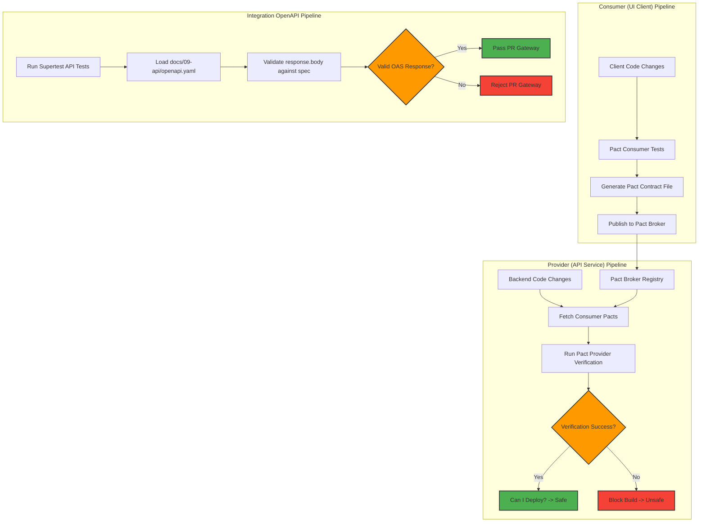

# API Contract Testing

## Purpose
This document specifies the standards, workflows, and configurations for API contract testing in the NewsOps Cloud ecosystem. It defines how we enforce compatibility between API consumers (such as frontend micro-frontends, CLI tools, and external publisher platforms) and API providers (such as the SaaS Gateway and core publishing services). Through **Pact** and **OpenAPI schema matching**, this framework ensures that interface changes are validated automatically prior to deployment, eliminating runtime communication breakdowns.

## Executive Summary
In a decoupled, microservices-driven operating system, API changes can introduce silent breaking faults. To address this risk, NewsOps Cloud mandates consumer-driven contract testing using **Pact** and schema compliance checking using **OpenAPI Specification (OAS)** matching. Consumer projects write pact declarations containing expected HTTP schemas and payloads, generating contract JSON files. Providers run verification tests against these pacts. Additionally, integration routers use **jest-openapi** to validate response schemas on every standard suite run. This document details the verification pipeline setup, script configurations, mock execution setups, and contract broker synchronization rules.

## Vision
The vision of our contract testing framework is a complete, developer-self-service verification pipeline that eliminates coordination meetings for API modifications. Any change in an API route must be automatically caught if it violates active consumer schemas, gating CI deployment pipelines before any broken client code can hit production environment clusters.

## Scope
This standard covers all client-to-server and server-to-server HTTP/REST communication interfaces inside the NewsOps Cloud architecture, including SaaS Gateway routes, AI Orchestrator endpoints, and administrative management micro-endpoints.

## Goals
- Achieve 100% contract coverage for key shared service interfaces (Identity, Editorial, and Social Publishing).
- Integrate OpenAPI validation checks directly into Jest integration test runs, failing tests that do not match the published `openapi.yaml` specification.
- Eliminate manual REST testing and API versioning lock-ins by automating interface drift detection.
- Enforce the automated submission of generated consumer pact definitions to the central Pact Broker registry.

## Functional Requirements
- Contract Publishing: Consumer applications must compile mock requests and responses to generate a valid Pact contract JSON.
- Provider Verification: The API gateway must host verification endpoints that Pact can query dynamically to confirm schema compatibility.
- Specification Alignment: Standard integration test responses must be verified against `openapi.yaml` schemas during execution.

## Non-Functional Requirements
- Verification Overhead: Provider verification checks must complete in under 45 seconds during CI.
- Schema Compatibility: OpenAPI validation middleware must compile and evaluate payloads within 5 milliseconds of request entry.
- Storage: Contract configurations stored in the Pact Broker database must be fully version-controlled, showing diff logs for every API revision.

## Business Rules
- A consumer team cannot release a schema-breaking API update to production without the provider first completing verification and updating its route layouts.
- Every OpenAPI definition file (`openapi.yaml`) in the code repository must be treated as a legally binding interface contract.
- The CI pipeline will automatically block pull requests if a contract verification fails.

## Actors
- **Frontend Engineer**: Defines consumer expectations and generates contract files.
- **Backend Engineer**: Integrates provider states and verifies compatibility against published pacts.
- **Pact Broker Portal**: Central repository holding published contracts and tracking deployment verification statuses ("Can I Deploy?").
- **Release Manager**: Evaluates contract compatibility metrics before initiating deployments to production cluster nodes.

## User Stories
- As a Frontend Engineer, I want to capture my API expectations inside a Pact file so that the backend team is notified if they make changes that break my layout components.
- As a Backend Service Engineer, I want to run a local Pact verification task against consumer contracts so that I can ensure my database changes do not break downstream client integrations.
- As a Release Manager, I want to query the Pact Broker's "Can I Deploy" database status so that I can guarantee the compatibility of microservice builds before releasing tags.

## Acceptance Criteria
- Every response in the integration tests must validate successfully against the `openapi.yaml` schema using `jest-openapi`.
- Complete Pact setup configuration scripts (both Consumer side and Provider side) must be provided in the appendix.
- The contract testing workflow must verify HTTP status codes, JSON keys, data types, and required headers exactly, rejecting payload deviations.

## Workflows
1. **Consumer Contract Creation**:
   - The consumer developer writes client-side tests, mocking the provider service using Pact.
   - The runner executes client test suites, outputting contract files to `/pacts`.
   - The consumer CI task publishes these contracts to the Pact Broker using the CLI script.
2. **Provider Contract Verification**:
   - The provider service CI pipeline triggers on a pull request.
   - The pipeline fetches active consumer pacts matching the provider name from the Pact Broker.
   - The provider executes verification scripts against its running test server.
   - The results of the verification runs are submitted back to the Pact Broker.
3. **Deployment Safety Evaluation**:
   - Before deploying, a release script executes the Pact command `can-i-deploy`.
   - If compatibility is validated, the release proceeds; otherwise, the deploy is aborted.

## API Design
Pact interaction routes communicate through standard Pact Broker registry interfaces. The following schema represents the mock contract registration payload used during build stages:

### PUT /pacts/provider/{provider}/consumer/{consumer}/version/{version}
Publishes a generated Pact contract document to the Pact Broker registry.

**Path Parameters:**
- `provider`: `NewsOpsGateway`
- `consumer`: `EditorialStudioUI`
- `version`: `1.42.0-sha.a8d9b1e`

**Request Payload:**
```json
{
  "consumer": {
    "name": "EditorialStudioUI"
  },
  "provider": {
    "name": "NewsOpsGateway"
  },
  "interactions": [
    {
      "description": "a request for an article detail",
      "providerState": "an article exists with ID art_12345",
      "request": {
        "method": "GET",
        "path": "/api/v1/articles/art_12345",
        "headers": {
          "Accept": "application/json",
          "Authorization": "Bearer jwt_token_value"
        }
      },
      "response": {
        "status": 200,
        "headers": {
          "Content-Type": "application/json; charset=utf-8"
        },
        "body": {
          "id": "art_12345",
          "title": "Mock Contract Article Title",
          "content": "Validated contract content block.",
          "status": "PUBLISHED"
        },
        "matchingRules": {
          "$.body.id": { "match": "type" },
          "$.body.title": { "match": "type" },
          "$.body.content": { "match": "type" },
          "$.body.status": { "match": "regex", "regex": "^(DRAFT|PUBLISHED|ARCHIVED)$" }
        }
      }
    }
  ]
}
```

**Response Payload (201 Created):**
```json
{
  "message": "Pact contract version 1.42.0-sha.a8d9b1e published successfully.",
  "links": {
    "self": "/pacts/provider/NewsOpsGateway/consumer/EditorialStudioUI/version/1.42.0-sha.a8d9b1e",
    "verification-results": "/pacts/provider/NewsOpsGateway/consumer/EditorialStudioUI/version/1.42.0-sha.a8d9b1e/verification-results"
  }
}
```

## Database Design
To track contract files, consumer states, and compatibility verification results over deployment cycles, our admin services use the following database schema:

### Table: `api_contracts`
Stores compiled contract schemas and version tracking details.
```sql
CREATE TABLE api_contracts (
    id UUID PRIMARY KEY DEFAULT gen_random_uuid(),
    consumer_name VARCHAR(150) NOT NULL,
    provider_name VARCHAR(150) NOT NULL,
    version VARCHAR(100) NOT NULL,
    contract_data JSONB NOT NULL,
    published_at TIMESTAMP WITH TIME ZONE DEFAULT CURRENT_TIMESTAMP,
    CONSTRAINT uq_consumer_provider_version UNIQUE (consumer_name, provider_name, version)
);

CREATE INDEX idx_api_contracts_names ON api_contracts(consumer_name, provider_name);
```

### Table: `contract_verifications`
Tracks execution logs of provider verification runs.
```sql
CREATE TABLE contract_verifications (
    id UUID PRIMARY KEY DEFAULT gen_random_uuid(),
    contract_id UUID REFERENCES api_contracts(id) ON DELETE CASCADE,
    provider_version VARCHAR(100) NOT NULL,
    status VARCHAR(50) NOT NULL, -- 'SUCCESSFUL', 'FAILED'
    verification_log TEXT,
    verified_at TIMESTAMP WITH TIME ZONE DEFAULT CURRENT_TIMESTAMP
);

CREATE INDEX idx_contract_verifications_status ON contract_verifications(status);
```

## UI Design
The Pact Broker Dashboard displays:
- **Matrix View**: A table grid showing Consumer Versions on the Y-axis and Provider Versions on the X-axis, with cells colored green (verified compatible) or red (broken contracts).
- **Interactions List**: An interface highlighting details of specific route requests and matching schemas.

## Permissions
- `contracts:publish`: Granted to CI runners executing consumer repository pipelines.
- `contracts:verify`: Granted to CI runners executing provider database verification steps.
- `contracts:delete`: Restricted to Admin roles for cleaning deprecated service scopes.

## Security
- API validation scripts must not capture and save production access keys inside verification logs.
- The contract registry must authenticate all request payloads using HMAC signatures to block the injection of fraudulent pact definitions.

## Performance
- Schema Verification Speed: Static OpenAPI assertions on standard routes must execute in under 10ms per test assertion.
- Registry Latency: Uploading contract files to the broker storage must take less than 1.5 seconds.

## Monitoring
- Prometheus Metric: `newsops_contract_verifications_failed_total`
- Prometheus Metric: `newsops_pact_broker_sync_status`
- Alert Trigger: If `newsops_contract_verifications_failed_total` rises above 0 on the main integration pipeline, notifications are instantly pushed to the API Platform channel.

## Logging
Detailed contract validation events use structured logging formats:
```json
{
  "timestamp": "2026-06-27T22:36:12Z",
  "level": "WARN",
  "context": "pact_verifier",
  "message": "Pact verification failed between EditorialStudioUI and NewsOpsGateway",
  "meta": {
    "provider": "NewsOpsGateway",
    "consumer": "EditorialStudioUI",
    "consumer_version": "1.42.0-sha.a8d9b1e",
    "interaction": "GET /api/v1/articles/art_12345",
    "error_details": "Key 'author_profile' was expected in response but was absent."
  }
}
```

## Error Handling
Map contract validation errors to pipeline build codes:
- **Contract Schema Mismatch (Build Code 201)**: Verification returns key discrepancies. Pipeline aborts. Console message: "Verification failed. Provider API response structure does not match consumer expectations. Check API Contract documentation."
- **OpenAPI Schema Check Failed (Build Code 202)**: Supertest returns non-compliant layout. Console message: "Assertion Error: API response payload does not comply with the OpenAPI spec template defined in docs/09-api/openapi.yaml."

## Edge Cases
- **Dynamic Array Ordering**: Pact tests asserting arrays (e.g. article search results) must use the Pact `eachLike` matcher rather than validating exact list lengths or items sequence.
- **State Seeding Latency**: When validating provider setups, test databases must run state setups asynchronously under 1.5 seconds to prevent mock gateway timeouts.

## Future Improvements
- **Automated Client SDK Generation**: Automatically rebuild and publish TypeScript client packages from validated OpenAPI schemas upon successful contract check-ins.
- **Bi-Directional Contract Verification**: Incorporate tools that compare OpenAPI definitions directly to Pact contract definitions, reducing double entry requirements.

## Mermaid Diagrams


## References
- [Testing Strategy Directory Index](./index.md)
- [Unit Testing Standards](./unit_testing_standards.md)
- [Integration Testing Strategy](./integration_testing.md)
- [API Gateway Specifications](../09-api/index.md)

---

# Appendices: Configurations & Examples

### Appendix A: Pact Consumer Setup (`test/contract/consumer.test.ts`)
```typescript
import { Pact, Matchers } from '@pact-foundation/pact';
import path from 'path';
import axios from 'axios';

// Initialize the Pact Mock Service Provider
const provider = new Pact({
  consumer: 'EditorialStudioUI',
  provider: 'NewsOpsGateway',
  port: 8089,
  log: path.resolve(process.cwd(), 'logs', 'pact.log'),
  dir: path.resolve(process.cwd(), 'pacts'),
  spec: 2,
  logLevel: 'info'
});

describe('EditorialStudioUI Client - Pact Consumer Tests', () => {
  beforeAll(() => provider.setup());
  afterEach(() => provider.verify());
  afterAll(() => provider.finalize());

  it('should receive a valid 200 response when querying article details', async () => {
    // Arrange: Define expectations and matching rules
    await provider.addInteraction({
      state: 'an article exists with ID art_12345',
      uponReceiving: 'a request for an article detail',
      withRequest: {
        method: 'GET',
        path: '/api/v1/articles/art_12345',
        headers: {
          'Accept': 'application/json',
          'Authorization': 'Bearer jwt_token_value'
        }
      },
      response: {
        status: 200,
        headers: {
          'Content-Type': 'application/json; charset=utf-8'
        },
        body: {
          id: Matchers.somethingLike('art_12345'),
          title: Matchers.somethingLike('Pact Mocked Title'),
          content: Matchers.somethingLike('Pact content mock data body details.'),
          status: Matchers.term({
            generate: 'PUBLISHED',
            matcher: '^(DRAFT|PUBLISHED|ARCHIVED)$'
          })
        }
      }
    });

    // Act: Invoke consumer mock client code
    const client = axios.create({ baseURL: 'http://localhost:8089' });
    const response = await client.get('/api/v1/articles/art_12345', {
      headers: {
        'Accept': 'application/json',
        'Authorization': 'Bearer jwt_token_value'
      }
    });

    // Assert: Verify client parsed response properly
    expect(response.status).toBe(200);
    expect(response.data.id).toBe('art_12345');
    expect(response.data.status).toBe('PUBLISHED');
  });
});
```

### Appendix B: Pact Provider Verification (`test/contract/provider.verify.ts`)
```typescript
import { Verifier } from '@pact-foundation/pact';
import { createServer } from '@src/server';
import path from 'path';
import http from 'http';

describe('NewsOpsGateway - Pact Provider Verification', () => {
  let serverInstance: http.Server;

  beforeAll((done) => {
    // Run the actual API server on local port to receive Pact queries
    const app = createServer();
    serverInstance = app.listen(8085, () => {
      console.log('Provider service listening on port 8085 for verification checks...');
      done();
    });
  });

  afterAll((done) => {
    if (serverInstance) {
      serverInstance.close(() => done());
    } else {
      done();
    }
  });

  it('should pass all consumer contract checks', async () => {
    const opts = {
      provider: 'NewsOpsGateway',
      providerBaseUrl: 'http://localhost:8085',
      // Path containing local or fetched pact files
      pactUrls: [
        path.resolve(process.cwd(), 'pacts', 'editorialstudioui-newsopsgateway.json')
      ],
      // Define state-handlers to hook mock database setups per contract state
      stateHandlers: {
        'an article exists with ID art_12345': async () => {
          // Add test seeding or mocking helper logic here
          console.log('State setup: Seeding article art_12345 into database mockup context...');
          return Promise.resolve();
        }
      },
      publishVerificationResult: process.env.CI === 'true',
      providerVersion: '1.0.0-git-sha'
    };

    // Run verification framework process
    const output = await new Verifier(opts).verifyProvider();
    expect(output).toBeDefined();
  });
});
```

### Appendix C: OpenAPI Schema Integration Test Verification
```typescript
import request from 'supertest';
import { createServer } from '@src/server';
import jestOpenAPI from 'jest-openapi';
import path from 'path';

// Load structural openapi specification schema
jestOpenAPI(path.resolve(__dirname, '../../../docs/09-api/openapi.yaml'));

const app = createServer();

describe('API Route Compliance - OpenAPI Validation', () => {
  it('should successfully match response structure of GET /api/v1/articles', async () => {
    // Act: query router instance
    const response = await request(app)
      .get('/api/v1/articles')
      .set('Authorization', 'Bearer jwt_token_value');

    // Assert: status code
    expect(response.status).toBe(200);

    // Assert: Validate exact match against OpenAPI spec definition
    expect(response).toSatisfyApiSpec();
  });
});
```
