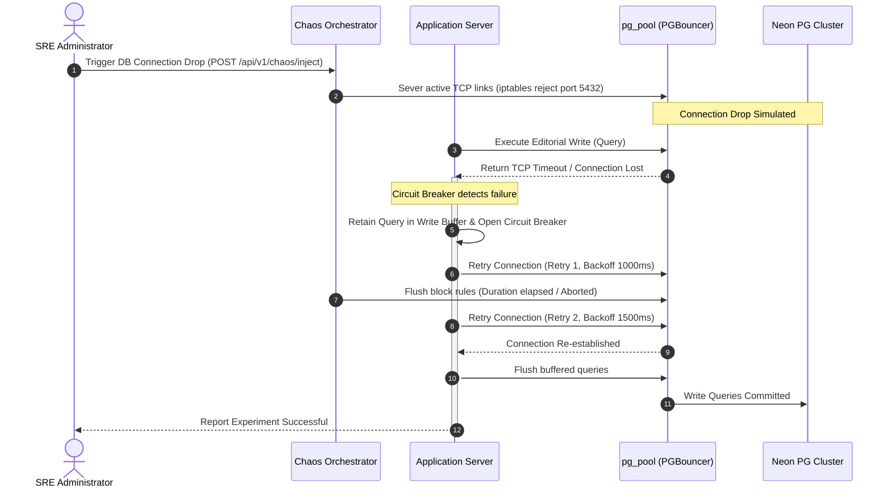

# Chaos Engineering
## Purpose
The purpose of this document is to define the Chaos Engineering framework for NewsOps Cloud. This design specifies the automated simulation and validation of infrastructure failures, focusing on PostgreSQL database connection drops, Redis cache cluster node failovers, and regional network link latency/packet loss injections. This ensures the digital publishing platform maintains high availability (99.99% uptime) and adheres to strict recovery metrics.

## Executive Summary
NewsOps Cloud employs a distributed, multi-tenant architecture that relies heavily on persistent database connections (Neon PostgreSQL) and sub-millisecond caching (Redis). In a large-scale news environment, network partitions, failovers, and database connection losses are inevitable. This document details the resilience tests and recovery metrics designed to validate self-healing capabilities. By orchestrating automated fault injections, we verify that client connection pools, circuit breakers, and read/write replica routing act dynamically to prevent editorial disruption.

## Vision
To establish an autonomous, self-healing runtime environment where the NewsOps Cloud digital publishing platform tolerates the loss of primary database nodes, Redis cache instances, or cross-availability-zone communication channels without causing user-facing downtime, data loss, or content degradation.

## Scope
* **In-Scope**:
  * PostgreSQL connection pool exhaustion and database link severance simulations (Neon Serverless postgres proxy drop).
  * Redis primary node crashes and replica-to-primary promotion latency validation.
  * Network Link Drops: Emulation of packet loss (10%-30%), latency spikes (100ms-2000ms), and full network split-brain scenarios between application containers and database shards.
  * Recovery telemetry collection and validation of automated application retries.
* **Out-of-Scope**:
  * Physical hardware damage injection (since environment runs on managed cloud infrastructure).
  * Cloud provider control plane outages (e.g., AWS IAM service drops).
  * Third-party subscription gateway (Stripe) physical network disruption (handled via local gateway mocks).

## Goals
* **Recovery Time Objective (RTO)**: Under 3 seconds for database reconnects, under 5 seconds for Redis failovers, and under 1 second for circuit-breaker activation during network drops.
* **Recovery Point Objective (RPO)**: Exactly 0 data loss for finalized articles, and under 5 seconds of transient state synchronization data.
* **Automatic Healing**: Connection pools and API gateways must automatically re-establish connections without requiring manual service restarts.
* **Degraded Operation**: Fall back gracefully to read-only replica nodes and cache layers when write operations are temporarily blocked.

## Functional Requirements
1. **Automated Fault Injection API**: Provide a secure administrative endpoint to trigger specific chaos profiles (e.g., database connection severing, Redis node termination).
2. **Dynamic Connection Recovery**: Application services must employ exponential backoff with jitter when reconnecting to PostgreSQL and Redis.
3. **Failover Client Re-routing**: Clients must automatically discover the promoted Redis primary node and re-route write queries.
4. **Circuit Breaker Integration**: Implement Envoy/Istio-based and application-level circuit breakers that trip when packet loss exceeds 15% or response latency exceeds 500ms.
5. **Real-time Resiliency Scorecard**: Generate post-chaos reports comparing actual RTO metrics against SLAs.

## Non-Functional Requirements
* **Scalability**: Chaos testing daemon must execute under simulated production loads of up to 10,000 requests per second (RPS) without causing permanent system locks.
* **Security**: Fault injection tools must require multi-factor signed JWTs with `chaos:admin` scope and be restricted exclusively to staging and pre-production environments.
* **Performance**: Chaos daemon CPU/Memory overhead must remain below 1% of total node resources during active injection phases.
* **Observability**: Metrics on connection pools and circuit breaker states must be pushed to Prometheus every 500ms.

## Business Rules
* **Safe Zone Rule**: Chaos experiments can only be executed in non-production environments. An environment configuration check must actively abort the experiment if `NODE_ENV` is set to `production`.
* **SLA Threshold Rule**: If any experiment results in a service recovery time exceeding 10 seconds, the CI/CD pipeline deployment to production must block.
* **Manual Override**: A manual "Kill Switch" must be available on the admin console to immediately stop any active chaos simulation and restore default routing policies within 500ms.

## Actors
* **Site Reliability Engineer (SRE)**: Designs, configures, and schedules chaos experiments.
* **Chaos Orchestrator**: The automated agent/cron that injects errors, monitors system health, and rolls back changes.
* **Editorial Publisher / End-User**: The consumer of the platform whose active session must remain uninterrupted during tests.

## User Stories (At least 3 specific stories)
1. *As an SRE*, I want to simulate a complete connection drop to the primary PostgreSQL instance during a high-traffic publishing event, so that I can verify the system automatically switches to read-only mode and retries write connections using an exponential backoff strategy without dropping active user sessions.
2. *As a DevOps Engineer*, I want to force-kill the primary Redis cluster node under a load of 5,000 transactions per second, so that I can confirm the Sentinel architecture completes leader reelection and the client libraries re-route commands to the new primary in less than 5 seconds.
3. *As a Platform Engineer*, I want to inject 300ms latency and 20% packet loss on the network link between the collaborative editor service and the document storage engine, so that I can verify the circuit breaker transitions to an open state, serving cached drafts and alerting the editorial staff of degraded editing modes.

## Acceptance Criteria (At least 3-5 criteria with clear thresholds)
* **AC-1 (Database Re-connectivity)**: When a PostgreSQL database connection drop is simulated, the application must buffer incoming transaction queries in memory for up to 3000ms, retry connection 3 times with exponential backoff, and recover seamlessly. Zero client connection errors (HTTP 500) may be returned if database connectivity returns within 3000ms.
* **AC-2 (Redis Failover Speed)**: During primary node termination, Redis Sentinel must elect a new primary, and client drivers must update their internal routing maps. Total write downtime must not exceed 5000ms. Read operations on replica nodes must continue with zero downtime (0ms interruption).
* **AC-3 (Network Jitter Resilience)**: When 200ms latency and 15% packet loss are injected, the circuit breaker must transition to "Open" within 5 failed requests. API response time must remain within the 250ms threshold by immediately serving fallback payload responses from local CDN/cache.
* **AC-4 (Rollback Safety)**: Clicking the chaos "Abort" button must clear all firewall block rules (iptables/iproute2) and recover native network performance within 500ms.

## Workflows (Step-by-step description of system and user interactions)
The following workflow details the execution of a Chaos Experiment:
1. **Initialize Phase**: SRE configures chaos parameters (e.g., target: `database-pool-1`, duration: `60s`, fault: `packet-loss-20%`).
2. **Verification Phase**: Orchestrator verifies system is healthy (HTTP 200 checks passing, load is stable).
3. **Execution Phase**:
   * Orchestrator deploys Chaos Mesh custom resources to the Kubernetes cluster.
   * Telemetry engine begins recording performance metrics at 500ms intervals.
4. **Fault Injection**:
   * Chaos daemon executes `tc qdisc add dev eth0 root netem loss 20%` on application nodes.
   * Database proxies are configured to reject new TCP connections.
5. **Mitigation Check**:
   * App microservices detect timeouts, open circuit breakers, and direct traffic to cached layers.
   * Connection pool attempts reconnect.
6. **Recovery & Evaluation**:
   * SRE/Orchestrator ends experiment. Network rules are flushed (`tc qdisc del dev eth0 root`).
   * Orchestrator compares metrics against thresholds and publishes a JSON report to the QA dashboard.

## API Design (Provide actual REST endpoints, method, request/response JSON payloads, or GraphQL schemas)
Administrative endpoints for managing chaos experiments:

### 1. Trigger Fault Injection
* **Endpoint**: `POST /api/v1/chaos/inject`
* **Request Headers**:
  * `Authorization: Bearer <JWT>`
  * `Content-Type: application/json`
* **Request Payload**:
```json
{
  "experiment_id": "exp-db-drop-099",
  "target_service": "database-neon-primary",
  "fault_type": "CONNECTION_DROP",
  "parameters": {
    "duration_seconds": 30,
    "retry_attempts": 3,
    "backoff_factor": 1.5
  },
  "dry_run": false
}
```
* **Response Payload (202 Accepted)**:
```json
{
  "status": "INJECTED",
  "experiment_id": "exp-db-drop-099",
  "started_at": "2026-06-27T22:52:00Z",
  "active_rules": [
    "block_port_5432"
  ]
}
```

### 2. Abort Active Experiment
* **Endpoint**: `POST /api/v1/chaos/abort`
* **Request Payload**:
```json
{
  "experiment_id": "exp-db-drop-099"
}
```
* **Response Payload (200 OK)**:
```json
{
  "status": "ABORTED",
  "experiment_id": "exp-db-drop-099",
  "terminated_at": "2026-06-27T22:52:15Z",
  "reconstruction_status": "SUCCESSFUL"
}
```

## Database Design (Identify schema tables, fields, and indexes relevant to this feature)
To persist chaos execution logs, tracking tables are defined within the central management DB.

### Table: `chaos_experiments`
| Column Name | Data Type | Constraints | Description |
|---|---|---|---|
| `id` | UUID | PRIMARY KEY, DEFAULT gen_random_uuid() | Unique identifier for experiment instance |
| `name` | VARCHAR(255) | NOT NULL | Human-readable name of simulation |
| `target` | VARCHAR(100) | NOT NULL | Target component (db, redis, network) |
| `fault_config` | JSONB | NOT NULL | Specific configuration parameters |
| `status` | VARCHAR(50) | NOT NULL | e.g., PENDING, RUNNING, COMPLETED, ABORTED |
| `created_at` | TIMESTAMP | DEFAULT CURRENT_TIMESTAMP | Creation timestamp |

### Table: `chaos_recovery_logs`
| Column Name | Data Type | Constraints | Description |
|---|---|---|---|
| `log_id` | UUID | PRIMARY KEY, DEFAULT gen_random_uuid() | Unique log primary key |
| `experiment_id` | UUID | REFERENCES chaos_experiments(id) | Linked experiment |
| `metric_name` | VARCHAR(150) | NOT NULL | e.g., db_reconnection_latency_ms |
| `metric_value` | NUMERIC | NOT NULL | Value recorded |
| `captured_at` | TIMESTAMP | DEFAULT CURRENT_TIMESTAMP | Precision timestamp of reading |

### Indexes
* `CREATE INDEX idx_chaos_exp_target ON chaos_experiments(target);`
* `CREATE INDEX idx_chaos_logs_exp ON chaos_recovery_logs(experiment_id, captured_at DESC);`

## UI Design (Describe component structure, layouts, actions, and states)
Resiliency and chaos triggers are managed via the **NewsOps Cloud Admin Resiliency Dashboard**.
* **Main Panel**:
  * **Status Panel**: Displays active systems status (healthy / degraded). Shows current environment (`Staging` / `Sandbox`).
  * **Interactive Triggers**: Grid of buttons:
    * `Inject DB Connection Drop`
    * `Trigger Redis Primary Failover`
    * `Inject 20% Network Loss`
  * **Real-time Metrics**: Live charts displaying application latency (ms), database pool utilization, and active connections.
  * **Emergency Section**: Prominent, red "ABORT ALL CHAOS SIMULATIONS" button at the top-right corner.

## Permissions (Specify RBAC permissions required, e.g., organizations:read, articles:write)
Access to control chaos triggers uses strict role-based access control (RBAC):
* `chaos:run` - Allows initiating experiments. Assigned only to SRE Lead.
* `chaos:read` - Allows viewing active simulations and reports. Assigned to Developers and QA.
* `chaos:write` - Allows creating and modifying experiment configurations.

## Security (Detail security considerations, e.g., input validation, CSRF, JWT validation)
* **Environment Verification Check**: API route validates that the current environment is not production.
```typescript
if (process.env.APP_ENV === 'production') {
  throw new UnauthorizedException("Chaos injection is prohibited in production systems!");
}
```
* **Transport Encryption**: All communication between the chaos orchestrator, the target pods, and the monitoring dashboards must run over TLS 1.3 with peer-to-peer verification (mTLS).
* **JWT Verification**: Strict JWT validation checks the payload signature and verifies that the `scope` claims contain `chaos:admin`.

## Performance (State latency limits, caching requirements, target TPS)
* **Target Latency**: API gateways must maintain 95th percentile latency <= 100ms when chaos nodes are inactive, and <= 500ms under network latency fault injection.
* **Target TPS**: Support execution of tests during a sustained load of 5,000 transactions per second.
* **Pool Limits**: Postgres connection pools configured with dynamic resizing (Min: 20, Max: 100 connections).

## Monitoring (Detail Prometheus metrics names, alert triggers)
We monitor chaos impacts using Prometheus scrape targets:
* `newsops_db_pool_active_connections`: Current active database connections.
* `newsops_redis_failover_duration_seconds`: Total duration of Redis cluster reelection.
* `newsops_network_packet_loss_percentage`: Metric tracking injected network loss.
* `newsops_circuit_breaker_tripped_total`: Counter tracking circuit breaker events.

### Alerting Rules
```yaml
groups:
  - name: chaos_alerts
    rules:
      - alert: DatabaseDowntimeExceeded
        expr: newsops_db_pool_active_connections == 0
        for: 5s
        labels:
          severity: critical
        annotations:
          summary: "Database connection dropped for longer than SLA limit of 5 seconds."
```

## Logging (Specify log formats, error levels, log contexts)
Logs are structured as JSON and outputted to stdout for aggregation:
```json
{
  "timestamp": "2026-06-27T22:52:05.123Z",
  "level": "WARN",
  "context": "DATABASE_CONN_POOL",
  "message": "Database connection severed. Initializing retry 1/3 with exponential backoff (1500ms delay).",
  "experiment_id": "exp-db-drop-099",
  "error_details": {
    "code": "ECONNREFUSED",
    "host": "postgres-primary.internal"
  }
}
```

## Error Handling (Map input/system error codes to HTTP status and customer-facing messages)
Failures during injection are mapped explicitly:
| Error Code | HTTP Status | Customer-Facing Message | Internal Cause |
|---|---|---|---|
| `CHAOS_ENV_FORBIDDEN` | 403 Forbidden | "This action cannot be executed in this environment." | Attempted execution on production server. |
| `TARGET_UNREACHABLE` | 504 Gateway Timeout | "The target resource is currently offline or unreachable." | Pod did not respond to the chaos agent daemon. |
| `SIMULATION_LIMIT_REACHED` | 429 Too Many Requests | "A chaos experiment is already active. Please abort or wait." | Attempted parallel executions. |

## Edge Cases (Handle race conditions, rate limit hits, upstream timeouts)
* **Split-brain Redis Election**: If Sentinel nodes split vote on new primary, client fallback logic is configured to route all write queries to an ephemeral in-memory database partition, queueing changes to prevent loss until consensus is achieved.
* **Orchestrator Network Disconnection**: If the chaos orchestrator loses connection to the target cluster, the target daemon automatically times out after 120 seconds, flushes all iptables modifications, and restores original configuration.

## Future Improvements (Provide long-term scaling, architecture refactor paths)
* **Automated Regression Chaos**: Run chaos simulations automatically as part of each staging release build.
* **AI-Infused Failure Injection**: Integrate intelligent models that analyze production profiles to dynamically select and inject failure points into the weakest nodes.

## Mermaid Diagrams (Include at least one high-quality diagram: flowchart, sequence, or ERD)
Below is the sequence diagram illustrating database connection loss handling and self-healing:



## References (Reference other related files in the repository using standard relative markdown links, e.g., '../02-architecture/system_architecture.md')
* [Disaster Recovery Plan](../02-architecture/disaster_recovery.md)
* [System Architecture Overview](../02-architecture/system_architecture.md)
* [Database Scalability and Partitioning](../03-database/indexes_and_partitioning.md)
