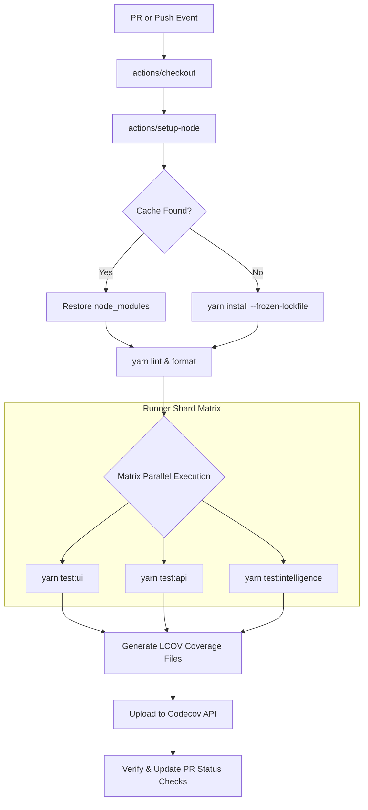

# CI/CD Test Integration
## Purpose
This document details the configuration and design of the Continuous Integration (CI) validation workflows for NewsOps Cloud. It outlines the parallel execution of test suites within GitHub Actions, configuration of dependency caching to minimize build overheads, and the automated integration of Codecov for regression checking and test coverage enforcement on pull requests.

## Executive Summary
Optimizing developer feedback loops requires a fast, reliable, and secure CI pipeline. This design achieves that goal by partition-scheduling test tasks across parallel virtual machine instances, utilizing GitHub Actions cache mechanisms for package managers (`node_modules`), and sending coverage summaries to Codecov. This document provides the operational configurations, database metrics tracking, security baselines, and architectural workflows that govern this process.

## Vision
To establish an enterprise-class verification pipeline that executes linting, unit tests, integration tests, and end-to-end (E2E) suites in less than 5 minutes on every code change, ensuring zero regressions reach the main code branch.

## Scope
* **In-Scope**:
  * GitHub Actions YAML workflow files targeting parallel unit and integration tests.
  * Node.js/Yarn lockfile-based caching configurations.
  * Integration hooks and payload models for Codecov uploads.
  * PR branch protection rules based on test suite results.
* **Out-of-Scope**:
  * Deployment and hosting configurations (defined in DevOps documents).
  * Static code analysis configurations (SonarQube/ESLint configuration files are detailed in style guidelines).
  * Manual release pipeline executions.

## Goals
* **Speed**: Complete all unit and integration tests in under 3 minutes using parallel matrix runners.
* **Cost Efficiency**: Minimize GitHub Actions compute charges by optimizing cache hits for packages to > 90%.
* **Quality Assurance**: Maintain a repository-wide minimum coverage threshold of 85% with zero PR exceptions.
* **Robustness**: Build retry and diagnostic systems that eliminate false-positives caused by flaky test runners.

## Functional Requirements
1. **Parallel Execution Matrix**: Automatically split unit and integration testing tasks across multiple virtual environments based on service folders (e.g., API, UI, News-Intelligence).
2. **Lockfile Caching**: Implement automated cache verification using the package manager's lockfile hash as the cache key.
3. **Coverage Report Publishing**: Generate LCOV coverage files and export them to Codecov immediately following successful test suites.
4. **Merge Blocking Hooks**: Block GitHub pull requests automatically if code coverage drops by more than 1% compared to the target branch.
5. **Linting and Format Enforcement**: Execute code style checks before starting downstream test executions.

## Non-Functional Requirements
* **Reliability**: GitHub Action runners must return a valid exit status code (0 or 1) representing the absolute test outcome.
* **Security**: Restrict secrets access so that `CODECOV_TOKEN` is hidden from forks running pull requests.
* **Maintainability**: Maintain clean configuration structures using standardized YAML without redundant commands.
* **Availability**: Utilize GitHub Actions hosted runners with SLA-backed availability.

## Business Rules
* **No Bypass**: No administrative bypass of CI test checks is permitted for merging to the `main` or `release` branches.
* **Prerequisite Order**: Unit tests must pass before integration and E2E tests are scheduled to run.
* **Grace Period**: Flaky tests flagged in the system must be resolved or isolated within 48 hours.

## Actors
* **Software Engineer**: Author of the code who submits pull requests and reviews feedback.
* **GitHub Actions Runner**: Execution agent running in the cloud environment.
* **Quality Assurance Lead**: Configures coverage limits and signs off on testing policies.

## User Stories (At least 3 specific stories)
1. *As a Developer*, I want my unit tests to run in parallel shards across multiple runners during my pull request, so that I can see test results and fix regressions in under 3 minutes without waiting for serial tasks.
2. *As a DevOps Engineer*, I want the system to cache `node_modules` and Yarn binaries based on the hash of `yarn.lock`, so that we avoid downloading unchanged packages on every single commit.
3. *As a Quality Lead*, I want code coverage metrics to be sent automatically to Codecov and displayed as a comment on the PR, highlighting any untested lines.

## Acceptance Criteria (At least 3-5 criteria with clear thresholds)
* **AC-1 (Execution Timeout Limit)**: The absolute execution time of the unit-test job running in the GitHub Actions container must be less than 180 seconds.
* **AC-2 (Cache Hit Speed)**: Yarn package installation must consume less than 12 seconds when a warm cache hit occurs (i.e. `yarn.lock` hash is unchanged).
* **AC-3 (Codecov Report Accuracy)**: The code coverage upload step must complete within 30 seconds and map report line metrics to the exact Git commit SHA without error.
* **AC-4 (Failure Notification)**: A pipeline failure must update the GitHub status indicator to "failed" within 15 seconds, detailing the specific failed spec file.

## Workflows (Step-by-step description of system and user interactions)
The CI validation workflow follows this sequence:
1. **Trigger**: Code is pushed to `main` or a pull request is created.
2. **Setup Job**:
   * Instantiates an Ubuntu runner.
   * Checks out code repository using `actions/checkout@v4`.
   * Restores `node_modules` cache using `actions/cache@v4`.
   * Installs node dependencies using `yarn install --frozen-lockfile`.
3. **Execution Steps (Parallelized Matrix)**:
   * **Runner 1**: Runs code style and quality linting (`yarn lint` & `yarn format:check`).
   * **Runner 2**: Runs frontend UI test suite (`yarn test:ui`).
   * **Runner 3**: Runs backend API test suite (`yarn test:api`).
   * **Runner 4**: Runs news-intelligence unit tests (`yarn test:intel`).
4. **Coverage Processing**:
   * Each test runner generates a coverage report in `.nyc_output/` or `coverage/clover.xml`.
   * Runner uploads output reports to the Codecov dashboard.
5. **Check Conclusion**: GitHub Checks API is updated with success or failure indicators.

Here is the production-ready GitHub Actions YAML configuration file (`.github/workflows/ci.yml`):

```yaml
name: Continuous Integration

on:
  push:
    branches: [ main, release ]
  pull_request:
    branches: [ main, release ]

jobs:
  lint-and-format:
    runs-on: ubuntu-latest
    steps:
      - name: Checkout Code
        uses: actions/checkout@v4

      - name: Setup Node.js
        uses: actions/setup-node@v4
        with:
          node-version: '20.x'

      - name: Restore Cache
        uses: actions/cache@v4
        id: yarn-cache
        with:
          path: |
            **/node_modules
            ~/.cache/yarn
          key: ${{ runner.os }}-yarn-${{ hashFiles('**/yarn.lock') }}
          restore-keys: |
            ${{ runner.os }}-yarn-

      - name: Install Dependencies
        if: steps.yarn-cache.outputs.cache-hit != 'true'
        run: yarn install --frozen-lockfile

      - name: Run Linter
        run: yarn lint

      - name: Check Formatting
        run: yarn format:check

  test-matrix:
    needs: lint-and-format
    runs-on: ubuntu-latest
    strategy:
      matrix:
        service: [ ui, api, intelligence ]
      fail-fast: false
    steps:
      - name: Checkout Code
        uses: actions/checkout@v4

      - name: Setup Node.js
        uses: actions/setup-node@v4
        with:
          node-version: '20.x'

      - name: Restore Cache
        uses: actions/cache@v4
        id: yarn-cache
        with:
          path: |
            **/node_modules
            ~/.cache/yarn
          key: ${{ runner.os }}-yarn-${{ hashFiles('**/yarn.lock') }}
          restore-keys: |
            ${{ runner.os }}-yarn-

      - name: Install Dependencies
        if: steps.yarn-cache.outputs.cache-hit != 'true'
        run: yarn install --frozen-lockfile

      - name: Execute Tests
        run: yarn test:${{ matrix.service }} --coverage --runInBand

      - name: Upload Coverage to Codecov
        uses: codecov/codecov-action@v4
        with:
          token: ${{ secrets.CODECOV_TOKEN }}
          flags: ${{ matrix.service }}
          name: newsops-codecov-uploader
          fail_ci_if_error: true
```

## API Design (Provide actual REST endpoints, method, request/response JSON payloads, or GraphQL schemas)
Interaction between GitHub Actions, GitHub API, and the Codecov API occurs via secure webhooks.

### 1. Codecov Webhook Payload (Post-Upload confirmation)
* **Endpoint**: `POST /api/v1/ci/coverage-callback`
* **Request Payload**:
```json
{
  "commit": "a5d93b91c2b530c14bdf882e3f538e124500ba12",
  "branch": "feature/collaboration-editor",
  "repository": "newsops/newsops-cloud",
  "coverage_percentage": 87.65,
  "diff_coverage": 92.30,
  "status": "success",
  "reports": [
    {
      "flag": "ui",
      "lines_covered": 4512,
      "lines_total": 5120
    },
    {
      "flag": "api",
      "lines_covered": 8104,
      "lines_total": 9200
    }
  ]
}
```
* **Response Payload (200 OK)**:
```json
{
  "processed": true,
  "message": "PR check status updated to SUCCESS"
}
```

## Database Design (Identify schema tables, fields, and indexes relevant to this feature)
We capture metrics on CI runs inside the NewsOps Telemetry Database for analytical dashboards.

### Table: `ci_build_metrics`
| Column Name | Data Type | Constraints | Description |
|---|---|---|---|
| `build_id` | UUID | PRIMARY KEY, DEFAULT gen_random_uuid() | Unique ID of CI build |
| `commit_sha` | CHAR(40) | NOT NULL | Git Commit SHA |
| `branch_name` | VARCHAR(100) | NOT NULL | Branch triggered |
| `run_duration_ms` | INTEGER | NOT NULL | Execution time in ms |
| `cache_status` | VARCHAR(20) | NOT NULL | e.g. HIT, MISS, PARTIAL |
| `total_coverage` | NUMERIC(5,2) | NOT NULL | Final coverage percentage |
| `created_at` | TIMESTAMP | DEFAULT CURRENT_TIMESTAMP | Run timestamp |

### Table: `flaky_tests_registry`
| Column Name | Data Type | Constraints | Description |
|---|---|---|---|
| `test_id` | UUID | PRIMARY KEY | Unique ID |
| `test_name` | VARCHAR(255) | NOT NULL | Full name of spec file |
| `failure_rate` | NUMERIC(3,2) | NOT NULL | Rate of false negatives |
| `last_failed_at` | TIMESTAMP | NOT NULL | Last test run failure |

### Indexes
* `CREATE INDEX idx_ci_commit ON ci_build_metrics(commit_sha);`
* `CREATE INDEX idx_flaky_test_name ON flaky_tests_registry(test_name);`

## UI Design (Describe component structure, layouts, actions, and states)
CI metrics are integrated directly into the **GitHub PR Checks UI** and the **NewsOps Developer Platform Portal**.
* **Dashboard Component Structure**:
  * **Summary Matrix**: Displays lists of tests run, durations, status (checkmarks or red marks).
  * **Cache Chart**: Visualizes Yarn cache efficiency trend (Hit Ratio over time).
  * **Coverage Trend**: Displays coverage percentage variations on recent commits.
  * **Flaky Alert banner**: Prominently highlights spec suites that failed during execution but passed on retry.

## Permissions (Specify RBAC permissions required, e.g., organizations:read, articles:write)
* `github:actions:write` - Required to execute workflows and update check statuses.
* `github:packages:read` - Required to download packages from GitHub Container Registry.
* `codecov:upload` - Authorized using the repository secret `CODECOV_TOKEN`.

## Security (Detail security considerations, e.g., input validation, CSRF, JWT validation)
* **Secrets Masking**: All keys and API tokens are encrypted as GitHub Secrets (`secrets.CODECOV_TOKEN`). GitHub runner output actively masks secrets using `***`.
* **Container Isolation**: Runners execute inside locked-down, single-use virtualization layers that are immediately terminated after completion to prevent data leakage.
* **Dependency Auditing**: Integrate automatic security scanning tools (`yarn audit` or Snyk) to identify and block security vulnerabilities in dependencies.

## Performance (State latency limits, caching requirements, target TPS)
* **Target Build Duration**: Maintain less than 5 minutes total run time for pull requests.
* **Yarn Cache Size Limit**: Target under 1.5 GB total cache size per repository to prevent excessive load/unpack overheads on runners.
* **Worker Concurrent Slots**: Configure max 4 runners per repository concurrently to remain within budget limits.

## Monitoring (Detail Prometheus metrics names, alert triggers)
Telemetry details are aggregated using Prometheus and GitHub API integrations.
* `newsops_ci_build_duration_seconds`: Total duration of continuous integration execution.
* `newsops_ci_cache_hit_ratio`: Ratio of successful cache hits during install phases.
* `newsops_ci_coverage_percentage`: Final global coverage metric from Codecov.

### Alerting Rules
```yaml
groups:
  - name: ci_alerts
    rules:
      - alert: CICacheEfficiencyAlert
        expr: newsops_ci_cache_hit_ratio < 0.60
        for: 1h
        labels:
          severity: warning
        annotations:
          summary: "GitHub Actions cache hit ratio has fallen below 60%. Investigate lockfile changes."
```

## Logging (Specify log formats, error levels, log contexts)
Runners emit detailed, structured diagnostic statements.
```log
[2026-06-27T22:52:00.005Z] INFO  [CI_RUNNER] Initializing environment setup on host: ubuntu-latest
[2026-06-27T22:52:01.300Z] INFO  [CACHE_SERVICE] Checking cache for key: ubuntu-latest-yarn-f6a89c8b
[2026-06-27T22:52:02.150Z] INFO  [CACHE_SERVICE] Cache Hit! Restoring node_modules...
[2026-06-27T22:52:13.400Z] INFO  [YARN_INSTALL] Dependency verification completed in 11.25 seconds.
[2026-06-27T22:52:14.000Z] INFO  [EXECUTION] Spawning sub-process: yarn test:api --coverage
```

## Error Handling (Map input/system error codes to HTTP status and customer-facing messages)
Run errors are mapped to prevent pipeline stalls:
| Exit Code | Action Outcome | Mitigation / Solution |
|---|---|---|
| `1` | Tests Failed | Fix code bug or update invalid snapshots. |
| `127` | Command Not Found | Fix typo in target executable script path inside the configuration YAML. |
| `2` | Cache Restore Timeout | Automatically bypass cache retrieval and execute clean installation. |

## Edge Cases (Handle race conditions, rate limit hits, upstream timeouts)
* **Lockfile Merge Conflict**: If merge conflicts arise in `yarn.lock`, dependencies will fail to resolve. CI is configured to run `yarn install --check-files` to revalidate status.
* **Codecov API Timeout**: If Codecov endpoints timeout, the action is configured with a 30-second connection limit, continuing without breaking the main CI build execution.

## Future Improvements (Provide long-term scaling, architecture refactor paths)
* **Self-Hosted Auto-Scaling Nodes**: Deploy custom Actions Runner Controller (ARC) nodes inside our private Kubernetes infrastructure to reduce runner boot overhead.
* **Incremental Smart Testing**: Implement dependency graph parsing so that only tests impacted by changes in the git diff are run, reducing test durations to < 60 seconds.

## Mermaid Diagrams (Include at least one high-quality diagram: flowchart, sequence, or ERD)
Below is the execution flow of the parallelized CI validation pipeline:



## References (Reference other related files in the repository using standard relative markdown links, e.g., '../02-architecture/system_architecture.md')
* [DevOps Infrastructure Configurations](../11-devops/index.md)
* [System Architecture overview](../02-architecture/system_architecture.md)
* [Database Schema Migration standards](../03-database/migration_strategy.md)
