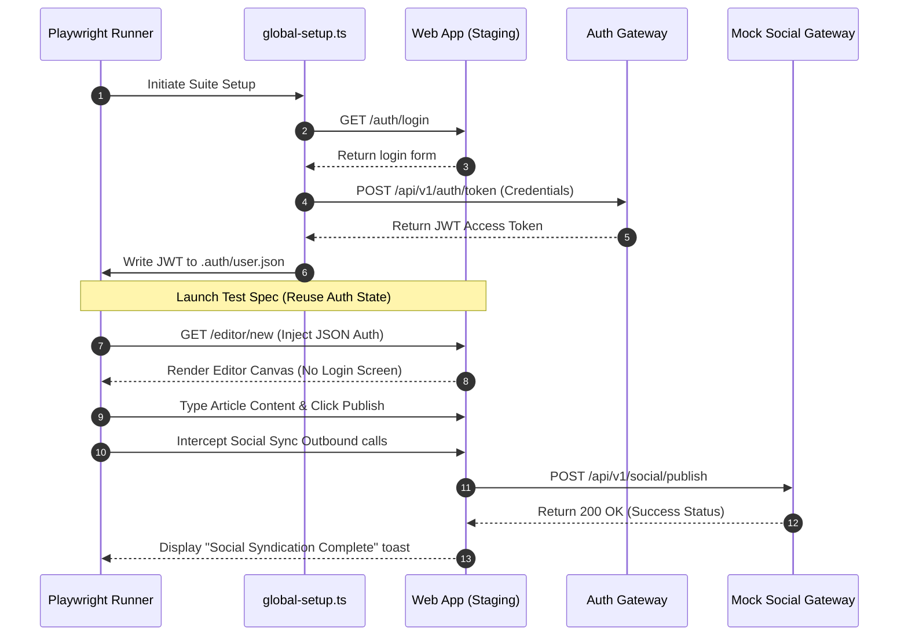

# End-to-End Playwright Testing Specifications

## Purpose
This document establishes the End-to-End (E2E) testing framework, test suite configurations, authentication bypass strategies, and automation scripts for the NewsOps Cloud platform using Playwright. It defines target user journeys, multi-browser configurations, API intercept rules, and automated testing criteria for the Editor Dashboard and the Social Publishing system.

## Executive Summary
To ensure high software reliability across complex, multi-tenant digital news publishing flows, NewsOps Cloud relies on Playwright for end-to-end user journey validation. The test suite simulates actual user actions on headless browsers (Chromium, WebKit, and Firefox). By utilizing saved login states, tests bypass repeating authorization screens. This document details the complete configuration files, mock schemas, visual selectors, execution pipelines, and E2E specs for the CMS ecosystem.

## Vision
Our vision is to run robust, parallelized E2E tests with zero flakiness that execute within 10 minutes, validating critical reader and newsroom editing flows against every build before production release.

## Scope
The scope of E2E testing covers:
1. **Authentication and Session State**: Storing and sharing JWT cookies across multiple specs to bypass login screens.
2. **Collaborative WYSIWYG Editor**: Testing text additions, block styling, formatting shortcuts, and real-time co-author updates.
3. **Social Publisher Suite**: Linking third-party profiles (LinkedIn, X/Twitter) and testing automatic cross-posting integrations.
4. **Tenant Workspace Switching**: Verifying multi-tenant isolation, ensuring organization administrators can only see and access their own tenant's articles.

## Goals
- **Minimize Test Execution Latency**: Achieve parallelized execution across multiple browser environments in under `10 minutes`.
- **Eliminate Auth Overload**: Bypassing login flows on subsequent tests, reducing calls to the authentication provider (Keycloak/Auth0) by 90%.
- **Zero Regression in Critical Paths**: Guarantee 100% test coverage for the article publish and social media share flows.

## Functional Requirements
1. **Session Bypass (State Reuse)**: Playwright must compile and save user auth tokens (`cookies`, `localStorage`) to a localized JSON file during startup, which subsequent tests load automatically.
2. **Real-time Collaboration Testing**: Launch dual browser contexts (User A and User B) to verify co-editing cursor presence and non-conflicting save operations.
3. **Third-party Social Mocking**: Intercept outbound calls to social networks (e.g. LinkedIn API, X API) and return stubbed responses to prevent dependency on third-party uptime.
4. **Visual Regression Verification**: Compare screenshots of critical dashboard layouts against master baselines during test compilation to detect layout shift regressions.

## Non-Functional Requirements
1. **Parallel Execution Shards**: The runner must support splitting the E2E test files into `4 parallel shards` in the CI pipeline.
2. **Automatic Retries**: Retries must be capped at exactly `2 attempts` inside CI environments to account for transient network drops, and `0 attempts` in local developer mode.
3. **Video and Trace Capture**: Playwright must capture trace logs (`trace.zip`) and video recordings for every failed test run, archiving them as CI artifacts.

## Business Rules
1. **Database Seeding and Isolation**: Every E2E run must start with a clean test tenant namespace (`tenant_uuid_e2e_99`) initialized via a seeding script before the suite starts.
2. **No Production Database Connections**: Playwright tests are forbidden from executing against the production database. All tests target staging/ephemeral environments.
3. **Strict Selector Policy**: Developers must decorate interactive test targets (buttons, inputs) with the `data-testid` attribute. Standard DOM class-based selectors are banned.

## Actors
- **QA Automation Engineer**: Writes and maintains Playwright test scripts, configures mocks, and monitors flake rate.
- **Newsroom Writer**: Operates the article writing canvas (simulated via Playwright).
- **Social Media Manager**: Manages syndication check-boxes and profile linking.
- **DevOps Engineer**: Integrates E2E sharding in Jenkins/GitHub Actions and archives trace metrics.

## User Stories
1. **Bypassing Login Screens**: As a QA Automation Engineer, I want the E2E framework to reuse a pre-saved browser state so that my test suite doesn't spend time re-entering credentials for all 50 test cases.
2. **Collaborative Text Verification**: As a Newsroom Writer, I want to ensure that if my colleague and I edit different sections of an article concurrently, both changes are preserved in the DB without lock errors.
3. **Cross-Posting Social Intercept**: As a Social Media Manager, I want to verify that checking the "Share to LinkedIn" option during article publication successfully routes the post metadata to our social queue without hitting real API rate limits.

## Acceptance Criteria
1. **Auth State Setup Time**: The authentication preparation script must run first, save credentials in under `3 seconds`, and allow next tests to launch directly onto authenticated routes.
2. **Editor Autosave Stability**: Writing inside the collaborative editor canvas must trigger an automatic save request within `1.5 seconds` of typing inactivity, asserting a `status: saved` tag in the bottom status bar.
3. **Interception Coverage**: 100% of social media platform outbound integrations must be intercepted using `route.fulfill()`, verifying correct payload composition (containing correct title, link, and tenant keys).

## Workflows

### 1. Authenticated Session Setup and Execution Workflow
```
CI Container Spins Up -> Execute global-setup.ts
                                  |
                                  v
                       Launch Browser Headless
                                  v
                       Navigate to /auth/login
                                  v
                      Submit Credentials Form
                                  v
                    Save state to .auth/user.json
                                  |
       -------------------------------------------------------
       |                                                     |
Launch Test Spec A (Reader)                          Launch Test Spec B (CMS)
       |                                                     |
Inject .auth/user.json (Bypass Login)               Inject .auth/user.json (Bypass Login)
       |                                                     |
Navigate straight to /reader/dashboard              Navigate straight to /editor/new
```

### 2. Social Publisher Integration Verification Workflow
1. Playwright test script launches page and navigates to `/editor/article-123`.
2. Script invokes intercept rule: `await page.route('**/api/v1/social/publish', route => route.fulfill({ status: 200, body: JSON.stringify({ success: true }) }))`.
3. Script locates the "Social Publisher" pane on the right.
4. It clicks the "LinkedIn Share" checkbox: `await page.locator('data-testid=linkedin-share-toggle').click()`.
5. Script enters custom social post copy: `Check out our latest breaking news!`.
6. Script clicks the "Publish & Share" action button.
7. Script intercepts the request, validates that the POST body contains the custom copy, and verifies that a success toast (`Article Published and Shared`) is rendered on the screen.

## API Design

### 1. Seeding Endpoint for E2E Database State
- **Method**: `POST`
- **Path**: `/api/v1/e2e/seed`
- **Headers**:
  - `X-E2E-Secret`: `system_e2e_key_99`
  - `Content-Type`: `application/json`
- **Request Payload**:
```json
{
  "tenant_id": "tenant_uuid_e2e_99",
  "seed_profile": "editorial_standard",
  "articles": [
    {
      "id": "art_uuid_991",
      "title": "Initial Seed Story",
      "content": "This is raw seeded content.",
      "status": "draft"
    }
  ]
}
```
- **Response (200 OK)**:
```json
{
  "seeded": true,
  "tenant_id": "tenant_uuid_e2e_99",
  "records_inserted": 1,
  "timestamp": "2026-06-27T17:50:00Z"
}
```

### 2. Teardown Database State
- **Method**: `POST`
- **Path**: `/api/v1/e2e/teardown`
- **Headers**:
  - `X-E2E-Secret`: `system_e2e_key_99`
- **Response (200 OK)**:
```json
{
  "status": "cleaned",
  "tenant_purged": "tenant_uuid_e2e_99"
}
```

## Database Design
No operational database schemas are defined in this file. However, during the `global-setup` phase, the database runs a transactional cleanup hook:
```sql
-- Transactional DB Reset block executed during staging E2E start
BEGIN;
DELETE FROM social_publish_jobs WHERE tenant_id = 'tenant_uuid_e2e_99';
DELETE FROM articles WHERE tenant_id = 'tenant_uuid_e2e_99';
DELETE FROM users WHERE tenant_id = 'tenant_uuid_e2e_99';
-- Insert fresh test profiles
INSERT INTO users (id, email, role, tenant_id) 
VALUES ('usr_uuid_e2e_editor', 'e2e-editor@newsops.cloud', 'editor', 'tenant_uuid_e2e_99');
COMMIT;
```

## UI Design
To interact reliably, the E2E script depends on consistent HTML attributes:
1. **Editor Canvas Area**: Decorated with `<div data-testid="editor-canvas" contenteditable="true">` for keyboard input simulations.
2. **Social Toggle Panel**: The platform choices checkbox group utilizes clear markers:
   - `<input type="checkbox" data-testid="platform-checkbox-linkedin" />`
   - `<input type="checkbox" data-testid="platform-checkbox-twitter" />`
3. **Publish Confirm Trigger**: The save-publish flow uses `<button data-testid="publish-confirm-btn">`.

## Permissions
The Playwright test actors assume specific permissions during script execution:
- `e2e-editor@newsops.cloud` (Editor user configuration):
  - `articles:create`
  - `articles:write`
  - `social:publish`
- `e2e-admin@newsops.cloud` (Admin user configuration):
  - `tenant:settings:write`
  - `articles:publish`

## Security
1. **Auth Storage Protection**: The output file `.auth/user.json` contains sensitive JWT keys and session tokens. It is explicitly added to `.gitignore` to prevent leaks.
2. **Access token validation**: Staging test APIs verify the `X-E2E-Secret` header before running seeding queries, preventing execution of teardown endpoints in production environments.
3. **Sanitized Inputs**: Playwright text input tests avoid passing executable `<script>` blocks unless testing security XSS sanitizer coverage specifically.

## Performance
- **Disable Dynamic Media Loading**: E2E test runs configure the browser to block image and video asset downloads (`**/*.{png,jpg,jpeg,mp4}`) to save 30% execution time.
- **Trace Overhead**: Enable tracing only on the first retry of failed tests (`trace: 'on-first-retry'`) to minimize processing CPU load during successful initial runs.

## Monitoring
Telemetry of test runs is recorded using these Prometheus metrics:
- `newsops_e2e_test_duration_seconds`: Histogram tracking test file execution runtimes.
- `newsops_e2e_test_failures_total`: Counter tracking test failures, with labels `[spec_file, browser, environment]`.

### Alert Triggers
- **Pipeline Fail Notification**: If `newsops_e2e_test_failures_total` is greater than `0` on the `main` branch build, trigger a high-severity Slack build alert.

## Logging
E2E suite execution logging is written in structured JSON:
```json
{
  "timestamp": "2026-06-27T17:52:10.450Z",
  "level": "INFO",
  "context": "playwright-test-runner",
  "spec_file": "editor_collaboration.spec.ts",
  "browser": "chromium",
  "action": "click",
  "selector": "data-testid=publish-confirm-btn",
  "message": "Clicking publish confirmation button to trigger article publish event."
}
```

## Error Handling
| Error Code | Source Component | HTTP Status | Customer-Facing Message |
| :--- | :--- | :--- | :--- |
| `ERR_PLAYWRIGHT_TIMEOUT` | Playwright Runner | 408 Timeout | The test runner execution timed out waiting for the page element to appear. |
| `ERR_AUTH_STATE_LOAD_FAILED` | E2E Setup Module | 500 Internal Error | The session storage JSON was empty or malformed. |
| `ERR_INTERCEPT_MOCK_ERROR` | Network Manager | 502 Bad Gateway | The test runner was unable to mock the third-party publisher API. |

## Edge Cases
1. **WebSocket Collaboration Dropouts**: If User A and User B edit simultaneously and the mock collaborative server drops, both cursors desynchronize. The spec handles this by monitoring the connectivity indicator element (`data-testid=sync-indicator`) and forcing a page reload if it toggles to `disconnected`.
2. **Flaky Auth0 Token Expiry**: The saved `.auth/user.json` expires midway through a long test run. Mitigated by checking the expiry claim (`exp`) of the cached JWT. If expired, it triggers a fresh login run automatically.
3. **Dynamic Elements Render Lag**: Elements like select drop-downs might render animations causing premature click errors. Use explicit action states like `await page.click('data-testid=publish-btn', { force: true })` or check locator stability.

## Future Improvements
1. **Visual Regression Matching**: Incorporate pixel-perfect visual validation tools (e.g. Playwright's `toHaveScreenshot`) to verify UI visual layout stability across dynamic viewports.
2. **Network Latency Emulation**: Stagger API mock response times during E2E runs to test application loading skeletons and spinner states under poor network speeds.
3. **AI-Driven E2E Healing**: Integrate automated locator generators that auto-heal scripts if design updates change the underlying page DOM structure.

## Mermaid Diagrams

### E2E Test Execution Sequence


## References
- [UI Component Design Standards](../12-ui/index.md)
- [System Architecture & Network Routing](../02-architecture/system_architecture.md)
- [DevOps CI/CD Build Pipelines](../11-devops/index.md)
- [Load and Performance Test Specifications](./load_and_performance.md)
- [Security Scanning and Compliance Standards](./security_scans.md)
- [Accessibility Compliance Specifications](./accessibility_scans.md)
