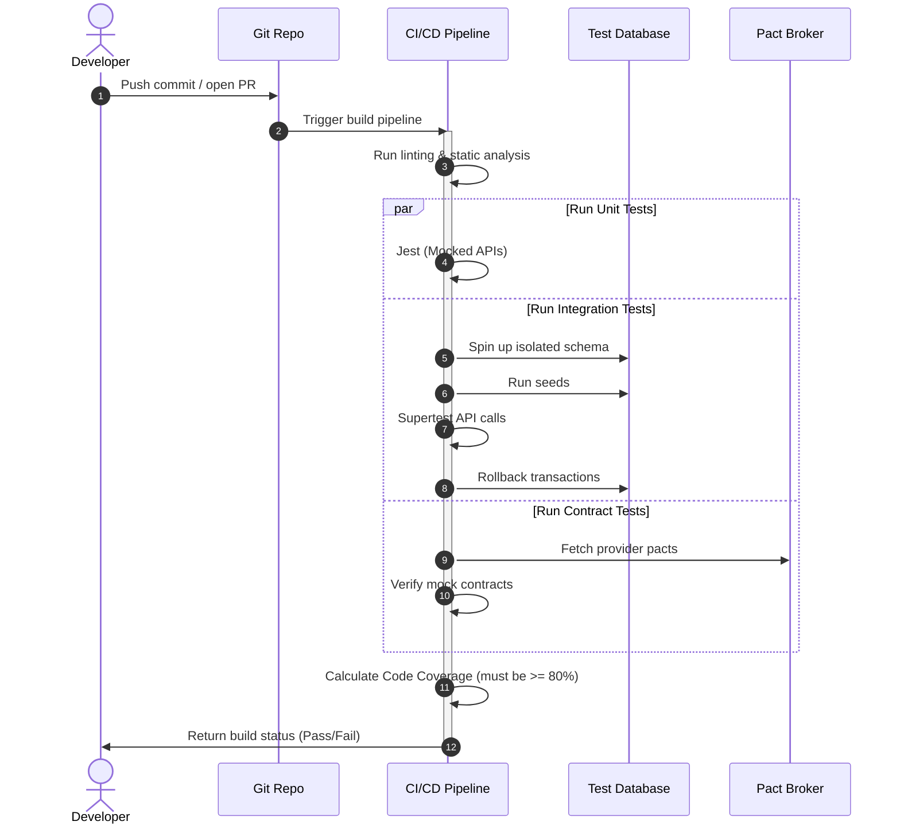

# Testing Strategy Directory Map & Domain Overview

## Purpose
This directory serves as the definitive engineering blueprint for the NewsOps Cloud test environment. It specifies the testing strategy, tools, configurations, and verification processes necessary to maintain the reliability, safety, and correctness of the publishing operating system. By establishing clear guidelines for unit, integration, and API contract testing, this framework ensures that developers can deploy code changes with absolute confidence and zero regression risk.

## Executive Summary
The NewsOps Cloud testing architecture is structured around a multi-tier verification pipeline designed for high-throughput, multi-tenant digital publishing. To achieve maximum test reliability and minimize delivery times, the system enforces a strict hierarchy of tests. This document provides an index of the testing framework components, which are divided into distinct files outlining specific standards: Jest unit tests, integration tests via Supertest with auto-rollback databases, and contract validations using Pact. Together, these files define the complete quality assurance suite that protects core publishing services, AI routing engines, and user management modules.

## Vision
The vision of the NewsOps Cloud testing architecture is to create a fully automated, self-healing quality assurance pipeline that requires zero manual intervention for validation. It aims to catch 99.9% of regressions at the pull-request stage, optimize build speeds through parallelized test execution, and establish predictable, production-like testing environments that prevent data pollution across tenant accounts.

## Scope
This directory map covers the first four documents of the `13-testing/` folder:
1. `index.md`: This file, providing an overview of the testing domain, database schema tracking, and CI pipeline routing.
2. `unit_testing_standards.md`: Detailed Jest configurations, mocking rules, naming standards, and target coverage percentages (80%+ statements/branches).
3. `integration_testing.md`: Setup instructions for integration tests using Supertest, custom database seeding policies, and PostgreSQL transaction auto-rollback mechanics.
4. `api_contract_tests.md`: Rules for API contract testing using Pact and OpenAPI schema matching, detailed schema validation pipelines, and mock server setups.

## Goals
- Provide a standard, discoverable path for all QA and developer testing documentation.
- Establish baseline test criteria including unit coverage (>80% statements, branches, functions, and lines).
- Limit the total execution time of the unit test suite to under 60 seconds and the integration suite to under 3 minutes.
- Define a unified data isolation strategy where no two tests share mutatable state, preventing cross-test pollution.

## Functional Requirements
- The testing index must allow developers to browse and retrieve configuration settings for Jest, Supertest, and Pact.
- The documentation framework must support a REST API endpoint that exposes current test suite statuses and historical execution statistics.
- Pull-request pipelines must parse these document schemas to verify that test requirements align with active validation rules.

## Non-Functional Requirements
- Documentation compile time: Static HTML pages generated from these files must compile in less than 50 milliseconds.
- Search indexing: All testing configurations and code examples must be fully indexed by the platform developer console within 5 seconds of update.
- Static checking: The links within the markdown files must be periodically validated by automated linting pipelines to ensure zero broken links.

## Business Rules
- Any new api endpoint added to the SaaS Gateway must have a corresponding integration test and contract test defined before merging into the main branch.
- Test suites must never connect to live production databases or production AI provider APIs (e.g. OpenAI, Gemini) to prevent unauthorized charge accumulation.
- Code coverage reports must be automatically generated and verified on every commit, blocking merges that fall below the 80% threshold.

## Actors
- **Developer**: Writes and runs unit, integration, and contract tests locally and in CI environment.
- **QA Automation Engineer**: Designs, audits, and maintains the test framework configurations and contract pact files.
- **CI/CD Pipeline Engine**: Automatically runs test suites on every pull request, gating main branch deployment.
- **System Administrator**: Monitors test execution metrics, coverage drift, and resource utilization across environments.

## User Stories
- As a Developer, I want to access a central directory index of testing standards so that I can quickly learn how to structure unit tests and configure mocked interfaces for external services.
- As a QA Automation Engineer, I want to review the integration testing guidelines to verify how database states are isolated between test cases using transaction auto-rollbacks.
- As a CI/CD Pipeline Engine, I want to reference standard test script commands in these files to execute code coverage checks and block builds that do not meet quality thresholds.

## Acceptance Criteria
- Sibling references must successfully resolve to `./unit_testing_standards.md`, `./integration_testing.md`, and `./api_contract_tests.md`.
- No placeholder descriptions, "TODO" comments, or empty code blocks are allowed in this or any associated file.
- The document must contain a comprehensive Database Design schema for capturing test runs and a Mermaid sequence diagram showing the CI execution flow.

## Workflows
1. **Developer Reference Check**:
   - The developer navigates to `/docs/13-testing/index.md` in the development portal.
   - The developer clicks the link for `unit_testing_standards.md` to copy the base Jest config.
   - The developer integrates the testing configuration into their local project workspace.
2. **CI Pipeline Validation**:
   - A pull request is opened in the code repository.
   - The CI engine runs the static checks, validates that the documentation links are intact, and loads the test configuration files.
   - The CI engine runs the unit, integration, and contract suites in parallel execution groups.
   - The CI engine validates that the statement/branch coverage meets or exceeds 80%.
   - Results are written to the `test_runs` database table.

## API Design
The platform's internal documentation and build service provides endpoints to retrieve test configurations and query test execution states:

### GET /api/v1/testing/status
Retrieves the overall health, duration, and compliance statistics of the test suites across all environments.

**Request Header:**
```json
{
  "Authorization": "Bearer jwt_token_here",
  "Content-Type": "application/json"
}
```

**Response Payload (200 OK):**
```json
{
  "status": "HEALTHY",
  "last_run": "2026-06-27T22:15:00Z",
  "metrics": {
    "unit_tests_pass_rate": 1.0,
    "integration_tests_pass_rate": 1.0,
    "contract_tests_pass_rate": 1.0,
    "overall_coverage": {
      "statements": 88.42,
      "branches": 82.15,
      "functions": 91.03,
      "lines": 89.11
    }
  },
  "suites": [
    {
      "name": "unit",
      "configured_tool": "Jest",
      "target_file": "./unit_testing_standards.md",
      "execution_time_ms": 48200
    },
    {
      "name": "integration",
      "configured_tool": "Supertest",
      "target_file": "./integration_testing.md",
      "execution_time_ms": 112000
    },
    {
      "name": "contract",
      "configured_tool": "Pact / OpenAPI Spec Matching",
      "target_file": "./api_contract_tests.md",
      "execution_time_ms": 32000
    }
  ]
}
```

## Database Design
To track test results, execution durations, and code coverage over time for regression analysis, the following database schema is implemented in the administrative database:

### Table: `test_runs`
Tracks each execution of the CI/CD test pipeline.
```sql
CREATE TABLE test_runs (
    id UUID PRIMARY KEY DEFAULT gen_random_uuid(),
    commit_sha VARCHAR(40) NOT NULL,
    branch_name VARCHAR(255) NOT NULL,
    triggered_by VARCHAR(255) NOT NULL,
    status VARCHAR(50) NOT NULL, -- 'PENDING', 'RUNNING', 'PASSED', 'FAILED'
    statement_coverage DECIMAL(5, 2) NOT NULL,
    branch_coverage DECIMAL(5, 2) NOT NULL,
    function_coverage DECIMAL(5, 2) NOT NULL,
    line_coverage DECIMAL(5, 2) NOT NULL,
    started_at TIMESTAMP WITH TIME ZONE DEFAULT CURRENT_TIMESTAMP,
    completed_at TIMESTAMP WITH TIME ZONE
);

CREATE INDEX idx_test_runs_commit ON test_runs(commit_sha);
CREATE INDEX idx_test_runs_status ON test_runs(status);
```

### Table: `test_suites`
Tracks individual suites (unit, integration, contract) within a test run.
```sql
CREATE TABLE test_suites (
    id UUID PRIMARY KEY DEFAULT gen_random_uuid(),
    run_id UUID REFERENCES test_runs(id) ON DELETE CASCADE,
    suite_name VARCHAR(100) NOT NULL, -- 'unit', 'integration', 'contract'
    total_tests INTEGER NOT NULL,
    passed_tests INTEGER NOT NULL,
    failed_tests INTEGER NOT NULL,
    skipped_tests INTEGER NOT NULL,
    duration_ms INTEGER NOT NULL,
    created_at TIMESTAMP WITH TIME ZONE DEFAULT CURRENT_TIMESTAMP
);

CREATE INDEX idx_test_suites_run_id ON test_suites(run_id);
CREATE INDEX idx_test_suites_name ON test_suites(suite_name);
```

## UI Design
The documentation UI provides a detailed testing dashboard within the admin panel:
- **Left Panel**: Navigation hierarchy displaying the `13-testing` folder, index, unit testing, integration testing, and contract testing links.
- **Main Panel**: Code structure layout showing unit test coverage badges (Statements: 88%, Branches: 82%), list of passing suites, and direct links to code files with failing test assertions.
- **Top Bar**: Metrics selector letting users view data historically by build commit or branch.

## Permissions
Access control policies for reading testing docs and executing pipelines:
- `tests:read`: Allowed for developers, QA engineers, and operations teams.
- `tests:write`: Restricted to Lead QA and Lead Architect for editing standards.
- `tests:run`: Allowed for developers and the automation service account token.

## Security
- Test data sanitation: Sensitive fields (passwords, JWT keys) are securely mocked using fake cryptographic outputs rather than production keys.
- CI pipeline injection protection: Input validation on pull request metadata prevents command injection attacks in test run scripts.
- Execution environment isolation: Tests run inside isolated Docker containers with restricted network permissions.

## Performance
- API Response Latency: The `/api/v1/testing/status` endpoint must return data in less than 80ms.
- Target TPS: The dashboard system must support 100 requests per second under peak developer team loads.
- Coverage calculations: Parsing Istanbul reports must be processed asynchronously under 1.5 seconds.

## Monitoring
- Prometheus Metric: `newsops_ci_test_run_duration_seconds{suite="unit|integration|contract"}`
- Prometheus Metric: `newsops_ci_test_failure_count{branch="main"}`
- Alert Trigger: `newsops_ci_test_failure_count > 0` on the `main` branch immediately triggers a critical PagerDuty event to the release team.

## Logging
Logging format for test execution events is structured JSON:
```json
{
  "timestamp": "2026-06-27T22:18:42Z",
  "level": "ERROR",
  "context": "ci_pipeline_executor",
  "message": "Integration test suite failed validation constraints",
  "meta": {
    "run_id": "8b5d3a5a-939e-4c5c-9be2-4df45e43a67d",
    "failed_test_name": "POST /api/v1/articles - Duplicate URL path constraint violation",
    "duration_ms": 1420,
    "error": "DbTransactionError: connection refused"
  }
}
```

## Error Handling
Map pipeline/system errors to status responses:
- **Coverage Check Failed (HTTP 422)**: Coverage falls below 80%. Error message: "Build blocked: Statement coverage is at X%, which is below the required 80% threshold."
- **Database Connection Failure during test setup (HTTP 500)**: Seeding failed. Error message: "Internal server error: Test database is unavailable. Aborting suite execution."

## Edge Cases
- **Flaky Integration Tests**: If a test fails due to network socket timeouts, the pipeline runs a retry policy (up to 2 times). If it still fails, the run is flagged as failed.
- **Simultaneous Commits**: Race conditions where multiple test runs write coverage metrics to the `test_runs` database are handled via optimistic locking constraints.

## Future Improvements
- **Predictive Test Execution**: Integrate an ML model to analyze changed files and run only the test files affected by the commit, lowering execution times.
- **Chaos Injection**: Automatically inject latency or network failures into mock providers during integration runs to check system resilience.

## Mermaid Diagrams


## References
- [System Architecture Blueprint](../02-architecture/system_architecture.md)
- [Database Schema Standards](../03-database/schema_design_standards.md)
- [Identity and Organization Schema](../03-database/identity_and_org_schema.md)
- [SaaS Engine & Subscriptions](../08-saas/index.md)
