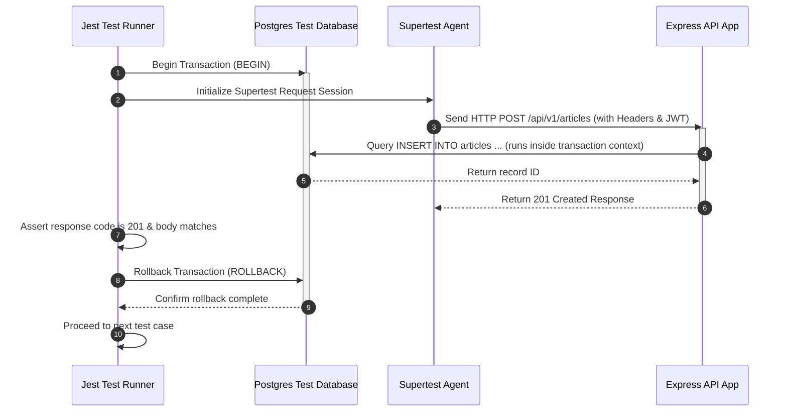

# Integration Testing Strategy

## Purpose
This document outlines the architecture, tooling, and execution guidelines for integration testing within the NewsOps Cloud digital publishing system. It defines how we verify the interaction between API layers, databases, caches, and third-party webhooks. Specifically, it establishes the configuration details for API testing using **Supertest**, isolated database transaction workflows using database rollbacks, and standard seeding strategies for testing database environments.

## Executive Summary
Unlike unit tests that rely entirely on mocks, integration tests verify the runtime compilation and connection of the entire software stack. We use **Supertest** to execute HTTP requests against the application routers without opening a physical network socket. To maintain absolute isolation between test executions, every test case runs inside an isolated PostgreSQL transaction that is automatically rolled back upon completion. This document describes our test container environments, seeding policies, transaction lifecycle wrappers, and standard test scripts.

## Vision
The vision of the integration testing strategy is to provide a fast, deterministic, and isolated testing suite that validates the integration of our API, ORM, and database constraints. Every test case should execute in less than 300ms, and the database should clean itself automatically using database transaction rollbacks, eliminating the overhead of dropping and recreating tables between tests.

## Scope
This strategy applies to all core REST and GraphQL API routes, database interaction models, webhook validation endpoints, and middleware chains (e.g. rate-limiting, authentication, tenant identification) within the NewsOps Cloud platform.

## Goals
- Enforce the validation of 100% of public REST endpoints via automated integration test suites.
- Guarantee database cleanups through auto-rollback mechanisms, achieving 100% data isolation between concurrent tests.
- Maintain a test database seeding time of under 5 seconds for core static records.
- Standardize the error verification format for HTTP status codes (2xx, 4xx, 5xx) returned by the API gateways.

## Functional Requirements
- Router Testing: Tests must use Supertest to trigger controllers, validation middleware, and data access objects.
- Transaction Control: The integration test runner must wrap every test assertion block in a PostgreSQL transaction (`BEGIN TRANSACTION` and `ROLLBACK`).
- Environment Detection: The testing framework must detect the running environment and block execution if run against production database connection strings.

## Non-Functional Requirements
- Execution Speed: API integration test suites must run at a minimum rate of 10 test files per second when executed in parallel.
- Resource footprint: Testing databases should run inside local Docker containers, requiring less than 500MB of RAM.
- Consistency: Tests must execute identically locally and within CI/CD pipelines by utilizing Dockerized test container environments.

## Business Rules
- Integration tests must never execute against actual tenant accounts or production databases.
- Integration tests must check that the rate-limiter logic correctly triggers HTTP 429 when threshold limits are exceeded.
- Seeding data must be separated into "Static Base Data" (immutable reference data, RBAC structures) and "Dynamic Scenario Data" (tenant-specific context created during test runtime).

## Actors
- **Software Engineer**: Creates integration test scenarios to verify endpoint behaviors and DB states.
- **QA Automation Engineer**: Audits database seeding structures and configures container environments.
- **CI Runner**: Configures a clean database service container, runs migrations, seeds core files, and runs the test suite.

## User Stories
- As a Developer, I want to write integration tests using Supertest so that I can verify that authentication headers, validation middleware, and ORM query builders function correctly.
- As a Developer, I want database changes made during an integration test to be rolled back automatically so that subsequent tests start with a clean, predictable state.
- As a QA Automation Engineer, I want a standard seed script that populates required tenant tiers and RBAC roles once before the test suite starts, preventing duplicate database operations.

## Acceptance Criteria
- The testing environment must block execution if the `DATABASE_URL` environment variable contains production host domains.
- The transaction rollback wrapper code block must prove that database records created during a test block are deleted before the next test case executes.
- Every API endpoint test must verify at least three states: Success (2xx), Invalid Input Validation (400 Bad Request), and Unauthorized (401 Unauthorized).

## Workflows
1. **Suite Initialization**:
   - The test runner spins up the PostgreSQL test container.
   - The runner runs all pending database migrations (`npx prisma migrate deploy`).
   - The runner executes the global seed file (`npx prisma db seed`) to populate roles, pricing tiers, and static properties.
2. **Individual Test Run**:
   - Jest initializes the test context.
   - A PostgreSQL transaction client is opened (`BEGIN`).
   - Supertest fires an HTTP request against the API server instance, passing the mocked transaction client to the database router.
   - The test asserts response payloads, database records, and side-effect logs.
   - The runner executes a `ROLLBACK` command, clearing all changes.
3. **Container Teardown**:
   - The test runner outputs execution statistics.
   - The PostgreSQL test container is stopped and discarded.

## API Design
Integration tests target the API paths directly. The following endpoints are validated during standard integration testing:

### POST /api/v1/auth/register
Registers a new platform user and tenant workspace.

**Request Payload:**
```json
{
  "email": "test-publisher@newsops.cloud",
  "password": "SecurePassword123!",
  "organization_name": "Test Publishing Corp",
  "plan_tier": "ENTERPRISE"
}
```

**Response Payload (201 Created):**
```json
{
  "user": {
    "id": "u_9b1deb4d-3b7d-4b2a-9e32-2d12513f5c7d",
    "email": "test-publisher@newsops.cloud",
    "role": "OWNER"
  },
  "organization": {
    "id": "org_7e3d8f2a-5b1c-4b9d-a3e2-1a2b3c4d5e6f",
    "name": "Test Publishing Corp",
    "plan_tier": "ENTERPRISE"
  },
  "token": "eyJhbGciOiJIUzI1NiIsIn..."
}
```

## Database Design
To support integration testing and prevent database locks, the test execution runs against isolated target schemas:

### Schema Isolation Model
We assign a unique database schema dynamically per worker thread to enable parallel execution without race conditions:
```sql
-- Executed programmatically per Jest worker thread
CREATE SCHEMA IF NOT EXISTS test_schema_worker_1;
SET search_path TO test_schema_worker_1, public;
```

### Seed Tracking Table (`test_seeds`)
Tracks which baseline datasets have been imported during the pre-test lifecycle.
```sql
CREATE TABLE test_seeds (
    seed_name VARCHAR(100) PRIMARY KEY,
    seeded_at TIMESTAMP WITH TIME ZONE DEFAULT CURRENT_TIMESTAMP,
    record_count INTEGER NOT NULL,
    status VARCHAR(50) NOT NULL -- 'SUCCESS', 'FAILED'
);
```

## UI Design
While integration tests are headless, test outcomes can be monitored via the pipeline output view:
- **Test Matrix Summary Table**: Lists endpoint method, path, response latency, and database execution times.
- **Fail Logs Pane**: Shows the exact diff between expected response payload and the actual response output.

## Permissions
Execution permission models for testing actions:
- `db:migrate`: Allowed for the CI execution runner service account.
- `db:seed`: Restrained to local development profiles and CI container initializers.

## Security
- No Production Connections: Hard check in the connection pool to throw errors if the target host contains production identifiers:
  ```typescript
  if (process.env.DATABASE_URL.includes("neon.tech") && process.env.NODE_ENV === "test") {
      throw new Error("CRITICAL: Integration tests cannot be executed against production database!");
  }
  ```
- Data Sanitization: Dynamic seed records generate random passwords via cryptographic hashes (Argon2ID) to maintain standard hashing pipeline behaviors.

## Performance
- API Processing Latency: Individual Supertest API queries must resolve inside the router in less than 50ms (excluding external third-party API mocks).
- Database Rollback Speed: The transaction rollback must execute in under 10ms.

## Monitoring
- Prometheus Metric: `newsops_integration_test_duration_seconds`
- Prometheus Metric: `newsops_integration_test_failures_total`
- Alert Trigger: If the average integration test duration increases by > 20% across two consecutive builds, an alert warning is dispatched to the performance optimization channel.

## Logging
Detailed logging formats capture query executions during integration test states:
```json
{
  "timestamp": "2026-06-27T22:31:02Z",
  "level": "DEBUG",
  "context": "database_transaction_wrapper",
  "message": "Auto-rollback executed successfully for test session",
  "meta": {
    "test_name": "POST /api/v1/articles - should enforce tenant database isolation rules",
    "transaction_id": "tx_abc123xyz",
    "duration_ms": 14
  }
}
```

## Error Handling
Map testing database errors to standard outputs:
- **Database Lock Timeout (HTTP 500)**: Multiple tests waiting on resource locks. Output: "Test execution failed: Database query timeout or lock contention detected. Verify test isolation scopes."
- **Constraint Violation on Seed Data (HTTP 409)**: Trying to seed duplicated data. Output: "Seed failed: Duplicate record found. Ensure database is clean before running seeds."

## Edge Cases
- **Nested Transactions**: If the core code path uses its own transactions, the rollback client must use PostgreSQL `SAVEPOINT` identifiers to allow nested rollbacks without invalidating the parent test transaction.
- **Leaked Connections**: Unreleased connection handles to PostgreSQL pools are mitigated by explicitly invoking `await pool.end()` in the global teardown block.

## Future Improvements
- **Write-Ahead Log (WAL) Replay**: Fast database replication to restore test databases dynamically using disk images instead of executing migrations.
- **Real-time Webhook Mocks**: Emulate live stripe or social platform webhooks inside the integration environment using local HTTP wiremock servers.

## Mermaid Diagrams


## References
- [Testing Strategy Directory Index](./index.md)
- [Unit Testing Standards](./unit_testing_standards.md)
- [API Contract Testing](./api_contract_tests.md)
- [Database Schema Design Standards](../03-database/schema_design_standards.md)

---

# Appendices: Configurations & Examples

### Appendix A: Supertest Environment Setup (`test/integration/setup.ts`)
```typescript
import { Express } from 'express';
import { createServer } from '@src/server';
import { prisma } from '@src/database/client';
import { execSync } from 'child_process';

let appInstance: Express;

beforeAll(async () => {
  // Prevent execution on production servers
  if (process.env.DATABASE_URL?.includes('production-db-instance')) {
    throw new Error('Canceled execution. Running tests against production databases is forbidden.');
  }

  // Ensure DB matches current schema layout
  execSync('npx prisma migrate deploy', { stdio: 'inherit' });
});

afterAll(async () => {
  // Close database connections safely
  await prisma.$disconnect();
});
```

### Appendix B: Prisma Transaction Auto-Rollback Handler
To run tests inside transaction boundaries without committing mutations, the application utilizes a custom Prisma proxy inside the integration runner:
```typescript
import { PrismaClient } from '@prisma/client';
import { prisma } from '@src/database/client';

export type TransactionClient = Omit<
  PrismaClient,
  '$connect' | '$disconnect' | '$on' | '$transaction' | '$use'
>;

export function runInTransaction(
  testBlock: (tx: TransactionClient) => Promise<void>
): () => Promise<void> {
  return async () => {
    try {
      // Start a transaction block and enforce an auto-rollback path
      await prisma.$transaction(async (tx) => {
        await testBlock(tx);
        // Throw a sentinel error to force a rollback after assertion checks
        throw new RollbackSentinel();
      });
    } catch (error) {
      if (error instanceof RollbackSentinel) {
        // Rollback completed successfully, suppress sentinel error
        return;
      }
      throw error;
    }
  };
}

class RollbackSentinel extends Error {
  constructor() {
    super('Database auto-rollback trigger sentinel.');
    this.name = 'RollbackSentinel';
  }
}
```

### Appendix C: Endpoint Integration Test Example (`test/integration/articles.test.ts`)
```typescript
import request from 'supertest';
import { createServer } from '@src/server';
import { runInTransaction } from './setup';
import { generateTestToken } from '../helpers/auth';

const app = createServer();

describe('POST /api/v1/articles - Integration Tests', () => {
  it('should successfully create an article and index it', runInTransaction(async (tx) => {
    // Arrange
    const testToken = generateTestToken({
      userId: 'u_test_user_id',
      tenantId: 'tenant_123',
      role: 'EDITOR'
    });

    const payload = {
      title: 'Valid Integration Article Title',
      content: 'This content block is evaluated inside the test database environment.',
      category: 'TECHNOLOGY'
    };

    // Pre-insert tenant context inside the active transaction boundary
    await tx.organization.create({
      data: {
        id: 'tenant_123',
        name: 'Test Tenant Corp',
        planTier: 'ENTERPRISE'
      }
    });

    // Act
    const response = await request(app)
      .post('/api/v1/articles')
      .set('Authorization', `Bearer ${testToken}`)
      .send(payload);

    // Assert
    expect(response.status).toBe(201);
    expect(response.body).toHaveProperty('id');
    expect(response.body.title).toBe(payload.title);

    // Verify record exists in database during transaction
    const dbRecord = await tx.article.findUnique({
      where: { id: response.body.id }
    });
    expect(dbRecord).toBeDefined();
    expect(dbRecord?.title).toBe(payload.title);
  }));

  it('should reject creation request if input is invalid', runInTransaction(async (tx) => {
    // Arrange
    const testToken = generateTestToken({
      userId: 'u_test_user_id',
      tenantId: 'tenant_123',
      role: 'EDITOR'
    });

    const invalidPayload = {
      title: '', // Empty titles are invalid
      content: 'Short content.'
    };

    // Act
    const response = await request(app)
      .post('/api/v1/articles')
      .set('Authorization', `Bearer ${testToken}`)
      .send(invalidPayload);

    // Assert
    expect(response.status).toBe(400);
    expect(response.body.error).toBe('Validation failed');
    expect(response.body.details).toContain('Title cannot be empty');
  }));

  it('should reject requests without a valid JWT token', async () => {
    // Act
    const response = await request(app)
      .post('/api/v1/articles')
      .send({
        title: 'Unauthenticated Request Title',
        content: 'No auth headers provided.'
      });

    // Assert
    expect(response.status).toBe(401);
    expect(response.body.error).toBe('Unauthorized access');
  });
});
```
