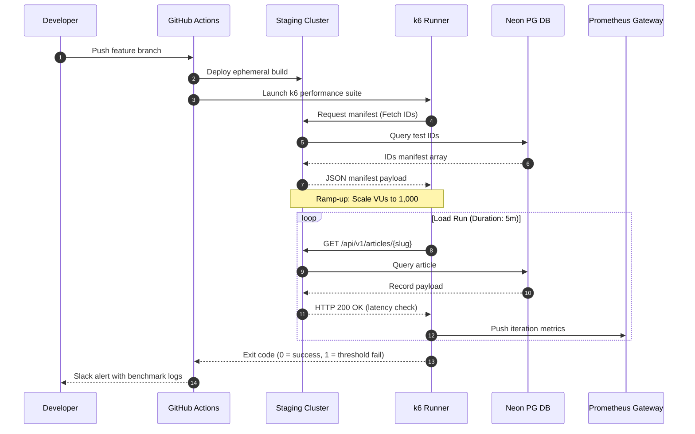

# Load and Performance Testing Specifications

## Purpose
This document establishes the load testing and performance validation framework for the NewsOps Cloud digital publishing platform. It details the scripts, test designs, baseline benchmarks, and quality gates required to verify that both reader-facing content delivery and editorial publishing systems meet their scalability, latency, and throughput SLA criteria before being released to production environments.

## Executive Summary
NewsOps Cloud serves public-facing media websites and internal editorial dashboards across multiple tenants. To prevent performance degradation, the CI/CD pipeline enforces performance test gates using the `k6` load testing utility. This document defines the load testing strategy, including a complete, ready-to-run k6 test script, performance budgets, error rate thresholds, system workflows under stress, and integration targets.

## Vision
Our vision is to run continuous, automated performance profiling that guarantees 10,000 Transactions Per Second (TPS) for public reader views and 500 concurrent collaborative editor operations, ensuring sub-second visual renders and rapid API response times globally.

## Scope
The scope of performance validation covers:
1. **Public-Facing Delivery API**: GET operations for articles, categories, search, and landing pages.
2. **CMS Editorial Dashboard**: POST, PUT, and DELETE operations, collaborative WebSocket synchronization, and file upload endpoints.
3. **Third-Party Syndication Ingress**: High-concurrency webhooks and syndication feeds.
4. **Static Regeneration Pipelines**: Next.js Incremental Static Regeneration (ISR) triggers and edge CDN cache-validation loops.

## Goals
- **Maintain SLA Limits**: Enforce P95 latency below 150ms for delivery APIs, and P95 latency below 200ms for CMS operations.
- **Ensure Stability Under Stress**: Confirm 0% request failures (HTTP 5xx) up to 10,000 public reader TPS.
- **Continuous Performance Feedback**: Automate performance regression detection with every build in pre-production staging environments.

## Functional Requirements
1. **Automated k6 Execution**: The CI/CD pipeline must invoke the local k6 engine after successful staging deployment.
2. **Dynamic Multi-Scenario Testing**: The performance suite must run distinct workloads representing standard traffic, peak traffic, and soak (longevity) profiles.
3. **Database Pool Stressing**: Validate Neon PgBouncer pooling limits by running database-intensive article search queries at scale.
4. **Telemetry Ingestion**: Output load test metrics to a Prometheus push gateway for visualization in standard Grafana dashboards.

## Non-Functional Requirements
1. **Resource Isolation**: Load tests must run in isolated staging environments and must not hit production databases or production CDNs.
2. **Data Cleanup**: Any transient database state created by load testing (e.g., mock users, temp posts) must be isolated to temporary schemas or pruned during test teardown.
3. **Test Runner Memory Footprint**: The k6 runner itself must use less than 1.5 GB of RAM per 1,000 virtual users (VUs) to prevent runner resource exhaustion.

## Business Rules
1. **Staging Environment Pre-requisite**: Load tests targeting greater than 1,000 TPS must be scheduled and executed only on the dedicated performance testing environment (staging-perf).
2. **SLA Failure Enforcement**: A build must fail if any performance threshold (P95 latency or HTTP error rate) is exceeded during the CI-triggered run.
3. **Synthetic Tenant Isolation**: Load tests must use dedicated sandbox tenants (`tenant_uuid_perf_test_99`) to prevent interference with tenant analytics or billing pipelines.

## Actors
- **QA Performance Engineer**: Authors, updates, and reviews k6 scripts and performance test configurations.
- **DevOps Engineer**: Configures the CI/CD pipeline, manages test infrastructure scaling, and tunes PostgreSQL PgBouncer parameters.
- **Backend Engineer**: Resolves latency bottlenecks, slow queries, and database locks identified by performance runs.
- **Mock Reader VU (Virtual User)**: Simulated client fetching page layouts and static assets.
- **Mock Editor VU**: Simulated client authenticating, writing content, and initiating publishing tasks.

## User Stories
1. **GraphQL Gateway Soak Test**: As a DevOps Engineer, I want to execute a 2-hour soak test at 50% capacity so that I can detect memory leaks or socket leaks in the Apollo GraphQL gateway.
2. **Neon Database Connection Pool Validation**: As a Backend Engineer, I want to stress the database pooling layer with 5,000 concurrent read-write queries so that I can verify the app gracefully queues requests without timing out.
3. **Enterprise SLA Verification**: As a Product Owner, I want the system to generate automated compliance reports showing that public endpoints serve requests under 150ms P95 so that we can legally guarantee our Enterprise SaaS SLAs.

## Acceptance Criteria
1. **Public API Delivery Gate**: Under a steady state load of 10,000 TPS, the P95 latency of the `/api/v1/articles/latest` endpoint must not exceed `150ms`, and the error rate (HTTP 5xx) must remain exactly `0.00%`.
2. **CMS Collaborative Editor Gate**: Under a concurrent load of 500 VUs writing to collaborative documents, the P95 response time for saving content blocks must be below `200ms`.
3. **Auto-scaling Latency Transition**: During horizontal pod scaling (from 2 replicas to 10 replicas), transient P99 latency spikes must not exceed `800ms`, returning to `<150ms` within `90 seconds` of node startup.

## Workflows

### 1. CI/CD Performance Verification Workflow
```
Developer Pushes Code -> Build Completed -> Ephemeral Environment Deployed
                               |
                               v
                     Initiate k6 Test Runner
                               |
            ---------------------------------------
            |                                     |
    Execute Reader API Tests (GET)        Execute CMS Writer Tests (POST)
            |                                     |
            ---------------------------------------
                               |
                               v
                     Aggregate Results (k6 JSON)
                               |
                               v
                   Check Threshold Criteria
                               |
            ---------------------------------------
            |                                     |
       Thresholds Passed                   Thresholds Failed
            |                                     |
            v                                     v
    Mark Build Clean & Deploy             Block Release & Alert Slack
```

### 2. High-Traffic Cache Stampede Prevention Workflow
1. A cached article page (`GET /articles/breaking-news`) expires on the Edge CDN.
2. 5,000 concurrent reader VUs hit the backend server seeking the page.
3. The application intercepts the cache-miss and attempts to acquire a Redis distributed lock (`redlock:breaking-news`).
4. **Winner Thread**: Acquires the lock, runs the database queries (30ms), regenerates the HTML (100ms), saves it back to the cache, and releases the lock.
5. **Waiting Threads**: Block on the lock, poll the cache, and retrieve the newly populated static page in under 120ms total, preventing database crash.

## API Design

### 1. Trigger Performance Test Run
- **Method**: `POST`
- **Path**: `/api/v1/admin/performance/run`
- **Headers**:
  - `Content-Type`: `application/json`
  - `Authorization`: `Bearer JWT_SECRET_TOKEN`
- **Request Payload**:
```json
{
  "suite_name": "delivery_stress_test",
  "target_vus": 1000,
  "duration_seconds": 300,
  "ramp_up_seconds": 60,
  "tenant_id": "tenant_uuid_perf_test_99",
  "notify_webhook": "https://hooks.slack.com/services/T00/B00/X00"
}
```
- **Response (202 Accepted)**:
```json
{
  "test_run_id": "perf_run_881a2b3c-4d5e-6f7a-8b9c-0d1e2f3a4b5c",
  "status": "queued",
  "scheduled_at": "2026-06-27T17:35:00Z",
  "message": "Performance suite delivery_stress_test successfully queued."
}
```

### 2. Retrieve Performance Test Status and Metrics
- **Method**: `GET`
- **Path**: `/api/v1/admin/performance/runs/perf_run_881a2b3c-4d5e-6f7a-8b9c-0d1e2f3a4b5c`
- **Headers**:
  - `Authorization`: `Bearer JWT_SECRET_TOKEN`
- **Response (200 OK)**:
```json
{
  "test_run_id": "perf_run_881a2b3c-4d5e-6f7a-8b9c-0d1e2f3a4b5c",
  "suite_name": "delivery_stress_test",
  "status": "completed",
  "metrics": {
    "vus_peak": 1000,
    "total_requests": 650000,
    "failed_requests": 0,
    "http_req_failed_rate": 0.0,
    "p50_latency_ms": 42.1,
    "p95_latency_ms": 112.5,
    "p99_latency_ms": 185.0
  },
  "thresholds_passed": true,
  "completed_at": "2026-06-27T17:41:00Z"
}
```

## Database Design

### Database Tables for Metrics Persistence
```sql
-- Schema version tracking for performance DB
CREATE TABLE performance_test_runs (
    id UUID PRIMARY KEY DEFAULT gen_random_uuid(),
    suite_name VARCHAR(100) NOT NULL,
    vus_target INT NOT NULL,
    duration_seconds INT NOT NULL,
    status VARCHAR(50) NOT NULL, -- 'queued', 'running', 'completed', 'failed'
    p95_latency_ms DECIMAL(10,2),
    error_rate DECIMAL(5,2),
    created_at TIMESTAMP WITH TIME ZONE DEFAULT CURRENT_TIMESTAMP,
    completed_at TIMESTAMP WITH TIME ZONE
);

CREATE TABLE performance_test_metrics (
    id UUID PRIMARY KEY DEFAULT gen_random_uuid(),
    run_id UUID REFERENCES performance_test_runs(id) ON DELETE CASCADE,
    endpoint VARCHAR(255) NOT NULL,
    method VARCHAR(10) NOT NULL,
    request_count INT NOT NULL,
    p50_latency DECIMAL(10,2) NOT NULL,
    p95_latency DECIMAL(10,2) NOT NULL,
    p99_latency DECIMAL(10,2) NOT NULL,
    error_count INT NOT NULL,
    created_at TIMESTAMP WITH TIME ZONE DEFAULT CURRENT_TIMESTAMP
);

CREATE INDEX idx_perf_runs_suite_created ON performance_test_runs(suite_name, created_at DESC);
CREATE INDEX idx_perf_metrics_run_id ON performance_test_metrics(run_id);
```

## UI Design
The system management interface includes a **Performance Benchmarks dashboard** within the Admin UI.
- **Top Metrics Row**: Large counter widgets showing `Peak Concurrency VUs`, `Aggregated P95 API Latency`, `Static Page Build Time (ms)`, and `Errors per Second`.
- **Latency Over Time Graph**: Multi-series area chart tracking P50, P95, and P99 latency levels against the SLA budget (plotted as a solid red target line).
- **Run Comparison Table**: Historic grid logging each release build, its corresponding commit hash, and whether performance thresholds passed or failed.

## Permissions
- `DevOps Admin`:
  - `performance:runs:create` (Trigger a manual load test run)
  - `performance:runs:read` (View detailed logs and telemetry charts)
  - `performance:thresholds:write` (Update active SLA/budget rules)
- `Newsroom Technical Lead`:
  - `performance:runs:read`

## Security
1. **Mock Token Rotation**: The test runner utilizes dedicated JWT credentials generated with an expiry time of 2 hours, valid only on the performance staging environment.
2. **Network Whitelisting**: Load testing staging APIs are isolated and require ingress security groups to allow traffic specifically from the Jenkins/GitHub Actions runner IPs.
3. **Database Scrubbing**: Performance database indexes and schema partitions are generated on synthetic datasets, completely omitting genuine reader email addresses, IP logs, or billing data.

## Performance
- **Connection Pooling optimization**: We enforce dynamic pooling via PgBouncer. Under stress runs, client applications reserve a connection for less than `15ms`.
- **Cache Pre-warming**: Before a major load test, the cache is warmed with the top 50 dummy article paths to prevent cold-start caching stampedes on DB instances.
- **k6 execution optimization**: Write k6 scripts with standard ES6 modules, disable default summary standard-out options to prevent CPU bottle-necking on the test executor.

## Monitoring
We capture k6 export telemetry using these Prometheus configurations:
- `k6_http_reqs_total`: Counter tracking the total requests executed.
- `k6_http_req_duration_seconds`: Histogram tracking request latencies.
- `k6_vus`: Gauge tracing the number of active virtual users.
- `k6_http_req_failed`: Counter of failed requests.

### Alert Triggers
- **Stress-Test SLA Fail**: If `k6_http_req_duration_seconds` (p95) goes above `0.15` (150ms) for more than `2 minutes` during the load run, raise an immediate Slack warning.

## Logging
Load test runtime logs use structured JSON formatting:
```json
{
  "timestamp": "2026-06-27T17:40:00.123Z",
  "level": "INFO",
  "test_run_id": "perf_run_881a2b3c-4d5e-6f7a-8b9c-0d1e2f3a4b5c",
  "phase": "peak_load",
  "active_vus": 1000,
  "current_tps": 9450,
  "failed_requests": 0,
  "p95_latency_ms": 118.4,
  "message": "Performance suite execution stable at peak VUs."
}
```

## Error Handling
| Error Code | Source Component | HTTP Status | Customer-Facing Message |
| :--- | :--- | :--- | :--- |
| `ERR_PERF_THRESHOLD_VIOLATION` | k6 Runner / CI Gate | 422 Unprocessable | The release bundle violated the P95 latency threshold of 150ms. Deploy blocked. |
| `ERR_DB_POOL_EXHAUSTED` | Neon Database PG | 503 Service Unavailable | Database connection limit reached. Retrying connection. |
| `ERR_REDIS_LOCK_TIMEOUT` | Redis / Redlock | 504 Gateway Timeout | System was unable to acquire distributed build lock. Please try again. |

## Edge Cases
1. **Dynamic ID Desynchronization**: If the database seeds new mock IDs dynamically, the k6 script hardcoded paths will return 404 errors. To solve this, k6 fetches a `/api/v1/articles/manifest` endpoint during the `setup()` function to acquire a fresh array of valid target slugs.
2. **Runner Out-of-File-Descriptors (OOM/Limits)**: If running thousands of concurrent sockets, the host machine might hit limits. The run scripts must call `ulimit -n 65535` before launching the k6 container.
3. **Thundering Herd during CDN Cache purging**: Purging article paths concurrently triggers massive database queries. Mitigated by using staggered queue workers to regenerate the CDN cache asynchronously.

## Future Improvements
1. **Distributed k6 Runs**: Scale up the performance suite by deploying the k6 Kubernetes Operator, enabling tests to spawn up to 100,000 VUs spread across multiple geographical regions.
2. **Real-time Traffic Replay**: Log anonymized production HTTP paths and re-inject them into staging using k6 to mirror real user workflows and navigation paths.
3. **Adaptive Thresholds**: Use historic performance baselines to auto-calculate threshold limits rather than hardcoding static limits.

## Mermaid Diagrams

### Performance Verification Sequence Diagram


## References
- [Performance Budget and Latency Targets](../02-architecture/performance_budget.md)
- [System Architecture Specification](../02-architecture/system_architecture.md)
- [Zero Cost MVP Architecture Design](../02-architecture/zero_cost_mvp_architecture.md)
- [Database Schema Design Standards](../03-database/schema_design_standards.md)
