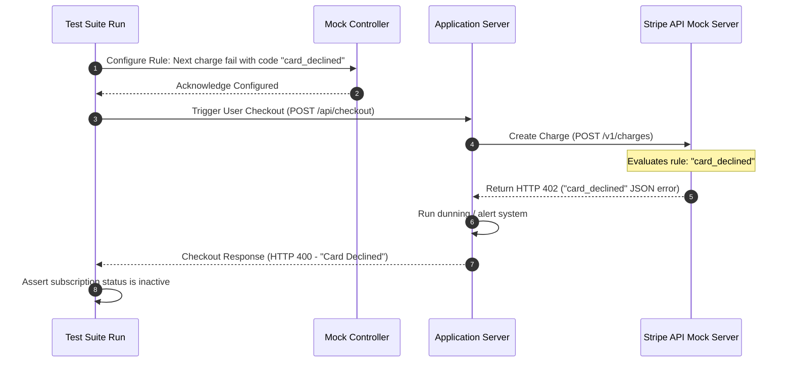
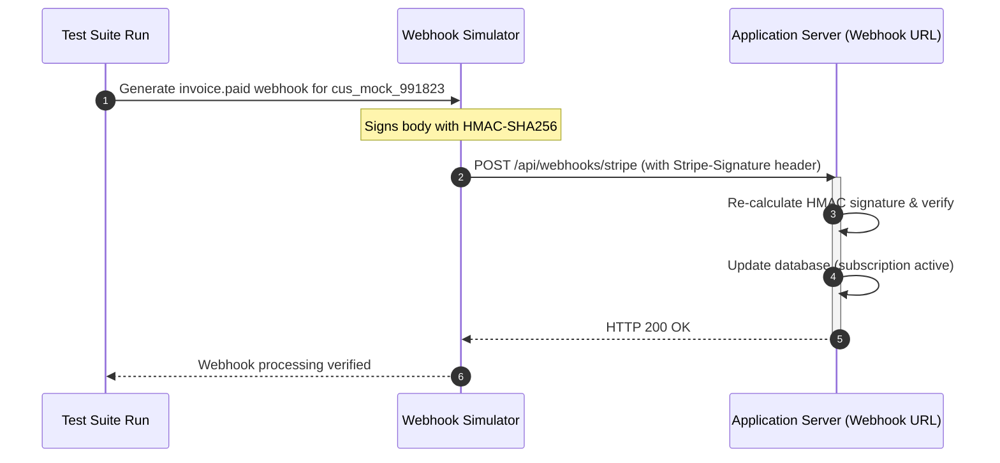

# Mocking Third-Party Integrations
## Purpose
This document defines the architectural design, schema models, and execution configurations for mocking external services within NewsOps Cloud. This design decouples test suites from real-world payment processors (Stripe) and social media publishing platforms (Meta Graph API, LinkedIn Publisher, Twitter/X API). It ensures deterministic behavior, sandboxed execution, and robust error-handling testing without incurring financial costs or hitting external API rate limits.

## Executive Summary
NewsOps Cloud integrates with multiple downstream services for monetization and content distribution. Testing these components live is slow, prone to network inconsistencies, and restricted by platform rate limits. This specification outlines a local mock server design that emulates the behavior of these platforms. By generating cryptographically signed Stripe webhooks and mimicking social publishing responses (including API exceptions), this mocking layer enables reliable offline integration testing and deterministic CI/CD evaluations.

## Vision
To establish a fully virtualized third-party integration framework that allows the NewsOps Cloud software suite to execute its entire test lifecycle offline with 100% coverage accuracy, complete payload validation, and predictable failure injections.

## Scope
* **In-Scope**:
  * Stripe Billing mocks (Customers, Subscriptions, Invoices, Payment Methods).
  * Cryptographically signed Stripe Webhook simulators (using HMAC-SHA256).
  * Social Publishing Mocks for Meta (Facebook/Instagram Graph API), LinkedIn API (V2 Community Management), and Twitter/X API (V2 Tweet creation).
  * Dynamic response control API (to inject error states, latencies, and rate limits).
* **Out-of-Scope**:
  * Simulating actual banking clearing houses or credit card validation.
  * Direct connections to social networks during automated tests.

## Goals
* **Deterministic Results**: Ensure all test runs produce identical outcomes when provided with identical input.
* **Test Isolation**: Eliminate dependencies on third-party uptime or network connectivity.
* **Exception Testing**: Validate error paths (e.g., failed credit cards, expired OAuth tokens, platform bans) that are difficult to trigger in production.
* **Performance**: Sub-10ms response times for all default mock queries to maximize CI execution speeds.

## Functional Requirements
1. **Mock Endpoints**: Replicate the exact URL paths, methods, and headers of Stripe (`api.stripe.com`) and social networks.
2. **Signature Verification Simulator**: Calculate and append valid signature headers (e.g., `Stripe-Signature`) using local development keys.
3. **Behavior Injection Panel**: Provide administration endpoints to dynamically override mock behaviors (e.g., set next request to fail with `HTTP 429`).
4. **Structured Payloads**: Match response structures with the official version schemas of Stripe V3 and Facebook Graph v17.0.

## Non-Functional Requirements
* **Fidelity**: Payloads returned by mocks must validate against target TypeScript models and OpenAPI specifications.
* **Latency Control**: Support configuration of artificial latency (0ms to 5000ms) to verify client-side timeouts.
* **Security**: Mocks must run only when `NODE_ENV` is set to `test` or `development`.
* **Statefulness**: Maintain basic in-memory state (e.g., creating a mock Stripe customer makes them queryable in subsequent requests).

## Business Rules
* **No Real Credentials**: The use of real Stripe API keys or live social network access tokens in test configurations is strictly forbidden.
* **Failure Simulation Priority**: Unit tests must explicitly test at least three distinct error codes (e.g., 400 Bad Request, 401 Unauthorized, 429 Too Many Requests) returned by the mock services.
* **Audit Trail**: Every request processed by a mock endpoint must be logged in-memory to verify that calls were made with the correct parameters.

## Actors
* **Backend Engineer**: Configures test environments and writes integration tests.
* **Test Runner / CI Agent**: Automates execution of integration tests.
* **Mock Server daemon**: The local virtual service mimicking external APIs.

## User Stories (At least 3 specific stories)
1. *As a Backend Engineer*, I want to simulate an `invoice.payment_failed` Stripe webhook payload signed with a valid cryptographic key, so that I can verify the subscription manager suspends the tenant organization's publishing access and triggers the email notification workflow.
2. *As a Quality Engineer*, I want to trigger a mock Meta Page Publishing API exception indicating an expired OAuth token, so that I can verify the system automatically pauses the scheduled post queue and flags the integration account as "re-authorization required".
3. *As a Frontend Developer*, I want the mock Stripe billing checkout session creator to return a valid payment portal URL, so that I can test the redirect flow and verify loading states without hitting the internet.

## Acceptance Criteria (At least 3-5 criteria with clear thresholds)
* **AC-1 (Webhook Cryptography)**: The webhook generator must generate a signature based on the timestamp and JSON body using HMAC-SHA256 and sign it with the test secret (`whsec_test_secret`). The application's webhook listener must successfully parse the signature and match it.
* **AC-2 (Social Network Failure Propagation)**: When the Mock Controller is configured to return a Meta rate limit error (Code 613), the publishing server must process it, abort active queue items, and enter retry backoff within 500ms.
* **AC-3 (State Consistency)**: Creating a customer through the mock endpoint `POST /v1/customers` must store the customer record in-memory. A subsequent `GET /v1/customers/:id` must return that same customer object with 100% field parity.
* **AC-4 (Performance Latency)**: When no delay is configured, the mock server must process and respond to requests in less than 15ms.

## Workflows (Step-by-step description of system and user interactions)
The diagram and steps below define the third-party mocking workflow:
1. **Configure Mock Behavior**: Before running a test, the test runner sends a request to the Mock Controller to configure behavior (e.g., inject status code `402 Payment Required`).
2. **Execute Business Logic**: The application executes action (e.g., attempt subscription creation).
3. **Interception**:
   * The application connects to `localhost:8080/stripe` (representing `api.stripe.com`).
4. **Mock Execution**:
   * Mock Server reads the injected rule, extracts payload, updates in-memory database, and returns payload representing simulated payment failure.
5. **Validation**: The test suite asserts that the application returned the correct business-level error response.



## API Design (Provide actual REST endpoints, method, request/response JSON payloads, or GraphQL schemas)
Endpoints exposed by the Mock Server and Mock Controller.

### 1. Mock Control API (Configures mock behavior)
* **Endpoint**: `POST /mock-control/configure`
* **Request Payload**:
```json
{
  "service": "stripe",
  "endpoint": "/v1/charges",
  "inject": {
    "status_code": 402,
    "error_payload": {
      "error": {
        "code": "card_declined",
        "decline_code": "insufficient_funds",
        "message": "The card has insufficient funds.",
        "type": "card_error"
      }
    },
    "latency_ms": 100
  }
}
```
* **Response Payload (200 OK)**:
```json
{
  "status": "configured",
  "rule_id": "rule_charge_decline_5"
}
```

### 2. Mock Stripe Customer Endpoint (Emulates Stripe API)
* **Endpoint**: `POST /stripe/v1/customers`
* **Request Payload**:
```json
{
  "email": "tenant-admin@newsops.cloud",
  "name": "Acme Publishing Group",
  "payment_method": "pm_card_visa"
}
```
* **Response Payload (201 Created)**:
```json
{
  "id": "cus_mock_991823",
  "object": "customer",
  "created": 1782600000,
  "currency": "usd",
  "email": "tenant-admin@newsops.cloud",
  "name": "Acme Publishing Group",
  "subscriptions": {
    "object": "list",
    "data": [],
    "has_more": false
  }
}
```

### 3. Mock Social Publishing (Meta Graph API)
* **Endpoint**: `POST /meta/v17.0/page_id/feed`
* **Request Payload**:
```json
{
  "message": "Publishing first article via NewsOps Cloud!",
  "link": "https://newsops.cloud/articles/first-story",
  "access_token": "mock_page_token_abc123"
}
```
* **Response Payload (200 OK)**:
```json
{
  "id": "123456789_987654321",
  "post_url": "https://facebook.com/123456789_987654321"
}
```

## Database Design (Identify schema tables, fields, and indexes relevant to this feature)
The mock server runs entirely in-memory using lightweight database tables (e.g., Sqlite in-memory) to maintain tenant state during integration tests.

### Table: `mock_customers`
| Column Name | Data Type | Constraints | Description |
|---|---|---|---|
| `stripe_customer_id` | VARCHAR(100) | PRIMARY KEY | Mock customer ID |
| `email` | VARCHAR(255) | NOT NULL | User email |
| `balance` | INTEGER | DEFAULT 0 | Account balance |
| `created_at` | TIMESTAMP | DEFAULT CURRENT_TIMESTAMP | Record created timestamp |

### Table: `mock_active_rules`
| Column Name | Data Type | Constraints | Description |
|---|---|---|---|
| `rule_id` | UUID | PRIMARY KEY | Rule ID |
| `target_path` | VARCHAR(255) | NOT NULL | Path matched |
| `injected_status` | INTEGER | NOT NULL | HTTP status code |
| `payload` | JSONB | NOT NULL | JSON payload response |

### Indexes
* `CREATE UNIQUE INDEX idx_mock_cust_id ON mock_customers(stripe_customer_id);`

## UI Design (Describe component structure, layouts, actions, and states)
The Developer portal provides a **Mock Testing Dashboard** interface.
* **Layout**:
  * **Service Selection**: Tabs for `Stripe`, `Meta API`, `LinkedIn API`, and `Twitter/X API`.
  * **Failure Injection Grid**: Checkboxes to turn on predefined failure modes:
    * `Card Declined (Stripe)`
    * `Rate Limit Hit (Meta)`
    * `Expired Access Token (LinkedIn)`
    * `Payload Invalid (Twitter/X)`
  * **Recent Logs**: Scrollable terminal component displaying intercepted request parameters and mock response JSON payloads.

## Permissions (Specify RBAC permissions required, e.g., organizations:read, articles:write)
* `developer:mock:read` - Read status of active mock overrides.
* `developer:mock:write` - Inject failures and alter mock state configuration.

## Security (Detail security considerations, e.g., input validation, CSRF, JWT validation)
* **JWT Token Requirement**: Dynamic mock manipulation endpoints require bearer token authorization containing `scope: developer`.
* **Sanitize Output**: Ensure mock logs mask card details, emails, and dummy secrets in the output terminal.
* **Environment Protection**: Boot hooks inside the Mock Server crash the process instantly if database config or server variables indicate production environments.

## Performance (State latency limits, caching requirements, target TPS)
* **Throughput**: Capable of processing 1,000 transactions per second under automated stress tests.
* **Memory footprint**: Keep the mock server memory footprint under 128MB.
* **Configurable Delay**: Delay accuracy must be within +/- 5ms.

## Monitoring (Detail Prometheus metrics names, alert triggers)
Telemetry is captured using standard Prometheus endpoints exposed by the mock server container.
* `newsops_mock_requests_received_total`: Total intercepted requests.
* `newsops_mock_injected_failures_total`: Total failures returned intentionally.
* `newsops_mock_average_latency_milliseconds`: Response latency tracker.

### Alerting Rules
```yaml
groups:
  - name: mock_alerts
    rules:
      - alert: MockActiveInProduction
        expr: newsops_mock_requests_received_total{env="production"} > 0
        for: 0s
        labels:
          severity: page
        annotations:
          summary: "CRITICAL: Mock server is actively handling requests in a production environment!"
```

## Logging (Specify log formats, error levels, log contexts)
Logs are printed in clean, structured JSON formats.
```json
{
  "timestamp": "2026-06-27T22:52:10.512Z",
  "level": "INFO",
  "category": "MOCK_INTERCEPTOR",
  "message": "Intercepted POST request to Stripe API",
  "path": "/stripe/v1/customers",
  "action": "SERVED_MOCK_SUCCESS",
  "response_payload_id": "cus_mock_991823"
}
```

## Error Handling (Map input/system error codes to HTTP status and customer-facing messages)
Mock server failures map directly to client errors.
| Internal Mock Error | Target Response Code | Client Behavior expected |
|---|---|---|
| `RULE_MATCHED_DECLINE` | 402 Payment Required | App marks subscription as pending / payment required. |
| `OAUTH_TOKEN_EXPIRED` | 401 Unauthorized | App triggers token refresh workflow or prompts user re-auth. |
| `API_RATE_LIMIT_EXCEEDED`| 429 Too Many Requests | App delays execution queue items using backoff delays. |

## Edge Cases (Handle race conditions, rate limit hits, upstream timeouts)
* **Missing Stripe-Signature Header**: The webhook route checks for this. When tested, missing signatures must throw a `400 Bad Request` exception to ensure validation isn't skipped.
* **Mock State Overflow**: During large test runs, in-memory Sqlite db size can grow. A memory-flush cron runs after every test suite completes, invoking `DELETE FROM mock_customers`.

## Future Improvements (Provide long-term scaling, architecture refactor paths)
* **Auto-refresh schemas**: Dynamically fetch OpenAPI definitions from Stripe and social provider developer portals to keep schemas updated automatically.
* **Chaos Mode**: Enable a toggle that injects randomized network delay and dropped TCP packages into social publishing runs.

## Mermaid Diagrams (Include at least one high-quality diagram: flowchart, sequence, or ERD)
This sequence shows the webhook generation and validation workflow:



## References (Reference other related files in the repository using standard relative markdown links, e.g., '../02-architecture/system_architecture.md')
* [SaaS Billing and Subscriptions Schema](../03-database/billing_and_subscriptions_schema.md)
* [Social Publishing Schema](../03-database/social_publishing_schema.md)
* [API Specification Webhooks](../09-api/index.md)
