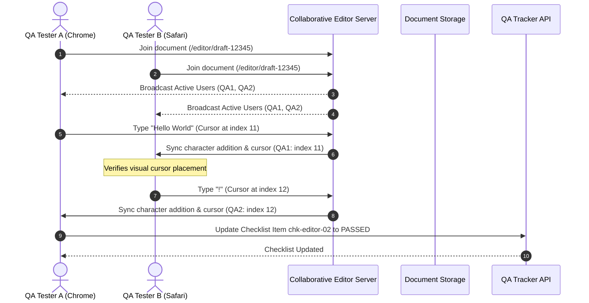

# QA Release Checklist
## Purpose
The purpose of this document is to detail the manual Quality Assurance (QA) release processes, regression testing checklists, and quality standards for NewsOps Cloud. This design focuses on verifying high-risk user experiences that require human evaluation, specifically highlighting manual testing procedures for the real-time collaborative document editor, regression verification suites, and the strict criteria required for production release sign-offs.

## Executive Summary
Automation handles execution speed, but manual quality assurance verifies correct formatting, real-time collaboration UX, and functional workflows under realistic human behaviors. This document describes the manual regression protocols for major deployments of NewsOps Cloud. It establishes testing steps for collaborative writing elements (including typing synchronization, cursor alignment, and offline merge behavior), provides the formal defect classification, and details the exit criteria required for QA sign-off before code changes are deployed to production.

## Vision
To enforce a zero-regression, high-fidelity publishing experience where every deployment undergoes structured human validation of collaboration interfaces, visual layouts, and edge-case workflows, maintaining the system's reputation for reliability.

## Scope
* **In-Scope**:
  * Manual regression testing checklist targeting core system workflows (billing, tenant registration, scheduling).
  * Structured multi-user testing pathways for the collaborative editor (typing conflict, cursor rendering, comment threads).
  * QA Sign-off exit criteria and defect severity classifications (P0 to P3).
  * Web/Mobile visual checking procedures.
* **Out-of-Scope**:
  * Infrastructure unit testing (automated in CI).
  * Security penetration scanning (handled by external audit schedules).

## Goals
* **Zero P0/P1 Escapes**: Ensure no blocker or critical defects escape to the production environment.
* **Collaboration Integrity**: Maintain correct Operational Transformation (OT) / CRDT synchronization state during multi-author writes.
* **Standardized Auditing**: Create verifiable logs for every manual release cycle to ensure accountability.

## Functional Requirements
1. **Manual Collaborative Editor Validation**: Test paths for simultaneous editing, cursor position accuracy, offline edits synchronization, and commenting components.
2. **Defect Tracking Database Integration**: Log all manual check failures directly to the system's tracking service.
3. **Multi-User Simulation Paths**: Provide step-by-step procedures for QA engineers simulating concurrent editing from distinct geographic nodes.
4. **Sign-off Management Console**: Allow the QA Lead to record digital signatures confirming release readiness.

## Non-Functional Requirements
* **Usability**: Collaborative editor sync delay between separate local test devices must remain visually imperceptible (< 150ms).
* **Environment Integrity**: Manual test accounts must use randomized, sanitized tenant datasets that prevent cross-tenant leakages.
* **Auditability**: Retain sign-off logs and checklists for a minimum of 180 days to meet compliance regulations.

## Business Rules
* **Blocker Termination**: The presence of a single unresolved P0 (Blocker) or P1 (Critical) defect automatically terminates the release cycle.
* **Sign-off Lifespan**: A QA Sign-off is valid for a maximum of 72 hours. If deployment does not occur within this window, a delta regression checklist must be rerun.
* **Hotfix Exception**: Urgent security patches require a subset checklist ("Critical Path Delta") consisting of identity checks, billing tests, and the modified lines validation.

## Actors
* **QA Test Engineer**: Performs the manual tests, updates checklists, and registers defects.
* **QA Lead**: Reviews test metrics, manages regressions, and issues the official QA Sign-off.
* **Release Manager**: Coordinates deployment schedules based on QA signatures.
* **Publishing Editor**: User editing content whose collaborative state must remain synchronized.

## User Stories (At least 3 specific stories)
1. *As a QA Engineer*, I want a structured testing script for the real-time collaborative editor using multiple active browser tabs, so that I can manually verify that characters, cursors, and comments synchronize correctly between users without collision.
2. *As a QA Lead*, I want to enforce a standardized exit criteria framework with strict thresholds for unresolved minor bugs, so that I can prevent low-quality releases from reaching the production tier.
3. *As a Release Manager*, I want a digital sign-off registry with cryptographic timestamps, so that I can audit which QA environments were validated before giving the final deployment greenlight.

## Acceptance Criteria (At least 3-5 criteria with clear thresholds)
* **AC-1 (Zero Defect Threshold)**: Release branch exit requires: 0 unresolved Blocker (P0) bugs, 0 unresolved Critical (P1) bugs, <= 2 unresolved Major (P2) bugs, and <= 5 unresolved Minor (P3) bugs.
* **AC-2 (Collaborative Sync Precision)**: Under a test of 3 concurrent QA users editing the same paragraph:
  * Characters must not be lost or rearranged out of typing sequence.
  * User cursors must render with matching user nicknames within 5px of the actual character insertion point.
* **AC-3 (Offline Reconnect Sync)**: When a QA tester disconnects from the internet (using Chrome DevTools Network offline toggle), writes 3 sentences in the editor, and reconnects after 60 seconds, the changes must merge back into the main document within 2000ms without overwriting other users' concurrent edits.
* **AC-4 (Cross-Browser Layout Checks)**: Visual tests must pass verification on Google Chrome (v115+), Safari (v16+), and Firefox (v115+) without text truncation or overlay errors.

## Workflows (Step-by-step description of system and user interactions)
The manual release verification workflow proceeds through these phases:
1. **Pre-release Freeze**: Release branch is locked, and codebase is deployed to the Staging environment.
2. **Setup Test Group**:
   * QA Lead assigns test scripts to the QA team.
   * QA Team opens test channels.
3. **Execution - Regression Run**:
   * Testers execute the manual regression checklist (e.g. login, payment checkout, scheduling, publishing).
   * Result is marked in the QA tracking panel.
4. **Execution - Collaborative Test**:
   * Tester A and Tester B join document workspace `doc-qa-test-100`.
   * Tester A writes paragraph 1; Tester B writes paragraph 2. Verify sync.
   * Tester A simulates offline state, writes, then goes online. Verify merge conflict resolution.
5. **Defect Registration**: Any bugs found are registered with severity levels.
6. **Sign-off Phase**: Once bugs are resolved (meeting exit criteria), the QA Lead issues the digital Sign-off.

### Manual Collaborative Editor Test Path Script:
* **Step 1: Concurrent Writing Sync**
  1. Open two separate browsers (Browser A: Chrome, Browser B: Safari).
  2. Log in with user accounts `tester.one@newsops.test` and `tester.two@newsops.test`.
  3. Navigate to the same draft article (`/editor/draft-12345`).
  4. Verify that two active user icons show up in the top right header.
  5. In Browser A, type: "The quick brown fox jumps over the lazy dog."
  6. In Browser B, observe characters appearing in real-time. Verify synchronization completes in <= 150ms.
* **Step 2: Cursor Overlay Validation**
  1. In Browser A, click and place the cursor in the middle of the word "jumps".
  2. In Browser B, verify that a cursor colored marker labeled "Tester One" is visible inside the word "jumps" exactly where the cursor is placed.
* **Step 3: Offline Disconnect and Reconnect**
  1. In Browser B, open developer console and set network state to `Offline`.
  2. In Browser B, type: " This edit is offline." at the end of the text.
  3. In Browser A (still online), type: " [Tester One Edit]" at the start of the text.
  4. In Browser B, switch network state to `Online`.
  5. Verify both edits merge correctly. The resulting text must read: "[Tester One Edit] The quick brown fox jumps over the lazy dog. This edit is offline."

## API Design (Provide actual REST endpoints, method, request/response JSON payloads, or GraphQL schemas)
Endpoints managed by the Release Tracking tool to audit checklist execution.

### 1. Retrieve Current Release Checklist
* **Endpoint**: `GET /api/v1/qa/releases/:release_id/checklist`
* **Response Payload (200 OK)**:
```json
{
  "release_id": "rel-2026-v2.1",
  "environment": "staging",
  "status": "IN_PROGRESS",
  "total_items": 4,
  "items": [
    {
      "item_id": "chk-auth-01",
      "category": "Authentication",
      "description": "Verify MFA challenge flow is triggered on logins from unrecognized IPs.",
      "status": "PASSED",
      "tested_by": "qa-tester-02@newsops.cloud",
      "updated_at": "2026-06-27T22:52:00Z"
    },
    {
      "item_id": "chk-editor-02",
      "category": "Collaborative Editor",
      "description": "Perform multi-user typing conflict validation script.",
      "status": "PENDING",
      "tested_by": null,
      "updated_at": null
    }
  ]
}
```

### 2. Submit QA Sign-Off
* **Endpoint**: `POST /api/v1/qa/releases/:release_id/signoff`
* **Request Headers**:
  * `Authorization: Bearer <JWT>`
  * `Content-Type: application/json`
* **Request Payload**:
```json
{
  "release_id": "rel-2026-v2.1",
  "signoff_by": "qa-lead@newsops.cloud",
  "metrics": {
    "passed_count": 48,
    "failed_count": 0,
    "unresolved_p2": 1,
    "unresolved_p3": 3
  },
  "verification_token": "sig_rsa_sha256_mock_00192388aa1b77c",
  "notes": "All critical tests pass. Editor sync behavior validated under simultaneous load."
}
```
* **Response Payload (201 Created)**:
```json
{
  "signoff_status": "APPROVED",
  "signoff_id": "so-99120023",
  "timestamp": "2026-06-27T22:52:30Z",
  "ready_for_production": true
}
```

## Database Design (Identify schema tables, fields, and indexes relevant to this feature)
Schema tables to track QA Release checklists and sign-offs.

### Table: `release_checklists`
| Column Name | Data Type | Constraints | Description |
|---|---|---|---|
| `release_id` | VARCHAR(100) | PRIMARY KEY | Release version tag |
| `status` | VARCHAR(50) | NOT NULL | e.g. PENDING, TESTING, APPROVED, BLOCKED |
| `target_date` | DATE | NOT NULL | Target production deploy date |
| `created_at` | TIMESTAMP | DEFAULT CURRENT_TIMESTAMP | Creation time |

### Table: `checklist_run_items`
| Column Name | Data Type | Constraints | Description |
|---|---|---|---|
| `item_id` | VARCHAR(50) | PRIMARY KEY | Unique item tag |
| `release_id` | VARCHAR(100) | REFERENCES release_checklists(release_id) | Linked release |
| `category` | VARCHAR(100) | NOT NULL | e.g. Editor, Billing, Authentication |
| `status` | VARCHAR(50) | NOT NULL | e.g. PENDING, PASSED, FAILED |
| `tester_email` | VARCHAR(255) | | Assigned QA tester |
| `defect_id` | VARCHAR(50) | | Linked defect from tracker (if FAILED) |

### Table: `release_signoffs`
| Column Name | Data Type | Constraints | Description |
|---|---|---|---|
| `signoff_id` | UUID | PRIMARY KEY, DEFAULT gen_random_uuid() | Unique signoff entry |
| `release_id` | VARCHAR(100) | REFERENCES release_checklists(release_id) | Linked release |
| `signed_by` | VARCHAR(255) | NOT NULL | QA Lead email |
| `notes` | TEXT | | Comments |
| `signed_at` | TIMESTAMP | DEFAULT CURRENT_TIMESTAMP | Timestamp of signoff |

### Indexes
* `CREATE INDEX idx_chk_release ON checklist_run_items(release_id);`
* `CREATE INDEX idx_signoff_release ON release_signoffs(release_id);`

## UI Design (Describe component structure, layouts, actions, and states)
The QA team utilizes the **NewsOps Release Control Center** interface.
* **Dashboard Component Structure**:
  * **Release Indicator**: Displays active release tag (`rel-2026-v2.1`), target deployment timeline, and total check completion progress bar.
  * **Checklist Table**: Lists test items, categorization, status (Pass/Fail toggles), tester dropdowns, and defect link input fields.
  * **Defect Monitor Grid**: Real-time display of open bugs by severity (P0/P1/P2/P3), blocking the release if P0/P1 are > 0.
  * **Sign-off Dialog**: Digital sign-off button, only active when exit criteria thresholds are satisfied. Includes digital signature verification field.

## Permissions (Specify RBAC permissions required, e.g., organizations:read, articles:write)
* `qa:checklist:update` - Permits modifying item status (Pass/Fail). Assigned to QA Engineers.
* `qa:signoff:execute` - Permits executing final release sign-off. Restricted to QA Leads.
* `release:operator:write` - Coordinate staging deployments and pipeline promotion.

## Security (Detail security considerations, e.g., input validation, CSRF, JWT validation)
* **Authentication**: All users accessing the release controls must authenticate with OAuth2 and pass multi-factor authentication (MFA).
* **Cryptographic Sign-off**: The sign-off signature is hashed using SHA256 with the QA Lead's private key to prevent tampering.
* **Data Sanitization**: Verification runs must not store real reader names, credit card details, or live billing credentials in test database records.

## Performance (State latency limits, caching requirements, target TPS)
* **Editor Lock Resolution**: Collaborative editor conflict resolution engine must complete merges under 100ms.
* **Dashboard Load Limit**: The QA Release status dashboard must load all 200+ checklist items in under 500ms.
* **Concurrent Editors**: Test scripts must run on server instances capable of maintaining Yjs synchronization for up to 50 concurrent virtual threads.

## Monitoring (Detail Prometheus metrics names, alert triggers)
Checklist execution and validation parameters are exported to metrics servers.
* `newsops_qa_checklist_pass_percentage`: Progress status of testing.
* `newsops_qa_open_defects_count`: Current count of reported bugs, grouped by severity.
* `newsops_qa_signoff_state`: Binary value (1 for signed off, 0 for unsigned).

### Alerting Rules
```yaml
groups:
  - name: release_qa_alerts
    rules:
      - alert: ReleaseP0DefectDetected
        expr: newsops_qa_open_defects_count{severity="P0"} > 0
        for: 0s
        labels:
          severity: page
        annotations:
          summary: "CRITICAL: P0 Blocker Bug logged on active release branch! Halting deployment pipelines."
```

## Logging (Specify log formats, error levels, log contexts)
Detailed events are logged during manual steps.
```json
{
  "timestamp": "2026-06-27T22:52:15.002Z",
  "level": "INFO",
  "context": "QA_CHECKLIST_SERVICE",
  "message": "Manual checklist item status updated",
  "release_id": "rel-2026-v2.1",
  "item_id": "chk-editor-02",
  "status": "PASSED",
  "tester": "qa-tester-02@newsops.cloud"
}
```

## Error Handling (Map input/system error codes to HTTP status and customer-facing messages)
Exceptions during the release process are mapped as follows:
| Error Code | HTTP Status | User Message | Diagnosis |
|---|---|---|---|
| `QA_PENDING_BLOCKERS` | 400 Bad Request | "Cannot complete sign-off. Unresolved P0/P1 defects exist." | Active blocker items in testing dashboard. |
| `CHECKLIST_INCOMPLETE` | 400 Bad Request | "All checklist items must be tested before sign-off." | Unchecked regression items. |
| `SIGNOFF_EXPIRED` | 410 Gone | "The sign-off signature has expired. Rerun delta regression." | Sign-off age exceeded the 72-hour limit. |

## Edge Cases (Handle race conditions, rate limit hits, upstream timeouts)
* **Sync Loop / Cursor Drift**: In collaborative editor tests, rapid simultaneous typing could cause cursors to drift. Manual tests check for this by using automated keyboard input simulators inside the test lab and measuring the text overlay coordinates.
* **Concurrent Sign-off Submissions**: If two QA Leads attempt to sign off on a release simultaneously, the system uses pessimistic database locking on the `release_checklists` row to prevent double submission anomalies.

## Future Improvements (Provide long-term scaling, architecture refactor paths)
* **Automated Visual Regression**: Integrate Playwright Visual Regression tests to automatically verify UI layout differences, reducing manual checking times by 50%.
* **Smart Test Case Selector**: Analyze code commit diffs to dynamically prioritize specific sections of the checklist that overlap with modified code.

## Mermaid Diagrams (Include at least one high-quality diagram: flowchart, sequence, or ERD)
The diagram below shows the sequence of events during a multi-user collaborative editor test execution:



## References (Reference other related files in the repository using standard relative markdown links, e.g., '../02-architecture/system_architecture.md')
* [Collaborative Editor Design](../06-editorial/index.md)
* [System Security and RBAC Policies](../10-security/index.md)
* [API Endpoint Schemas](../09-api/index.md)
