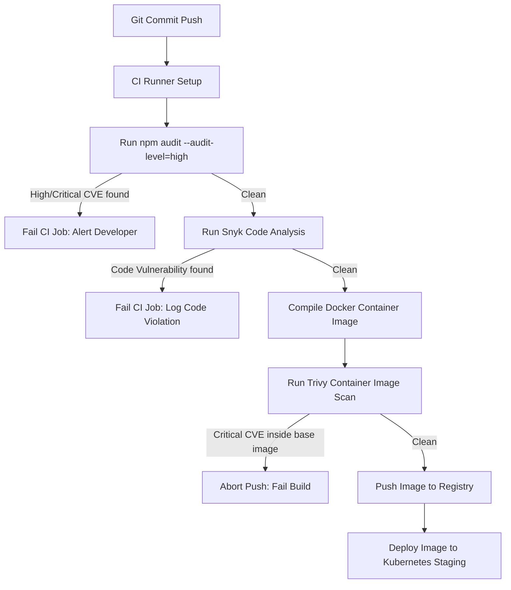

# Security Scanning and Compliance Specifications

## Purpose
This document establishes the security scanning, vulnerability management, and automated compliance verification framework for the NewsOps Cloud platform. It outlines the integration of dependency auditing (`npm audit`), Static Application Security Testing (SAST) and Software Composition Analysis (SCA) via Snyk, and container vulnerability scanning via Trivy into the continuous integration and deployment pipelines.

## Executive Summary
To protect our multi-tenant cloud digital publishing operating system, NewsOps Cloud mandates automated security tests at every phase of code delivery. Any code contribution or container compilation that introduces vulnerabilities above defined severity thresholds is systematically blocked in the build pipeline. This document defines the scanning rules, threshold limits, configuration files, and remediation workflows to maintain a robust, secure software supply chain.

## Vision
Our vision is to build a "zero-trust, zero-critical-exploit" application ecosystem where all third-party packages, operational container environments, and system configurations are analyzed for safety before any code reaches a staging or production cluster.

## Scope
The scope of security verification covers:
1. **Dependency Vulnerability Analysis**: Automated scans of Node.js package manifests (`package.json`, `package-lock.json`) and Go/Python submodule lockfiles.
2. **Static Code Analysis (SAST)**: Scanning internal application code to discover common vulnerabilities (SQL injections, cross-site scripting, improper access control).
3. **Container Image Scanning**: Analyzing Alpine/Debian base operating system files, system libraries, and runtimes inside Docker images.
4. **Infrastructure as Code (IaC) Scans**: Evaluating Kubernetes manifests, Helm charts, and Terraform configurations for privilege escalation or configuration errors.

## Goals
- **Eliminate High-Severity Threats**: Maintain zero "Critical" or "High" severity CVEs (Common Vulnerabilities and Exposures) in all active production systems.
- **Minimize CI Build Lag**: Deliver comprehensive dependency and container analysis in under 5 minutes per pipeline run.
- **Automate Dependency Patches**: Implement automated pull requests to update vulnerable packages within 12 hours of exploit publication.

## Functional Requirements
1. **CI Pipeline Gates**: Trigger vulnerability scans on every GitHub pull request, branch commit, and release tag.
2. **License Compliance Scanning**: Identify and block packages utilizing restricted licenses (e.g., AGPL-3.0, GPL-3.0) that violate commercial software compliance.
3. **Container Scan on Build**: Automatically scan all newly compiled Docker images before publishing them to the private container registry.
4. **Vulnerability Escalation Routing**: Output security alerts to Slack channels and dispatch PagerDuty alerts for production zero-day warnings.

## Non-Functional Requirements
1. **Scan Execution Latency**: Scan tasks must complete within `240 seconds` to avoid clogging standard build pipelines.
2. **Scan Database Caching**: Local runners must cache CVE databases for Trivy and Snyk to reduce network bandwidth and avoid hitting API rate limits.
3. **Failure Isolation**: If the external security scanning service (e.g. Snyk Cloud API) is unavailable, the pipeline must fail-secure, requiring a manual DevOps bypass code.

## Business Rules
1. **Critical/High Blocker**: Any dependency or container image containing a vulnerability with a Common Vulnerability Scoring System (CVSS) score of `7.0` or higher must block build compilation.
2. **SLA for Patching**:
   - **Critical (CVSS 9.0 - 10.0)**: Must be patched or mitigated within `24 hours` of detection.
   - **High (CVSS 7.0 - 8.9)**: Must be patched within `7 days` of detection.
   - **Medium (CVSS 4.0 - 6.9)**: Must be patched within `30 days`.
   - **Low (CVSS 0.1 - 3.9)**: Reviewed quarterly.
3. **Authorized Whitelisting**: Vulnerabilities may only be bypassed using a signed `.snyk` ignore file containing a valid security override token and documented mitigation strategy.

## Actors
- **Security Engineer**: Defines policies, configures thresholds, audits whitelists, and reviews pipeline reports.
- **DevOps Engineer**: Integrates scanner binaries in the CI pipelines, manages registry scanner setups, and tunes base Docker files.
- **Software Developer**: Receives alerts and upgrades packages or modifies code to fix reported issues.

## User Stories
1. **npm Audit Local Warning**: As a Software Developer, I want to receive vulnerability feedback when running local package updates so that I can resolve dependency loops before committing.
2. **Container Registry Security Check**: As a DevOps Engineer, I want the container scanner (Trivy) to check our Docker images before they are pushed to the registry so that compromised images are never deployed.
3. **Zero-Day Pipeline Block**: As a Security Engineer, I want the CI pipeline to fail immediately when a pull request introduces an npm package containing a fresh high-severity vulnerability so that our codebase is shielded from supply-chain threats.

## Acceptance Criteria
1. **npm Audit Quality Gate**: The build pipeline must run `npm audit --audit-level=high` and exit with code `1` if any High or Critical dependency exploit is found.
2. **Trivy Image Scan Quality Gate**: The Trivy scan script must search for vulnerabilities in compiled containers, exiting with code `1` when findings with severity `CRITICAL,HIGH` are detected.
3. **Snyk SAST Compliance**: Code scans must show a 100% completion rate, with 0 open SQL injection or cross-site scripting (XSS) warnings.

## Workflows

### 1. Continuous Integration Security Scan Workflow
```
Developer Pushes Code -> Start GitHub Actions CI Job
                               |
                               v
                     Execute npm audit scan
                               |
                   Did npm audit find High/Critical?
                     /                       \
                  Yes                         No
                   /                             \
                  v                               v
         Fail CI Build & Alert           Execute Snyk Code SCA
                                                  |
                                         Snyk finds Vulnerabilities?
                                            /                  \
                                         Yes                    No
                                          /                      \
                                         v                        v
                               Fail CI Build & Alert       Proceed to Docker Build
```

### 2. Container Build Verification Workflow
1. CI pipeline successfully builds the Docker image: `newsops-cms:latest`.
2. Pipeline spins up a Trivy local container scanner.
3. Trivy pulls the latest CVE cache, then scans `newsops-cms:latest`.
4. If Trivy finds any CVE with severity `CRITICAL` or `HIGH`, it outputs the findings to a JSON file and exits with code 1, aborting the container registry upload.
5. If clean, the image is tagged and pushed to the Amazon ECR registry.

## API Design

### 1. Webhook for Snyk Vulnerability Alerts
- **Method**: `POST`
- **Path**: `/api/v1/security/webhooks/snyk`
- **Headers**:
  - `Content-Type`: `application/json`
  - `X-Snyk-Signature`: `sha256=d3472f88b...`
- **Request Payload**:
```json
{
  "project": {
    "name": "newsops-cloud/cms-service",
    "id": "snyk-proj-77a8b9c0"
  },
  "new_vulnerabilities": [
    {
      "id": "SNYK-JS-LODASH-223401",
      "package": "lodash",
      "version": "4.17.20",
      "severity": "high",
      "title": "Prototype Pollution",
      "cvssScore": 7.8,
      "fixedIn": [
        "4.17.21"
      ]
    }
  ]
}
```
- **Response (200 OK)**:
```json
{
  "status": "processed",
  "alerts_triggered": 1,
  "incident_id": "sec_inc_99218"
}
```

### 2. Retrieve Compliance Registry Status
- **Method**: `GET`
- **Path**: `/api/v1/security/compliance-status`
- **Headers**:
  - `Authorization`: `Bearer JWT_TOKEN`
- **Response (200 OK)**:
```json
{
  "status": "non-compliant",
  "scanned_at": "2026-06-27T17:45:00Z",
  "services": {
    "cms_service": {
      "compliant": false,
      "critical_cve_count": 1,
      "high_cve_count": 3,
      "scanner_used": "Trivy v0.51.0"
    },
    "gateway_service": {
      "compliant": true,
      "critical_cve_count": 0,
      "high_cve_count": 0,
      "scanner_used": "Snyk Container"
    }
  }
}
```

## Database Design

### Security Vulnerabilities Management Database Schema
```sql
-- Track security scans performed across services
CREATE TABLE security_scan_records (
    id UUID PRIMARY KEY DEFAULT gen_random_uuid(),
    service_name VARCHAR(100) NOT NULL,
    branch_name VARCHAR(100) NOT NULL,
    commit_sha VARCHAR(40) NOT NULL,
    tool_name VARCHAR(50) NOT NULL, -- 'snyk', 'trivy', 'npm-audit'
    status VARCHAR(30) NOT NULL, -- 'passed', 'failed'
    critical_vulnerabilities INT DEFAULT 0,
    high_vulnerabilities INT DEFAULT 0,
    medium_vulnerabilities INT DEFAULT 0,
    scan_log_url VARCHAR(500),
    created_at TIMESTAMP WITH TIME ZONE DEFAULT CURRENT_TIMESTAMP
);

-- Store active vulnerabilities and their mitigation states
CREATE TABLE current_vulnerabilities (
    id UUID PRIMARY KEY DEFAULT gen_random_uuid(),
    scan_id UUID REFERENCES security_scan_records(id) ON DELETE CASCADE,
    cve_id VARCHAR(50) NOT NULL, -- e.g. 'CVE-2026-2241'
    severity VARCHAR(20) NOT NULL, -- 'critical', 'high', 'medium', 'low'
    package_name VARCHAR(150) NOT NULL,
    current_version VARCHAR(50) NOT NULL,
    fixed_version VARCHAR(50),
    description TEXT NOT NULL,
    status VARCHAR(30) NOT NULL, -- 'open', 'mitigated', 'resolved'
    mitigation_notes TEXT,
    resolved_at TIMESTAMP WITH TIME ZONE
);

CREATE INDEX idx_sec_scans_service ON security_scan_records(service_name, created_at DESC);
CREATE INDEX idx_vulnerabilities_cve ON current_vulnerabilities(cve_id);
```

## UI Design
The NewsOps Cloud Administrative Portal includes a **Security and Compliance** panel:
1. **Compliance Banner**: Big alert banner (Green/Red) indicating whether the system is "Fully Compliant" or "Action Required".
2. **Dependency Risk Matrix**: Interactive list of packages flagged by Snyk or npm audit, complete with dependency graphs showing where the vulnerable package is nested.
3. **Docker Image Scan Report**: Shows container scan history, highlighting the base layers and specific Linux packages (e.g. `openssl`, `libssl`) that require upgrades.
4. **Override Action Window**: Area for authorized Security Administrators to submit a temporary override for a CVE by inputting the CVE ID, a expiration date, and security mitigation notes.

## Permissions
- `Security Administrator`:
  - `security:scans:read`
  - `security:scans:write`
  - `security:vulnerability:override` (Submit signed overrides to bypass blocks)
- `DevOps Engineer`:
  - `security:scans:read`
  - `security:scans:write`
- `Developer`:
  - `security:scans:read`

## Security
1. **Secret Scanning Integration**: Snyk scans also verify that developer credentials, API tokens, and JWT secrets are not checked into source control (uses `git-secrets` checks).
2. **Scanner API Keys Isolation**: API keys for Snyk are stored in secure Vault parameters and never written out to build logs.
3. **Mitigation Validation**: Any bypass added to `.snyk` must include a valid validation code signed by the security team's public key.

## Performance
- **Trivy Database Caching**: Keep Trivy DB directory cached on persistent volumes on CI runners to save `45 seconds` per image compile run.
- **Scanned Dependency Pruning**: Run `npm prune --production` before performing container scans to avoid spending scan time auditing devDependencies that are never deployed.

## Monitoring
We monitor compliance values using these Prometheus gauge metrics:
- `newsops_security_vulnerabilities_count`: Gauge tracking outstanding vulnerabilities, with labels `[service_name, severity, status]`.
- `newsops_security_scan_status`: Gauge reflecting scan success/failure status (1 for passed, 0 for failed).

### Alert Triggers
- **Critical CVE Alert**: Alert fires immediately if `newsops_security_vulnerabilities_count{severity="critical",status="open"}` is greater than `0` for more than 1 hour in production.

## Logging
Security scan event logs are outputted in JSON format:
```json
{
  "timestamp": "2026-06-27T17:46:12.890Z",
  "level": "ERROR",
  "context": "ci-security-check",
  "tool": "Trivy",
  "target_image": "newsops-cms:latest",
  "vulnerability": {
    "cve_id": "CVE-2026-8877",
    "severity": "CRITICAL",
    "package": "openssl",
    "installed_version": "3.0.2-0ubuntu1.14",
    "fixed_version": "3.0.2-0ubuntu1.15"
  },
  "message": "Critical vulnerability detected in base image. CI build execution stopped."
}
```

## Error Handling
| Error Code | Source Component | HTTP Status | Customer-Facing Message |
| :--- | :--- | :--- | :--- |
| `ERR_SECURITY_VULNERABILITY_FOUND` | Snyk / Trivy CI Gate | 422 Unprocessable | The build cannot proceed as a high or critical security vulnerability was identified. |
| `ERR_SCAN_API_KEY_EXPIRED` | CI Runner | 500 Internal Error | Unable to complete security audit due to expired scanner credentials. DevOps notified. |
| `ERR_OVERRIDE_SIGNATURE_INVALID` | Security Pipeline Gateway| 403 Forbidden | The security bypass signature is invalid or expired. |

## Edge Cases
1. **Dynamic DevDependencies Exploits**: A development-only dependency contains a vulnerability, but it does not run in production. Mitigated by using `--only=prod` in audit configurations.
2. **Scanner API Down Time**: If the Snyk API goes down, the build pipeline will fail. We support a `BYPASS_SECURITY_SCAN` environment parameter that requires a rotating DevOps token to temporarily override.
3. **Zero-Day with No Immediate Patch**: A package has a high CVE, but the maintainer has not released a patch. Mitigated by using a Snyk override while applying a runtime code patch (e.g. input sanitization wrapper).

## Future Improvements
1. **Automated PR Remediation**: Connect Snyk to open automated GitHub pull requests that upgrade packages as soon as patches are announced.
2. **Runtime Container Monitoring**: Implement runtime threat detection (e.g. Falco) to discover active exploits on running Kubernetes pods in real-time.
3. **Binary Composition Analysis**: Expand scans to verify compiled Go/Rust binary dependencies, not just node_modules.

## Mermaid Diagrams

### Security Scanning Pipeline Flow


## References
- [System Architecture Zero-Trust Strategy](../02-architecture/system_architecture.md)
- [Operational Playbooks and Incident Response](../01-business/operational_playbooks.md)
- [DevOps CI/CD Build Pipelines](../11-devops/index.md)
- [Zero Cost MVP Infrastructure Config](../02-architecture/zero_cost_mvp_architecture.md)
