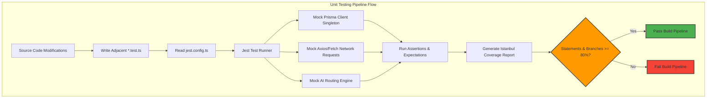

# Unit Testing Standards

## Purpose
This document establishes the official engineering standards, tooling configurations, and mocking strategies for unit testing within the NewsOps Cloud digital publishing platform. It defines how developers must isolate code components, mock external integrations, configure test runners, and achieve code coverage benchmarks. Consistent application of these standards ensures rapid test feedback loops and prevents regression leaks during continuous integration.

## Executive Summary
Unit tests serve as the primary defensive barrier in our deployment lifecycle. We use **Jest** paired with **ts-jest** as our standard execution framework. Every pull request must satisfy a mandatory minimum of **80% code coverage** for statements, branches, functions, and lines. To guarantee isolation and deterministic results, all database interactions, external HTTP requests, and AI router calls must be strictly mocked. This document outlines the standard Jest configuration, mock factory architectures, file layout rules, and test naming standards.

## Vision
The vision of our unit testing strategy is a fast, reliable, and completely mocked test execution pipeline. Every test must run in total isolation without external environment dependencies. The unit test suite should execute at a speed of over 100 tests per second, enabling instant feedback during local development and minimizing CI execution overhead.

## Scope
The guidelines in this document apply to all TypeScript/JavaScript services, utility packages, API controllers, middlewares, and data mappers across the NewsOps Cloud codebase. It explicitly excludes integration tests, which are documented separately in the integration testing guide.

## Goals
- Enforce a minimum threshold of **80% coverage** across all statements, branches, lines, and functions.
- Enforce strict test isolation, forbidding dependencies on actual databases, caches, or external third-party HTTP endpoints.
- Establish a uniform naming convention and structure for all unit test files.
- Minimize local suite run times to under 30 seconds for the entire application service layer.

## Functional Requirements
- Test Runner Integration: The system must use Jest with ts-jest compilation.
- Static Coverage Validation: The build pipeline must automatically parse coverage reports and fail if thresholds are violated.
- Auto-cleanup: Mocks and spies must be automatically restored after each test block to prevent pollution.

## Non-Functional Requirements
- Compilation Speed: Unit test TypeScript compilation using ts-jest must complete in under 10 seconds.
- Test Concurrency: Tests must run in parallel across CPU cores using Jest worker processes.
- Memory Limits: Jest workers must not leak memory, capping total execution overhead at 2GB RAM in CI.

## Business Rules
- Any code file containing business logic must have a matching unit test file.
- If a test relies on actual database instances or external network connections, it must be relocated to the Integration test suite.
- Code coverage calculations must exclude autogenerated migrations, database seed files, and configuration definition schemas.

## Actors
- **Software Engineer**: Writes unit tests for new business logic and refactors existing tests.
- **CI Runner**: Executes unit tests on pull requests and reports coverage numbers.
- **Lead Architect**: Audits test coverage trends and adjusts Jest configurations.

## User Stories
- As a Software Engineer, I want to reference a standardized Jest configuration so that my local test suite executes in the same environment as the CI pipeline.
- As a Software Engineer, I want to use standard mock definitions for the Prisma ORM client so that I can mock database responses cleanly without starting a PostgreSQL instance.
- As a Release Manager, I want the build pipeline to reject code changes that drop code coverage below 80% to protect code quality.

## Acceptance Criteria
- Code coverage targets must be strictly set to `80%` or higher for statements, branches, lines, and functions inside the `jest.config.ts`.
- The mocking strategy must include complete, functional mock declarations for Prisma database models and external AI providers.
- File naming conventions must enforce that test files reside adjacent to their implementation file with a `.test.ts` extension.

## Workflows
1. **Developer Writing Code**:
   - The developer creates a new service file, e.g., `src/services/publisher.service.ts`.
   - The developer creates the corresponding unit test file: `src/services/publisher.service.test.ts`.
   - The developer imports the module under test and applies the standard Jest mock wrappers.
2. **Local Test Execution**:
   - The developer runs `npm run test:unit`.
   - Jest compiles and runs the tests, displaying code coverage analysis.
3. **CI Block Verification**:
   - The developer pushes code.
   - The CI pipeline runs `jest --coverage`.
   - The runner validates the coverage JSON output. If coverage falls below 80%, the build fails.

## API Design
Although unit tests execute locally, we specify the API payload format of the Jest coverage report that is uploaded to our internal telemetry system:

### POST /api/v1/telemetry/coverage
Sends unit test coverage data to the telemetry platform.

**Request Payload:**
```json
{
  "commit_sha": "a3b9d4e5f6a7b8c9d0e1f2a3b4c5d6e7f8a9b0c1",
  "branch": "feature/analytics-reporting",
  "coverage": {
    "total": {
      "statements": { "total": 1250, "covered": 1050, "skipped": 0, "pct": 84.00 },
      "branches": { "total": 320, "covered": 260, "skipped": 0, "pct": 81.25 },
      "functions": { "total": 180, "covered": 150, "skipped": 0, "pct": 83.33 },
      "lines": { "total": 1200, "covered": 1020, "skipped": 0, "pct": 85.00 }
    }
  },
  "files": [
    {
      "file_path": "src/services/publisher.service.ts",
      "statements": 88.5,
      "branches": 82.1,
      "functions": 90.0,
      "lines": 89.2
    }
  ]
}
```

**Response Payload (201 Created):**
```json
{
  "id": "e2d3c4b5-a6b7-4c8d-9e0f-1a2b3c4d5e6f",
  "status": "APPROVED",
  "message": "Coverage data accepted. Code coverage of 84.00% is above the 80.00% target."
}
```

## Database Design
To save, track, and chart unit test coverage trends historically per repository module, the following table tracks files and their coverage attributes:

### Table: `unit_test_metrics`
Tracks module-level unit test coverage metrics.
```sql
CREATE TABLE unit_test_metrics (
    id UUID PRIMARY KEY DEFAULT gen_random_uuid(),
    commit_sha VARCHAR(40) NOT NULL,
    file_path VARCHAR(512) NOT NULL,
    statements_pct DECIMAL(5, 2) NOT NULL,
    branches_pct DECIMAL(5, 2) NOT NULL,
    functions_pct DECIMAL(5, 2) NOT NULL,
    lines_pct DECIMAL(5, 2) NOT NULL,
    total_lines INTEGER NOT NULL,
    created_at TIMESTAMP WITH TIME ZONE DEFAULT CURRENT_TIMESTAMP
);

CREATE INDEX idx_unit_test_metrics_commit ON unit_test_metrics(commit_sha);
CREATE INDEX idx_unit_test_metrics_file_path ON unit_test_metrics(file_path);
```

## UI Design
The test execution logs are rendered in developers' terminals, but code coverage dashboards are accessible in our developer console:
- **Coverage Gauge**: A circular progress bar that turns green above 80% coverage and red below.
- **Coverage Directory Tree**: A file explorer highlighting files in green (passed 80%+), yellow (70-80%), and red (below 70%).
- **Interactive Source Viewer**: Highlighting uncovered branches and lines in red directly in the browser viewport.

## Permissions
- `coverage:view`: Allowed for all authenticated developers.
- `coverage:submit`: Granted to CI/CD pipeline runner service account.

## Security
- Test data scrubbing: Unit tests must not contain real credentials or production security tokens.
- Sandboxing: `jest` tests run with standard permissions in containerized sandbox environments to isolate process calls from host system processes.

## Performance
- Individual Test Target: No single unit test should take longer than 100ms.
- Parallelization: Execution must use Jest multi-worker clustering (`jest -w 4` or `jest --runInBand` in resource-constrained environments).
- Module Resolution: Use Jest module resolution mappings to speed up loading path resolutions.

## Monitoring
- Prometheus Metric: `newsops_unit_tests_run_total`
- Prometheus Metric: `newsops_unit_tests_failed_total`
- Prometheus Metric: `newsops_unit_test_coverage_ratio`

## Logging
Logging output from test runs is printed using standard Jest reporting format:
```json
{
  "timestamp": "2026-06-27T22:25:31Z",
  "level": "INFO",
  "context": "jest_reporter",
  "message": "Unit test suite execution completed",
  "meta": {
    "numTotalTestSuites": 42,
    "numPassedTestSuites": 42,
    "numFailedTestSuites": 0,
    "numTotalTests": 312,
    "numPassedTests": 312,
    "numFailedTests": 0,
    "duration_seconds": 12.42
  }
}
```

## Error Handling
Map test execution errors to pipeline actions:
- **Coverage Target Violation (Build Code 102)**: Code coverage falls below 80%. Pipeline aborts with custom output: "Error: Code coverage verification failed. Branches: 78.4% (Threshold: 80%). Please add tests for untested branches."
- **Flaky Mock Definition (Build Code 103)**: Unhandled promise rejection in mocked external service. Code logs warnings and returns exit code 1.

## Edge Cases
- **Dynamic Date Dependency**: Logic depending on the current date (e.g. scheduling newsletters) must use Jest's time-mocking APIs (`jest.useFakeTimers()`) to assert calculations cleanly without relying on host computer time.
- **Async Execution Leak**: Tests where callbacks leak after execution must be caught using Jest's `--detectOpenHandles` flag.

## Future Improvements
- **Coverage Diffing in Pull Requests**: Automate comments directly on github commits highlighting lines of code that need unit tests.
- **Snapshot Autogeneration**: Automate structural schema snapshot testing for database models to alert when mutations happen.

## Mermaid Diagrams


## References
- [Testing Strategy Directory Index](./index.md)
- [Integration Testing Standards](./integration_testing.md)
- [API Contract Testing](./api_contract_tests.md)
- [DevOps CI Pipelines](../11-devops/index.md)

---

# Appendices: Configurations & Examples

### Appendix A: Production Jest Configuration (`jest.config.ts`)
```typescript
import type { Config } from 'jest';

const config: Config = {
  preset: 'ts-jest',
  testEnvironment: 'node',
  verbose: true,
  clearMocks: true,
  restoreMocks: true,
  resetMocks: true,
  rootDir: '../../',
  testMatch: [
    '<rootDir>/src/**/*.test.ts',
    '<rootDir>/src/**/*.spec.ts'
  ],
  collectCoverageFrom: [
    '<rootDir>/src/**/*.ts',
    '!<rootDir>/src/**/*.d.ts',
    '!<rootDir>/src/**/index.ts',
    '!<rootDir>/src/server.ts',
    '!<rootDir>/src/database/migrations/**',
    '!<rootDir>/src/database/seeds/**'
  ],
  coverageThreshold: {
    global: {
      statements: 80,
      branches: 80,
      functions: 80,
      lines: 80
    }
  },
  moduleNameMapper: {
    '^@src/(.*)$': '<rootDir>/src/$1',
    '^@test/(.*)$': '<rootDir>/test/$1'
  },
  setupFilesAfterEnv: [
    '<rootDir>/test/jest.setup.ts'
  ],
  coverageReporters: [
    'json',
    'lcov',
    'text',
    'clover'
  ],
  maxWorkers: '50%'
};

export default config;
```

### Appendix B: Standard Prisma Database Mock (`test/jest.setup.ts`)
```typescript
import { PrismaClient } from '@prisma/client';
import { mockDeep, mockReset, DeepMockProxy } from 'jest-mock-extended';
import { prisma } from '@src/database/client';

// Mock the main application database client
jest.mock('@src/database/client', () => ({
  __esModule: true,
  prisma: mockDeep<PrismaClient>()
}));

export const prismaMock = prisma as unknown as DeepMockProxy<PrismaClient>;

beforeEach(() => {
  mockReset(prismaMock);
});
```

### Appendix C: Standard Unit Test Implementation Example
```typescript
import { ArticleService } from '@src/services/article.service';
import { prismaMock } from '@test/jest.setup';
import { generateSummary } from '@src/services/ai.service';

// Mock the AI service module
jest.mock('@src/services/ai.service', () => ({
  generateSummary: jest.fn()
}));

const mockGenerateSummary = generateSummary as jest.MockedFunction<typeof generateSummary>;

describe('ArticleService - Unit Tests', () => {
  let articleService: ArticleService;

  beforeEach(() => {
    articleService = new ArticleService();
  });

  it('should successfully create an article and compute its summary', async () => {
    // Arrange: Setup mock data and behavior
    const mockArticleInput = {
      title: 'Breaking News: AI Publishing',
      content: 'This is a long article content about publishing systems.',
      tenantId: 'tenant-123',
      authorId: 'author-456'
    };

    const mockCreatedArticle = {
      id: 'article-999',
      ...mockArticleInput,
      summary: 'Mocked summary response',
      status: 'DRAFT',
      createdAt: new Date(),
      updatedAt: new Date()
    };

    // Define behavior for mocked functions
    mockGenerateSummary.mockResolvedValue('Mocked summary response');
    prismaMock.article.create.mockResolvedValue(mockCreatedArticle);

    // Act: Invoke the method under test
    const result = await articleService.createArticle(mockArticleInput);

    // Assert: Verify expected outcomes
    expect(result).toBeDefined();
    expect(result.id).toBe('article-999');
    expect(result.summary).toBe('Mocked summary response');
    expect(mockGenerateSummary).toHaveBeenCalledWith(mockArticleInput.content);
    expect(prismaMock.article.create).toHaveBeenCalledTimes(1);
    expect(prismaMock.article.create).toHaveBeenCalledWith({
      data: {
        title: mockArticleInput.title,
        content: mockArticleInput.content,
        summary: 'Mocked summary response',
        tenantId: mockArticleInput.tenantId,
        authorId: mockArticleInput.authorId,
        status: 'DRAFT'
      }
    });
  });

  it('should throw an error if the title is blank', async () => {
    // Arrange
    const invalidInput = {
      title: '   ',
      content: 'Valid content block',
      tenantId: 'tenant-123',
      authorId: 'author-456'
    };

    // Act & Assert
    await expect(articleService.createArticle(invalidInput))
      .rejects
      .toThrow('Article title cannot be blank');
      
    expect(prismaMock.article.create).not.toHaveBeenCalled();
  });
});
```
