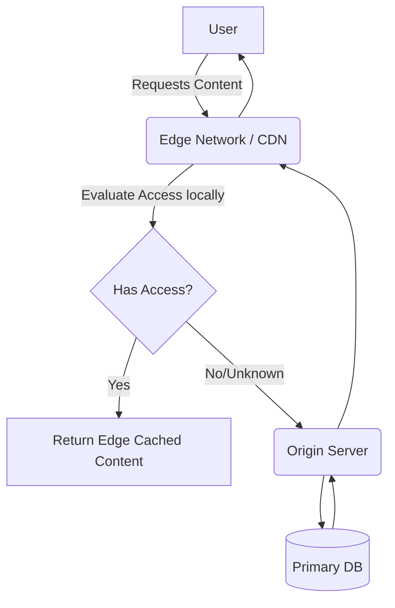

# Future Technology Evaluation

## Purpose
The purpose of this document is to track, assess, and document emerging technologies, frameworks, and methodologies that could impact the future architecture of NewsOps Cloud. It provides a structured approach to R&D and technical foresight.

## Executive Summary
To maintain a competitive edge, the NewsOps engineering team continuously evaluates frontier technologies. Current focus areas include advanced Generative AI models for multimodal content creation, edge computing architectures for zero-latency content delivery, and Web3/blockchain technologies for verifiable content provenance and copyright tracking.

## Vision
To architect a system that is fundamentally adaptable, ensuring that new paradigms in computing and data processing can be integrated seamlessly without requiring complete platform rewrites.

## Scope
The scope of this evaluation covers experimental prototypes, vendor assessments, and theoretical architectural mappings for Edge Computing (Cloudflare Workers, Fastly Compute), Next-Gen AI (GPT-5, open-source LLMs), and Decentralized Identifiers.

## Goals
1. Identify technologies that can reduce operational costs by 20%.
2. Prototype Edge-based rendering to achieve <50ms global content delivery.
3. Assess the feasibility of cryptographic watermarking for AI-generated images.

## Functional Requirements
- Prototyped systems must integrate with the existing NewsOps staging environment.
- Evaluation metrics must capture performance, cost, and developer experience (DX).
- Edge computing pilots must support executing existing business logic (e.g., paywall checks) at the CDN level.

## Non-Functional Requirements
- Experimental branches must not impact the stability of the production main branch.
- Evaluation data must be retained for historical comparison.

## Business Rules
- Any technology adopted must comply with existing data sovereignty and privacy commitments.
- Vendor lock-in must be minimized; open standards are preferred.

## Actors
- **Principal Engineer**: Leads the evaluation and prototyping efforts.
- **Architecture Board**: Reviews findings and approves adoption.
- **Security Auditor**: Assesses the security implications of new technologies.

## User Stories
1. As a Principal Engineer, I want to deploy a paywall verification script to an Edge Worker so that I can measure the reduction in origin server load.
2. As an Architecture Board member, I want to read a standardized evaluation report so that I can make an informed decision on tech adoption.
3. As a Security Auditor, I want to review the cryptographic signing mechanism for articles so that I can verify its robustness against tampering.

## Acceptance Criteria
1. Edge worker prototypes must process 90% of requests without hitting the origin backend.
2. The AI image generation evaluation must include a cost-per-image analysis across at least three different model providers.
3. The content provenance prototype must successfully attach a verifiable C2PA manifest to an image.

## Workflows
1. **Technology Piloting**: An engineer proposes a new technology (e.g., Edge SSR). A time-boxed spike (2 weeks) is approved. The engineer builds a Proof of Concept (PoC), gathers metrics (latency, cost), and presents the findings to the Architecture Board for a Go/No-Go decision.
2. **Content Provenance Flow**: An author uploads an image. The experimental pipeline hashes the image, signs it with the tenant's private key, and embeds a C2PA manifest into the file metadata before distribution.

## API Design
**POST /api/experimental/edge-auth**
(Deployed on Edge Node)
Evaluates user entitlement for premium content locally.

Request:
```json
{
  "token": "jwt_abc123",
  "article_id": "art_999"
}
```

Response:
```json
{
  "authorized": true,
  "edge_cache_hit": true,
  "latency_ms": 12
}
```

## Database Design
**Table: `tech_evaluations`**
- `id` (UUID)
- `technology_name` (VARCHAR)
- `category` (Enum: 'AI', 'Edge', 'Security', 'Data')
- `status` (Enum: 'Evaluating', 'Adopted', 'Rejected')
- `metrics_json` (JSONB)
- `conclusion` (TEXT)

## UI Design
- **Component Structure**: `InnovationRadar` dashboard showing technologies in concentric circles (Adopt, Trial, Assess, Hold).
- **Layouts**: Tech radar visualization based on the ThoughtWorks model.
- **Actions**: Click a technology node to open a detailed modal with the evaluation report.
- **States**: Interactive hover states detailing the current phase of the evaluation.

## Permissions
- `evaluations:read`: Available to all engineering staff.
- `evaluations:write`: Restricted to Principal Engineers and Architecture Board members.

## Security
- Edge computing logic must not store sensitive PII locally; all persistent data must route back to the secure origin.
- Evaluation environments must be strictly segregated from production data.

## Performance
- Edge Compute execution time limit: < 50ms per request.
- AI model evaluation focuses heavily on Time To First Token (TTFT).

## Monitoring
- `newsops_edge_execution_time`: Histogram of worker execution duration.
- `newsops_origin_offload_percent`: Gauge measuring the percentage of traffic handled entirely at the edge.

## Logging
- Format: JSON.
- Levels: DEBUG for prototype runs.
- Context: Edge node location (e.g., IAD, LHR), prototype version, request ID.

## Error Handling
- Edge Worker Failure: The CDN must automatically fall back to routing the request to the central origin server (Fail-open for availability, or Fail-closed for strict paywalls, depending on configuration).

## Edge Cases
- **Edge Data Stale**: The distributed nature of edge state (e.g., Edge KV stores) means data might be eventually consistent. Prototypes must account for race conditions where a user pays for a subscription but the edge node still denies access for a few seconds.

## Future Improvements
- Automate the benchmarking of new open-source AI models as they are released to HuggingFace.
- Explore Quantum computing implications for encryption algorithms used in the platform.

## Mermaid Diagrams


## References
- [Roadmap Index](./index.md)
- [Long Term Vision](./long_term_vision.md)
