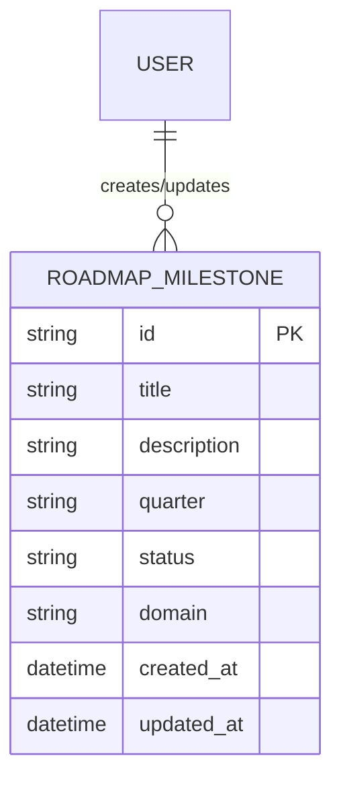

# Roadmap Index

## Purpose
The purpose of this document is to provide a central registry and index for the NewsOps Cloud roadmap, outlining the delivery schedule and strategic planning components for upcoming quarters and long-term milestones.

## Executive Summary
This index document aggregates the Q1/Q2, Q3/Q4, long-term vision, and future technology evaluation deliverables into a singular navigation hub. It allows stakeholders to track product evolution, upcoming feature sets, and infrastructural upgrades planned for the NewsOps platform.

## Vision
To establish a transparent, continuously updated, and predictable release schedule that aligns engineering capacity with business objectives, fostering trust among stakeholders and customers.

## Scope
The scope covers the architectural mapping, feature tracking, and timeline indexing for all modules within the NewsOps Cloud ecosystem, including CMS core, AI integrations, analytics, and platform scalability initiatives.

## Goals
1. Centralize the documentation of product roadmaps.
2. Provide a single source of truth for feature delivery timelines.
3. Establish a programmatic interface for querying release milestones.

## Functional Requirements
- The system must provide an API to fetch the current state of the roadmap.
- The system must allow authorized product managers to update milestones.
- The system must support tagging milestones with specific functional domains (e.g., CMS, AI).

## Non-Functional Requirements
- API latency for fetching the roadmap index must be under 150ms.
- The roadmap data must be highly available (99.99% uptime).
- Changes to the roadmap must be audited and logged.

## Business Rules
- Only users with the `ProductManager` role can create or modify roadmap items.
- Roadmap milestones cannot be deleted once they have entered the 'In Progress' state, they can only be marked as 'Deferred'.

## Actors
- **Product Manager**: Manages and updates roadmap entries.
- **Engineering Lead**: Reviews and aligns technical execution with roadmap milestones.
- **Stakeholder/Customer**: Views the read-only published roadmap.

## User Stories
1. As a Product Manager, I want to create a new roadmap milestone so that I can schedule a feature for an upcoming quarter.
2. As an Engineering Lead, I want to retrieve all milestones tagged with "AI" to plan team capacity.
3. As a Stakeholder, I want to view the roadmap index so that I understand what features are coming in Q3.

## Acceptance Criteria
1. The `/api/v1/roadmap` endpoint must return a list of all active milestones.
2. Updating a milestone must trigger an audit log entry containing the user ID and previous state.
3. Creating a milestone without a target quarter must return a 400 Bad Request error.

## Workflows
1. **Milestone Creation**: The Product Manager accesses the Roadmap dashboard, fills in the milestone details (title, description, target quarter), and submits the form. The system validates the input and persists the milestone in the database.
2. **Roadmap Retrieval**: The user navigates to the public roadmap page. The web client fetches the milestones from the API, grouping them by quarter, and renders the UI.

## API Design
**GET /api/v1/roadmap/milestones**
Returns a list of roadmap milestones.

Request:
```json
{
  "quarter": "Q1",
  "status": "planned"
}
```

Response:
```json
{
  "data": [
    {
      "id": "mlst_12345",
      "title": "MVP Core CMS",
      "quarter": "Q1",
      "status": "planned",
      "domain": "CMS"
    }
  ],
  "meta": {
    "total": 1
  }
}
```

**POST /api/v1/roadmap/milestones**
Creates a new milestone.

Request:
```json
{
  "title": "Advanced AI Analytics",
  "quarter": "Q3",
  "domain": "Analytics"
}
```

Response:
```json
{
  "id": "mlst_67890",
  "title": "Advanced AI Analytics",
  "quarter": "Q3",
  "status": "draft",
  "domain": "Analytics"
}
```

## Database Design
**Table: `roadmap_milestones`**
- `id` (VARCHAR, Primary Key)
- `title` (VARCHAR, Not Null)
- `description` (TEXT)
- `quarter` (VARCHAR, Not Null, Index)
- `status` (VARCHAR, Not Null)
- `domain` (VARCHAR, Index)
- `created_at` (TIMESTAMP)
- `updated_at` (TIMESTAMP)

## UI Design
- **Component Structure**: `RoadmapIndexLayout` wraps `QuarterlyLane` components. Each `QuarterlyLane` contains `MilestoneCard` components.
- **Layouts**: A Kanban-style board representing different quarters (Q1, Q2, Q3, Q4, Future).
- **Actions**: Drag-and-drop support for moving `MilestoneCard`s between quarters (for authorized users).
- **States**: Loading state shows skeleton lanes. Empty state shows a message "No milestones defined for this quarter".

## Permissions
- `roadmap:read`: Required to view the roadmap index.
- `roadmap:write`: Required to create, update, or delete milestones.

## Security
- All roadmap management endpoints must require a valid JWT with the `roadmap:write` scope.
- Input validation must ensure `quarter` strings match the regex `^Q[1-4]$|^Future$`.
- CSRF tokens are required for all POST/PUT/DELETE requests via the browser.

## Performance
- Target Latency: < 100ms for GET requests.
- Caching: Use Redis to cache the public roadmap GET endpoint, invalidated on any milestone update.
- Target TPS: 500 requests per second.

## Monitoring
- `newsops_roadmap_requests_total`: Counter for all API requests to the roadmap endpoints.
- `newsops_roadmap_latency_seconds`: Histogram measuring endpoint response times.
- **Alert Triggers**: If `newsops_roadmap_latency_seconds` P99 exceeds 300ms for 5 minutes, trigger a low-severity alert.

## Logging
- Format: JSON.
- Levels: INFO for successful CRUD operations, ERROR for unexpected failures.
- Context: Log entries must include `user_id`, `tenant_id` (if applicable), and `milestone_id`.

## Error Handling
- Invalid Quarter: HTTP 400 Bad Request, Message: "Invalid quarter specified. Must be Q1-Q4 or Future."
- Unauthorized: HTTP 401 Unauthorized, Message: "Missing or invalid authentication token."
- Permission Denied: HTTP 403 Forbidden, Message: "You do not have permission to modify the roadmap."

## Edge Cases
- **Concurrent Updates**: If two Product Managers edit the same milestone simultaneously, the system uses optimistic concurrency control (via an `updated_at` check) to reject the second update with a 409 Conflict.
- **Stale Cache**: If Redis becomes unavailable, the system gracefully degrades to querying the database directly.

## Future Improvements
- Integrate roadmap milestones directly with Jira or Linear to automatically update statuses based on engineering ticket progress.
- Implement a public voting mechanism for customers to request features.

## Mermaid Diagrams


## References
- [System Architecture](../02-architecture/system_architecture.md)
- [Q1 and Q2 Deliverables](./q1_q2_deliverables.md)
- [Q3 and Q4 Deliverables](./q3_q4_deliverables.md)
