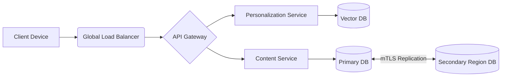

# Long Term Vision

## Purpose
The purpose of this document is to outline the 1-3 year strategic vision and major product milestones for NewsOps Cloud. It serves to align long-term engineering architecture with overarching business goals, ensuring the platform scales conceptually and technically.

## Executive Summary
The long-term vision for NewsOps Cloud transitions the product from a robust digital publishing platform into a fully integrated, omnichannel media operating system. Over the next three years, the focus will shift towards headless architecture maturation, deep personalization engines, and decentralized content syndication networks.

## Vision
To become the definitive operating system for modern digital media companies, enabling them to produce once, publish everywhere, and intelligently monetize audiences across all conceivable digital touchpoints.

## Scope
The scope includes the conceptualization and architectural planning for a fully extensible plugin ecosystem, highly advanced personalization and recommendation algorithms, and a federated content distribution network.

## Goals
1. Establish a mature, developer-friendly marketplace for third-party plugins.
2. Implement an ML-driven 1:1 content personalization engine.
3. Support seamless omnichannel distribution (Web, Mobile Apps, Smart TVs, IoT).
4. Achieve multi-region global deployment for ultra-low latency worldwide.

## Functional Requirements
- The platform must expose a comprehensive Webhook and Event Grid architecture for third-party integrations.
- The system must provide APIs to ingest user behavior and output personalized content feeds.
- The CMS must support defining custom delivery channels and formatting content agnostically.
- The platform must support active-active replication across multiple geographic regions.

## Non-Functional Requirements
- The plugin architecture must execute third-party code in secure, isolated sandboxes (e.g., WebAssembly).
- Personalization APIs must respond in under 50ms to allow real-time feed rendering.
- Global database replication lag must remain under 1 second.

## Business Rules
- Third-party plugins must undergo an automated security audit before being listed in the marketplace.
- Content syndication across tenants requires explicit cryptographic consent from both parties.

## Actors
- **Third-Party Developer**: Builds and monetizes plugins for the NewsOps ecosystem.
- **Media Strategist**: Configures personalization rules and omnichannel campaigns.
- **End Consumer**: Experiences tailored content across various devices.

## User Stories
1. As a Third-Party Developer, I want to publish a custom ad-integration plugin to the marketplace so that NewsOps customers can install and use it.
2. As a Media Strategist, I want to configure a rule that shows sports articles to users who frequently read about basketball, so that I can increase engagement.
3. As an End Consumer, I want my reading history to sync between the website and my smart TV app so that I can resume reading seamlessly.

## Acceptance Criteria
1. The Plugin API must allow registering custom UI components within the core editor.
2. The Personalization Engine must successfully prioritize articles tagged 'basketball' in the API response for the targeted user profile.
3. Multi-region deployments must automatically route users to the nearest healthy datacenter via GeoDNS.

## Workflows
1. **Plugin Installation**: A tenant admin browses the marketplace, selects a plugin, and clicks install. The system provisions a sandboxed environment, requests necessary API permissions from the admin, and activates the plugin.
2. **Personalized Delivery**: A user visits the homepage. The client requests the feed, passing the user ID. The backend queries the personalization service, which scores recent articles based on the user's historical vector profile, and returns the customized feed.

## API Design
**GET /api/v2/feed/personalized**
Retrieves a customized feed for the user.

Request:
```json
{
  "user_id": "aud_776655",
  "channel": "mobile_app",
  "limit": 10
}
```

Response:
```json
{
  "feed": [
    {
      "article_id": "art_101",
      "score": 0.98,
      "reason": "collaborative_filtering"
    }
  ]
}
```

## Database Design
**Table: `user_profiles` (Graph/Vector DB)**
- `user_id` (VARCHAR)
- `preference_vector` (ARRAY of FLOAT)
- `historical_interactions` (JSON)
- `last_updated` (TIMESTAMP)

## UI Design
- **Component Structure**: `PluginMarketplace` displaying `PluginCard`s. `PersonalizationRulesEditor` featuring a node-based visual logic builder.
- **Layouts**: Visual workflow editor for defining personalization logic (if-this-then-that).
- **Actions**: Drag-and-drop conditions, test rules against simulated user profiles.
- **States**: Visual indicators for active vs. inactive rules.

## Permissions
- `marketplace:install`: Required to add new plugins to a tenant.
- `personalization:manage`: Required to configure ML models and rules.

## Security
- WebAssembly (Wasm) modules are used to execute untrusted third-party plugin code securely.
- Cross-region data synchronization must be encrypted via mutual TLS (mTLS).
- Strict PII (Personally Identifiable Information) anonymization before data enters the ML training pipeline.

## Performance
- Target Latency for personalized feed: < 50ms at P95.
- Throughput: 100,000 requests per second globally.
- Real-time ML inference powered by GPU-accelerated endpoints.

## Monitoring
- `newsops_plugin_execution_errors`: Counter for sandbox crashes.
- `newsops_personalization_latency`: Histogram of inference times.
- `newsops_replication_lag_ms`: Gauge tracking database sync delays across regions.

## Logging
- Format: JSON.
- Levels: WARN for high latency, ERROR for replication failures.
- Context: Datacenter region, trace ID, plugin ID (if applicable).

## Error Handling
- Personalization Timeout: Gracefully degrade to returning the standard chronological feed, logging a WARN.
- Plugin Sandbox Crash: Isolate the failure, disable the plugin temporarily for the tenant, and alert the developer.

## Edge Cases
- **Data Privacy Regulations (GDPR/CCPA)**: If a user revokes tracking consent, their vector profile must be immediately purged, and the system must default to contextual (non-personalized) recommendations.
- **Regional Outage**: If the US-East region goes down, traffic is automatically routed to US-West, and the database fails over to the regional replica.

## Future Improvements
- Fully autonomous AI editorial assistants that can draft, curate, and publish entire newsletters based on learned audience preferences.
- Integration with emerging spatial computing platforms (AR/VR news experiences).

## Mermaid Diagrams


## References
- [Roadmap Index](./index.md)
- [Future Technology Evaluation](./future_tech_evaluation.md)
