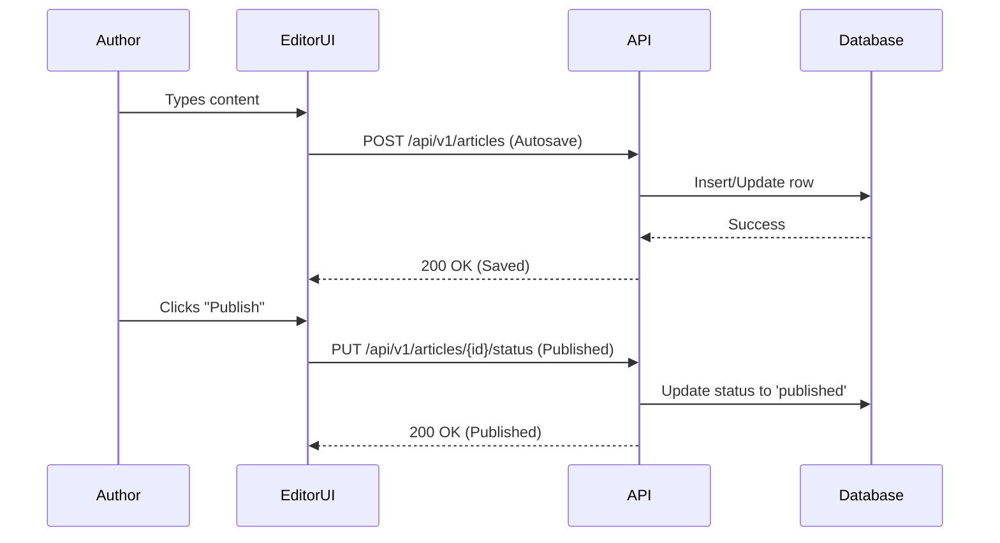

# Q1 and Q2 Deliverables

## Purpose
The purpose of this document is to detail the specific features, product releases, and infrastructure milestones slated for the first and second quarters (Q1 and Q2). It focuses on the delivery of the Minimum Viable Product (MVP) release and core CMS functionalities.

## Executive Summary
In Q1 and Q2, NewsOps Cloud will launch its foundational platform. Q1 is dedicated to finalizing the MVP, encompassing basic content authoring, user authentication, and initial API exposure. Q2 will build upon this foundation by introducing multi-tenant capabilities, complex editorial workflows, and basic analytics integrations.

## Vision
To establish a robust, reliable, and user-friendly content management core that proves the value proposition of NewsOps Cloud to early adopters and sets the stage for advanced enhancements.

## Scope
The scope includes the complete development, testing, and deployment of the core CMS editor, role-based access control (RBAC), media library management, and multi-tenant database isolation strategies.

## Goals
1. Launch the NewsOps Cloud MVP by the end of Q1.
2. Onboard 10 beta customers onto the platform.
3. Release the advanced editorial workflow engine in Q2.

## Functional Requirements
- The CMS must support rich text editing with block-based content structuring.
- The system must provide secure user authentication and RBAC.
- The system must support uploading, storing, and retrieving media assets (images, videos).
- The system must allow defining custom editorial workflows (Draft -> Review -> Published).

## Non-Functional Requirements
- The MVP must achieve a sub-200ms TTFB (Time to First Byte) for published content delivery.
- User authentication flows must complete in under 500ms.
- System uptime during the beta phase must be at least 99.9%.

## Business Rules
- A user can only access content associated with their assigned tenant (organization).
- Content cannot be published without passing through the required 'Review' stage if a custom workflow is enforced.

## Actors
- **Content Author**: Writes and edits articles.
- **Editor**: Reviews and approves content for publication.
- **Platform Admin**: Manages tenant configurations and system-wide settings.

## User Stories
1. As a Content Author, I want to use a block-based editor so that I can easily embed media and format my articles.
2. As an Editor, I want to review submitted drafts and approve or reject them so that quality control is maintained.
3. As a Platform Admin, I want to provision a new tenant workspace so that a new customer can begin using the platform.

## Acceptance Criteria
1. The block editor must successfully serialize content to a standardized JSON format.
2. Approving an article in the 'Review' state must update its status to 'Published' and trigger the cache invalidation event.
3. Tenant provisioning must take less than 60 seconds and create all required isolated database schemas.

## Workflows
1. **Content Creation**: The Author creates a new draft, adds text and images via the block editor, and clicks "Submit for Review". The article state changes to 'Pending Review'.
2. **Review and Publish**: The Editor receives a notification, opens the pending article, reviews the content, and clicks "Publish". The article state changes to 'Published' and is exposed via the Content Delivery API.

## API Design
**POST /api/v1/articles**
Creates a new article draft.

Request:
```json
{
  "title": "Breaking News: Market Hits Record High",
  "content": {
    "blocks": [
      { "type": "paragraph", "data": { "text": "The stock market reached unprecedented levels today." } }
    ]
  },
  "author_id": "usr_998877"
}
```

Response:
```json
{
  "id": "art_112233",
  "status": "draft",
  "created_at": "2026-06-28T12:00:00Z"
}
```

**PUT /api/v1/articles/{id}/status**
Updates article status.

Request:
```json
{
  "status": "published"
}
```

Response:
```json
{
  "id": "art_112233",
  "status": "published",
  "published_at": "2026-06-28T12:05:00Z"
}
```

## Database Design
**Table: `articles`**
- `id` (VARCHAR, Primary Key)
- `tenant_id` (VARCHAR, Not Null, Index)
- `title` (VARCHAR, Not Null)
- `content_json` (JSONB)
- `status` (VARCHAR, Default 'draft')
- `author_id` (VARCHAR, Foreign Key to users.id)
- `published_at` (TIMESTAMP)

## UI Design
- **Component Structure**: `EditorView` containing `Toolbar`, `BlockCanvas`, and `SidebarSettings`.
- **Layouts**: Two-column layout; left column for editing content (70%), right column for metadata and publishing controls (30%).
- **Actions**: "Save Draft", "Preview", "Submit for Review", "Publish".
- **States**: Autosaving indicates a spinner. Unsaved changes display a warning dialog upon attempted navigation away from the page.

## Permissions
- `articles:create`: Required to draft new content.
- `articles:publish`: Required to change status to 'published'.
- `tenants:manage`: Required to provision new organizations (Admin only).

## Security
- API endpoints are protected by OAuth2/JWT.
- Tenancy isolation is enforced via Row-Level Security (RLS) policies in PostgreSQL.
- Uploaded media must be scanned for malware before being stored in the S3 bucket.

## Performance
- Target Latency for Editor API: < 150ms.
- Content Delivery API caching via CDN (Cloudflare) with a 95% cache hit ratio.
- Target TPS: 1000 reads/sec, 50 writes/sec.

## Monitoring
- `newsops_article_publish_total`: Counter for total articles published.
- `newsops_editor_save_latency`: Histogram for autosave API latency.
- **Alert Triggers**: High error rate (>5%) on article creation endpoints triggers a PageDuty incident.

## Logging
- Format: JSON.
- Levels: INFO for publishing events, ERROR for database connection issues.
- Context: `tenant_id`, `user_id`, `article_id`, `trace_id`.

## Error Handling
- Invalid Content Block: HTTP 400, "Malformed block data provided."
- Publish Unauthorized: HTTP 403, "User lacks permission to publish articles."
- Tenant Not Found: HTTP 404, "The specified tenant context does not exist."

## Edge Cases
- **Autosave Conflict**: If an autosave request arrives out of order, the server uses a version vector or timestamp to reject older states.
- **Large Media Uploads**: Requests exceeding 50MB return HTTP 413 Payload Too Large. Direct-to-S3 signed URLs are used to bypass server limits.

## Future Improvements
- Real-time collaborative editing (multiplayer) utilizing WebSockets and CRDTs.
- Automated grammar and style checking integrated directly into the editor canvas.

## Mermaid Diagrams


## References
- [Roadmap Index](./index.md)
- [System Architecture](../02-architecture/system_architecture.md)
