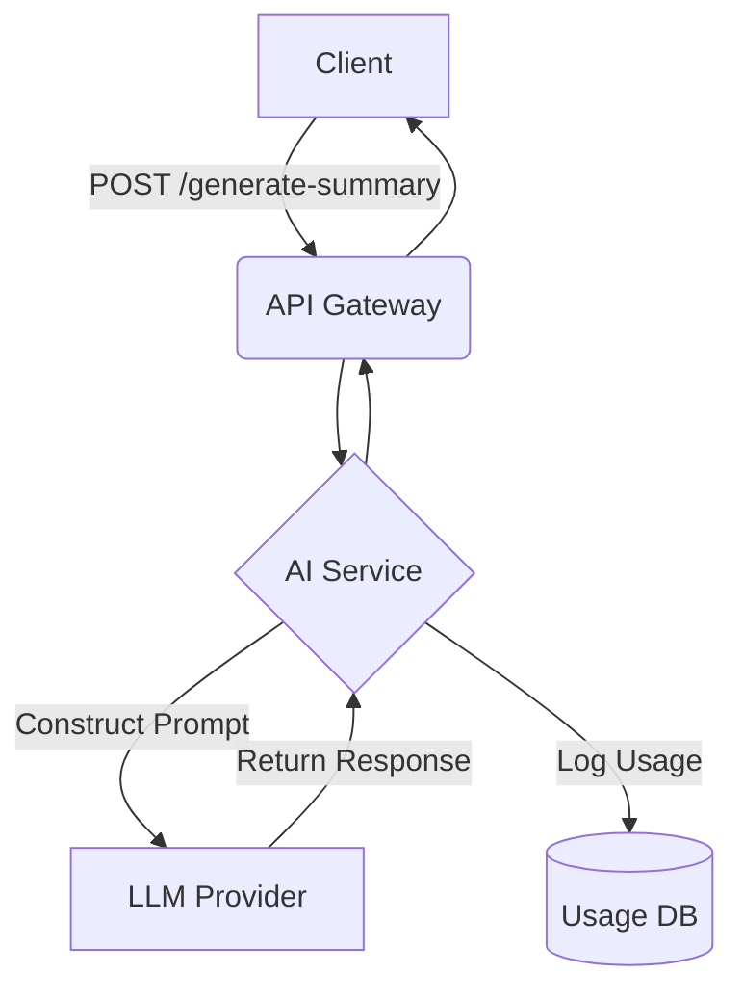

# Q3 and Q4 Deliverables

## Purpose
The purpose of this document is to outline the strategic initiatives, feature enhancements, and product deliverables planned for the third and fourth quarters (Q3 and Q4). This phase focuses heavily on advanced AI features, deeper analytics, and enterprise scalability.

## Executive Summary
Following the successful MVP rollout in the first half of the year, Q3 and Q4 will focus on differentiating NewsOps Cloud in the market. Key initiatives include the integration of AI-driven content generation and summarization tools, the deployment of a comprehensive analytics engine, and platform enhancements to support high-volume enterprise traffic.

## Vision
To evolve NewsOps Cloud from a foundational CMS into an intelligent, data-driven publishing operating system that proactively assists editorial teams in maximizing engagement and streamlining production.

## Scope
The scope encompasses the design, implementation, and release of AI Copilot modules for the editor, a real-time analytics dashboard tracking audience engagement, and infrastructure scaling to support 10x traffic growth.

## Goals
1. Launch the AI Copilot feature set (summarization, tag generation, SEO optimization) by Q3.
2. Deliver the comprehensive Audience Analytics Dashboard by Q4.
3. Achieve SOC2 Type II compliance readiness by the end of the year.

## Functional Requirements
- The system must provide AI-assisted summarization of long-form articles.
- The system must automatically suggest SEO metadata based on article content.
- The analytics module must track page views, average time on page, and bounce rates in real-time.
- The platform must support SSO (Single Sign-On) integration via SAML 2.0 for enterprise clients.

## Non-Functional Requirements
- AI generation tasks must return results within 3 seconds (P95).
- Analytics data aggregation must have a data freshness of less than 2 minutes.
- The platform architecture must scale dynamically to handle traffic spikes of up to 50,000 requests per second.

## Business Rules
- AI features are only available to tenants subscribed to the "Pro" or "Enterprise" tiers.
- Analytics data retention is limited to 90 days for basic tiers and 2 years for enterprise tiers.

## Actors
- **Content Author**: Utilizes AI tools to enhance article quality.
- **Data Analyst**: Reviews audience metrics to inform editorial strategy.
- **Enterprise Admin**: Configures SSO and manages large-scale user provisioning.

## User Stories
1. As a Content Author, I want the AI Copilot to generate an SEO meta description so that I can improve the article's search ranking without writing it manually.
2. As a Data Analyst, I want to view real-time traffic statistics on a dashboard so that I can identify trending topics immediately.
3. As an Enterprise Admin, I want to configure SAML SSO so that my organization's employees can log in using our existing identity provider.

## Acceptance Criteria
1. Clicking "Generate SEO" in the editor must populate the meta description field with a 150-160 character summary.
2. The analytics dashboard must load completely within 1.5 seconds, displaying data accurate to within the last 2 minutes.
3. A user successfully authenticating via their corporate IdP (e.g., Okta) must be seamlessly logged into their NewsOps tenant workspace.

## Workflows
1. **AI Summarization**: The Author writes an article and clicks the "Generate Summary" button. The frontend sends the content to the AI API endpoint, which interfaces with an LLM and returns the summary. The Author reviews and accepts the summary.
2. **Analytics Review**: The Data Analyst logs in and navigates to the Analytics tab. The frontend queries the ClickHouse analytics backend, rendering timeseries charts for pageviews and unique visitors over the selected date range.

## API Design
**POST /api/v1/ai/generate-summary**
Generates a summary for the provided text.

Request:
```json
{
  "article_content": "Full text of the article goes here...",
  "max_length": 200
}
```

Response:
```json
{
  "summary": "This is the AI-generated concise summary of the provided article content.",
  "tokens_used": 150
}
```

**GET /api/v1/analytics/pageviews**
Retrieves aggregated pageview metrics.

Request:
```json
{
  "start_date": "2026-09-01T00:00:00Z",
  "end_date": "2026-09-30T23:59:59Z",
  "interval": "day"
}
```

Response:
```json
{
  "data": [
    { "date": "2026-09-01", "views": 15420 },
    { "date": "2026-09-02", "views": 16100 }
  ]
}
```

## Database Design
**Table: `analytics_events` (ClickHouse)**
- `event_id` (UUID)
- `tenant_id` (VARCHAR)
- `article_id` (VARCHAR)
- `event_type` (Enum: 'pageview', 'click', 'scroll')
- `timestamp` (DateTime)
- `user_agent` (String)

## UI Design
- **Component Structure**: `AnalyticsDashboard` containing `MetricCard` (for high-level stats) and `TimeseriesChart` (for trends).
- **Layouts**: Dashboard layout with top-level date filters and a grid of charts.
- **Actions**: Export data to CSV, change date range, toggle metric types.
- **States**: Loading states display skeleton charts. No-data states show "Not enough data gathered for this period".

## Permissions
- `ai:use`: Required to access AI generation endpoints.
- `analytics:view`: Required to access the analytics dashboard.
- `sso:configure`: Required to setup SAML providers.

## Security
- AI prompts must be sanitized to prevent prompt injection attacks.
- Analytics APIs must strictly enforce tenant isolation so no organization can view another's data.
- Rate limiting on AI endpoints is strict (e.g., 20 requests/min per user) to prevent cost overruns.

## Performance
- Target Latency for AI generation: < 3000ms.
- Target Latency for Analytics Queries: < 500ms.
- Infrastructure auto-scaling based on CPU utilization and incoming HTTP request rates.

## Monitoring
- `newsops_ai_requests_total`: Counter for AI API invocations.
- `newsops_ai_generation_latency`: Histogram of LLM response times.
- `newsops_analytics_query_latency`: Histogram of ClickHouse query execution times.

## Logging
- Format: JSON.
- Levels: INFO for AI usage, WARN for rate limit hits.
- Context: Log tenant ID and user ID for all AI operations for billing reconciliation. Do not log the raw article content.

## Error Handling
- AI Service Unavailable: HTTP 503, "The AI service is currently experiencing high load. Please try again later."
- Analytics Query Timeout: HTTP 504, "The data request took too long to process. Try selecting a smaller date range."

## Edge Cases
- **LLM Hallucinations**: Mitigation includes strict system prompts and a UI design that forces the user to review and explicitly accept AI output before saving.
- **Massive Traffic Spikes**: If clickstream data overwhelms the ingest pipeline, Kafka buffers the events to prevent data loss while ClickHouse scales out.

## Future Improvements
- Predictive analytics to forecast article performance before publication.
- Custom model fine-tuning for specific enterprise tenants to match their unique editorial voice.

## Mermaid Diagrams


## References
- [Roadmap Index](./index.md)
- [Q1 and Q2 Deliverables](./q1_q2_deliverables.md)
