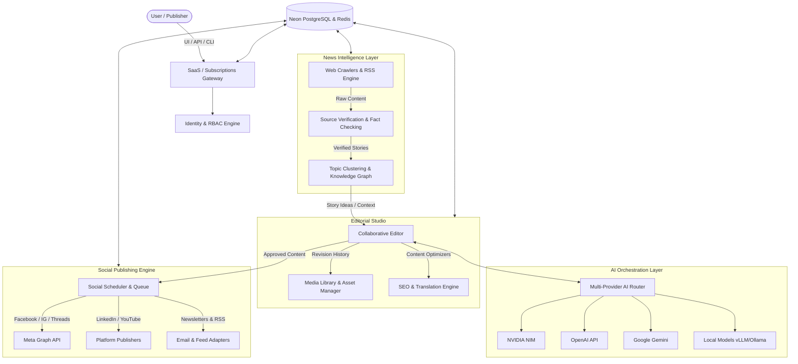

# Welcome to NewsOps Cloud Design Repository

Welcome to the comprehensive, enterprise-grade Software Design Repository for **NewsOps Cloud**—an AI-powered digital publishing operating system designed for modern newsrooms, corporate communications, independent journalists, and media conglomerates.

This repository serves as the single source of truth (SSoT) for engineering, product, QA, DevOps, and design teams.

---

## System Overview Diagram

---

## Core Product Principles

* **Configuration over Code**: Ensure integrations, approval rules, and prompt variations are entirely configurable without requiring core service deployments.
* **Plugin-First & API-First**: The system is designed headlessly. Every user action is supported by underlying, rate-limited REST or GraphQL endpoints.
* **Human-in-the-Loop (HITL)**: Nothing publishes to social endpoints or live web integrations without human sign-off unless explicit automatic bypasses are enabled.
* **Mandatory Attribution**: Provenance tracking is native. Every generated or clustered piece of text retains traces back to its source articles, scrapers, and AI prompt iterations.
* **Zero Vendor Lock-In**: The AI routing engine supports on-premises vLLM installations and platform-agnostic models, facilitating easy failovers and pricing optimization.

---

## Repository Guide

Use the navigation tabs to explore our designs across the 14 directories:

1. **[01 Business](01-business/index.md)**: Market landscape, tenant billing model, monetization, and compliance requirements.
2. **[02 Architecture](02-architecture/index.md)**: System design patterns, scaling blueprints, and zero-cost MVP setups.
3. **[03 Database](03-database/index.md)**: 200+ table schemas, multi-tenant partitioning, and data retention guidelines.
4. **[04 AI Orchestrator](04-ai/index.md)**: Multi-LLM routing, vector databases, prompt versioning, and media pipelines.
5. **[05 News Intelligence](05-news-intelligence/index.md)**: Locality-sensitive hashing deduplication, topic clustering, and fact verification.
6. **[06 Editorial Studio](06-editorial/index.md)**: Real-time collaborative CMS workspaces, SEO engines, and editorial flows.
7. **[07 Social Publishing](07-social/index.md)**: Queue structures, FFmpeg media adapters, and approval workflows.
8. **[08 SaaS Engine](08-saas/index.md)**: Organizations, usage metering, plugins SDK, and marketplace.
9. **[09 API Specifications](09-api/index.md)**: REST, GraphQL, SDKs, CLI, and webhook models.
10. **[10 Security](10-security/index.md)**: RBAC matrices, encryption keys, and GDPR checklist.
11. **[11 DevOps & Infrastructure](11-devops/index.md)**: Docker, K8s, Prometheus/Grafana, and CDN architectures.
12. **[12 UI/UX Design](12-ui/index.md)**: CSS design tokens, components layout, and micro-interactions.
13. **[13 Testing Strategy](13-testing/index.md)**: Contract tests, playwright E2E scenarios, and chaos injection.
14. **[14 Product Roadmap](14-roadmap/index.md)**: From zero-investment MVP to global scale stages.
